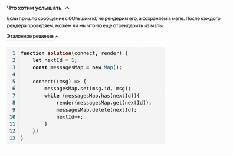

# Этап 2: алгоритмы

## Что из себя представляет данная секция 

Данная секция длится около полутора часа. Из них 1 час уделяется самим задачам, а остальные 30 минут на какие-то вопросы, если таковы имеются. Проверяются общие знания, не проверяются особенности javascript, а проверяются структуры данных, алгоритмы, оценку сложности и т.д.

Перед решением желательно называть алгоритм решения - можно обобщенно своими словами, ну а потом написать уже решение. В процессе будут какие-то вопросы - по типу как можно оптимизировать уже после задачи. Также как и в платформе использовать ничего нельзя

## Задачи

<details>
<summary>1. Задача: digitPermutation(arr)</summary>

[Leetcode - 150 задачек] - https://leetcode.com/problems/group-anagrams/

Дан массив целых неотрицательных чисел, нужно сгруппировать друг с другом числа, которые можно получить путём перестановки цифр их составляющих, нули при этом игнорируем, т. к. нет числа 011. Решение должно быть максимально эффективно по памяти и времени.

```js
function digitPermutation(arr) {
  // your code here
}

console.clear();
console.log("start test");
console.log(
  digitPermutation([1230, 99, 23001, 123, 111, 300021, 101010, 90000009, 9])
);
// [[99, 90000009], [111, 101010], [1230, 23001, 123, 300021], [9]]
console.log(digitPermutation([11, 22])); // [[11], [22]]
console.log(digitPermutation([11111111112, 122222222222])); // [[11111111112], [122222222222]]
console.log("end test");
```

<details>
<summary>Ответы</summary>

```js
function digitPermutation(arr) {
  const groups = {};

  for (let num of arr) {
    const key = String(num).replace(/0/g, "").split("").sort().join("");

    if (!groups[key]) {
      groups[key] = [];
    }

    groups[key].push(num);
  }

  return Object.values(groups);
}

console.log(
  digitPermutation([1230, 99, 23001, 123, 111, 300021, 101010, 900009, 9])
); // [[99, 900009], [111, 101010], [23001, 123, 23001, 300021], [9]]
console.log(digitPermutation([11, 22])); // [[11], [22]]
console.log(digitPermutation([11111112, 12222222])); // [[11111112], [12222222]]
```
Объяснение:
1. Создаем объект, в котором будем группировать числа
2. Проходимся по всем числам и каждое число превращаем в ключ
- Превращаем в строку
- Удаляем все нули
- Превращаем в массив
- Сортируем цифры по порядку
- Превращаем обратно в строку
3. Если в объекте еще нет этого ключа, то создаем пустой массив по этому ключу
4. Добавляем число в объект по сформированному ключу
5. Возвращаем все сгруппированные значения объекта в виде массива

</details>
</details>

<details>
<summary>2. Задача: getNodes(tree, type)</summary>

Дана древовидная структура следующего формата:

```js
const tree = {
  type: 'nested',
  children: [
    { type: 'added', value: 42 },
    {
      type: 'nested',
      children: [
        { type: 'added', value: 43 },
      ],
    },
    { type: 'added', value: 44 },
    ...
  ]
}
```

Необходимо написать функцию `getNodes(tree, type)`, которая возвращает все ноды в порядке следования, соответствующие переданному типу. Глубина вложенности любая. Пример:

```js
const addedItems = getNodes(tree, 'added');

// Результат:
[
  { type: 'added', value: 42 },
  { type: 'added', value: 43 },
  { type: 'added', value: 44 },
  ...
]
```

<details>
<summary>Ответы</summary>

```js
function getNodes(tree, type) {
  const result = [];

  const stack = [tree];

  while (stack.length != 0) {
    const node = stack.pop();

    if (node.type === type) {
      result.push(node);
    }

    if (node.children) {
      stack.push(...node.children);
    }
  }

  return result.reverse();
}

// Тестирование

const tree = {
  type: "nested",

  children: [
    { type: "added", value: 42 },

    {
      type: "nested",

      children: [{ type: "added", value: 43 }],
    },

    { type: "added", value: 44 },
  ],
};

console.log(getNodes(tree, "added"));
// [
// { type: 'added', value: 42 },
// { type: 'added', value: 43 },
// { type: 'added', value: 44 }
// ]
```

Объяснение
1. Необходимо обойти дерево в глубину (DFS)
2. Рекурсию использовать нельзя, так как по условию дерево может иметь любую глубину вложенности
3. Используем stack для хранения узлов.
4. Берём последний элемент (pop()), обрабатываем.
5. Если тип совпадает — добавляем в result.
6. Если есть children, добавляем их в stack (push(...children), LIFO).
7. При возвращении result делаем reverse, так как по условию нужно вернуть узлы в порядке следования
8. Обход гарантированно работает для любых деревьев, глубина не влияет.

Еще одно решение
```js
const getNodes = (tree, type) => {
    const res = []; //
    const queue = [tree]; // Используем стек для итерации
    while (queue.length) {
        const node = queue.shift(); // ПОТОМ МЕНЯЕМ НА POP
        // const node = queue.pop(); // Забираем элемент с конца стека
        // Если тип узла совпадает с заданным, добавляем его в результат
        if (node.type === type) {
            res.push(node);}
        // Если есть дочерние узлы, добавляем их в стек (в обратном порядке)
        if (node.children) {
            // ПОТОМ МЕНЯЕМ НА ОБРАТНЫЙ ПОРЯДОК
            for (let i = 0 ; i < node.children.length; i++) {
            // for (let i = node.children.length - 1; i >= 0; i--) {
                queue.push(node.children[i]);}}}
    return res;
};
```

</details>
</details>


<details>
<summary>3. Задача: throttle(fn, delay, ctx)</summary>

Throttle — это функция, которая позволяет ограничивать частоту вызова другой функции fn. Эта функция полезна для обработки событий, например, resize окна, так как она генерирует множество событий за короткий промежуток времени.


Основные требования:
1.	Вызов функции fn происходит не чаще, чем раз в указанный delay миллисекунд.
2.	Первый вызов функции должен быть выполнен немедленно.
3.	Если произошел вызов, который был проигнорирован, то он должен быть выполнен последним после окончания delay.

Напишите функцию throttle(fn, delay, ctx) — «тормозилку», которая возвращает обёртку,
- вызывающую fn не чаще, чем раз в delay миллисекунд.
- В качестве контекста исполнения используется ctx.
- Первый вызов fn всегда должен быть синхронным.
- Если игнорируемый вызов оказался последним, то он должен выполниться.
 
// пример для delay === 100
// . - вызовы throttledFn
// ! - вызовы fn
// ...............!
///   !         !
///0ms 100ms   200ms
//  .    .     .
//      !     !
///0ms 100ms 200ms

```js

function throttle(fn, delay, ctx) {
  // code here
}

function test() {
  const start = Date.now();

  function log(text) {
    const msPassed = Date.now() - start;
    console.log(`${msPassed}: ${this.name} logged ${text}`);
  }

  const throttled = throttle(log, 100, { name: "me" });

  setTimeout(() => throttled("m"), 0);
  setTimeout(() => throttled("mo"), 22);
  setTimeout(() => throttled("mos"), 33);
  setTimeout(() => throttled("mosc"), 150);
  setTimeout(() => throttled("moscow"), 400);

  // Ожидаемый вывод:
  //  0ms: me logged m
  // 100ms: me logged mos
  // 200ms: me logged mosc
  // 400ms: me logged moscow
}

<details>
<summary>Ответы</summary>

```js
function throttle(fn, delay, ctx) {
  let lastCallArgs = null;
  let blocked = false;

  function setTimer() {
    blocked = true;

    setTimeout(() => {
      blocked = false;

      if (lastCallArgs) {
        fn.apply(ctx, lastCallArgs);
        lastCallArgs = null;
        blocked = true;
        setTimer();
      }
    }, delay);
  }

  return function (...args) {
    if (blocked) {
      lastCallArgs = args;
    } else {
      fn.apply(ctx, args);
      setTimer();
    }
  };
}

function test() {
  const start = Date.now();

  function log(text) {
    const mPassed = Date.now() - start;

    console.log(`${mPassed}: ${this.name} logged ${text}`);
  }

  const throttled = throttle(log, 100, { name: "me" });

  setTimeout(() => throttled("m"), 0); // сразу
  setTimeout(() => throttled("mo"), 22); // игнор
  setTimeout(() => throttled("mos"), 33); // сохраняем 'mos'
  setTimeout(() => throttled("mosc"), 150); // прошло 150мс — вызов
  setTimeout(() => throttled("moscow"), 400); // прошло ещё 250мс — вызов
}

test();

// 0ms: me logged m
// 100ms: me logged mos
// 200ms: me logged mosc
// 400ms: me logged moscow
```

Объяснение
1. В lastCallArgs храним последний переданные в функцию аргументы;
2. В blocked храним флаг, который указывает, заблокирован ли вызов функции
3. Создаем функцию setTimer, которая блокирует потом и запускает таймер с переданным delay и вызывает fn с переданным lastCallArgs и контекстом
4. Возвращаем функцию, которая либо устанавливает новый lastCallArgs (если поток заблокирован), либо вызывает функцию и ставит таймер

```js
function throttle(fn, delay, ctx) {
    // Флаг, указывающий, нужно ли ждать перед следующим вызовом функции
    let needWait = false;
    // Переменная для хранения аргументов последнего вызова, который произошёл во время ожидания
    let lastArgs = null;
    function throttled(...args) {
        // Если мы в режиме ожидания, значит с момента последнего вызова не прошло delay мс
        // и мы не можем вызвать fn прямо сейчас.
        if (needWait) {
            // Запоминаем аргументы последнего вызова. Каждый новый вызов, пока needWait = true,
            // будет обновлять lastArgs, чтобы в итоге сохранить именно последний вызов.
            lastArgs = args;
            return;
        }
        // Если не нужно ждать, значит это либо первый вызов, либо прошёл delay
        // Вызываем функцию сразу
        fn.call(ctx, ...args);
        // Теперь мы вызвали fn, нам нужно подождать delay мс до следующего вызова.
        needWait = true;
        // Ставим таймер. По истечении delay мс мы разрешим следующий вызов,
        // и если за время ожидания были новые вызовы (хранятся в lastArgs),
        // мы вызовем fn ещё раз с последними переданными аргументами.
        setTimeout(function () {
            // Сбрасываем флаг ожидания, теперь снова можно вызывать fn немедленно.
            needWait = false;
            // Проверяем, были ли проигнорированные вызовы.
            if (lastArgs) {
                // Если были, вызываем throttled снова, но уже с отложенными аргументами.
                // Это обеспечит немедленный вызов fn, т.к. только что мы сбросили needWait.
                throttled.call(ctx, ...lastArgs);
                // После того, как мы обработали отложенный вызов, очищаем lastArgs.
                lastArgs = null;
            }
        }, delay);
    }
    return throttled;
}


// function throttle(fn, delay, ctx) {
//     let lastCall = 0; // Время последнего вызова функции
//     let timeout = null; // Таймер для выполнения следующего вызова
//     let lastArgs = null; // Аргументы последнего вызова
//     let lastContext = null; // Контекст последнего вызова
//
//     return function (...args) {
//         const now = Date.now();
//
//         // Если это первый вызов или прошло достаточно времени с последнего вызова
//         if (now - lastCall >= delay) {
//             // if (timeout) {
//             //     clearTimeout(timeout); // Удаляем запланированный таймер, если он был
//             //     timeout = null;
//             // }
//             lastCall = now; // Обновляем время последнего вызова
//             fn.apply(ctx, args); // Выполняем функцию с переданным контекстом
//         } else {
//             // Сохраняем контекст и аргументы последнего вызова
//             lastArgs = args;
//             lastContext = ctx;
//
//             // Если таймер еще не установлен, устанавливаем его
//             if (!timeout) {
//                 timeout = setTimeout(() => {
//                     lastCall = Date.now();
//                     timeout = null;
//                     fn.apply(ctx || lastContext, lastArgs); // Выполняем функцию с последними аргументами
//                 }, delay - (now - lastCall));
//             }
//         }
//     };
// }
```

</details>
</details>

<details>
<summary>4. Задача: connect(msg)</summary>

Наше приложение-чат должно отображать новые сообщения, которые приходят с сервера, как можно быстрее.

Сообщение имеет формат:

interface Message {
  id: number
  text: string
}

Id самого первого сообщения = 1, а id каждого следующего сообщения на 1 больше, чем id предыдущего.
Нам нужно выводить сообщения в правильном порядке, однако сервер не гарантирует правильный порядок
сообщений, отправляемых в наше приложение.

Таймлайн:
// (приходит)  1  3  4  2     5
// (рисуем)    1     2  3  4  5

Сообщения от сервера приходят в обработчик функции connect:

```js
connect((msg) => {
  ...
});
```

Отображать сообщения нужно с помощью функции `render`: render(msg)


<details>
<summary>Ответы</summary>

```js
function render(msg) {
  console.log(msg);
}

function createMessageHandler() {
  const buffer = new Map();

  let expectedId = 1;

  return function (msg) {
    buffer.set(msg.id, msg);

    while (buffer.has(expectedId)) {
      render(buffer.get(expectedId));

      buffer.delete(expectedId);

      ++expectedId;
    }
  };
}
const onMessage = createMessageHandler();
onMessage({ id: 1, text: "hi" }); // рендерится сразу
onMessage({ id: 3, text: "how are u" }); // в буфере
onMessage({ id: 2, text: "yo" }); // триггерит рендер 2 и 3
onMessage({ id: 5, text: "yo" }); // ждёт 4
onMessage({ id: 4, text: "yo" }); // триггерит рендер 4 и 5
```

Объяснение
1. Создаем createMessageHandler, который будет хранить буффер сообщение и возвращать обработчик onMessage

2. Объявляем buffer, в котором будут храниться все сообщения по ключу id

3. Объявляем expectedId, в котором будем хранить айдишник сообщения, которое должно быть выведено следующим (мы знаем, что айдишники идут по порядку)

4. Возвращаем функцию onMessage, которая

- Принимает сообщение msg
- Записывает сообщение в buffer по id
- Пока в буффере есть сообщения с ожидаемым id, мы их рендерим и инкрементируем expectedId

5. Таким образом, сообщения будут выведены в порядке, соответствующем id

</details>
</details>


<details>
<summary>5. Задача: printFileTree(root)</summary>

Дана вложенная структура файлов и папок.

```js
const data = {
  name: "folder",
  children: [
    { name: "file1.txt" },
    { name: "file2.txt" },
    {
      name: "images",
      children: [
        { name: "image.png" },
        {
          name: "vacation",
          children: [{ name: "crocodile.png" }, { name: "penguin.png" }],
        },
      ],
    },
    { name: "shopping-list.pdf" },
  ],
};
```

Нужно вывести в консоль файлы и папки с отступами, чтобы показать вложенность. Решение должно учитывать любую вложенность элементов (т.е. не должно содержать рекурсивные вызовы).

Пример вывода:
```js
/*
folder
  file1.txt
  file2.txt
  images
    image.png
    vacation
      crocodile.png
      penguin.png
  shopping-list.pdf
*/

function printFileTree(root) {
  // todo
}

printFileTree(data);
```
<details>
<summary>Ответы</summary>

```js
const data = {
  name: "folder",
  children: [
    { name: "file1.txt" },
    { name: "file2.txt" },
    {
      name: "images",
      children: [
        { name: "image.png" },
        {
          name: "vacation",
          children: [{ name: "crocodile.png" }, { name: "penguin.png" }],
        },
      ],
    },
    { name: "shopping-list.pdf" },
  ],
};

function printFileTree(root) {
  const stack = [{ node: root, depth: 0 }];

  while (stack.length > 0) {
    const { node, depth } = stack.pop();

    console.log("  ".repeat(depth) + node.name);

    if (node.children) {
      for (let i = node.children.length - 1; i >= 0; i--) {
        stack.push({ node: node.children[i], depth: depth + 1 });
      }
    }
  }
}

printFileTree(data);
```

Объяснение

1. Необходимо реализовать алгоритм DFS (обход дерева в глубину) без рекурсии, поэтому используем стек
2. stack — стек, где каждый элемент содержит:
3. node — текущая папка или файл
4. depth — сколько отступов печатать
5. console.log(' '.repeat(depth) + node.name) — вывод имени с нужным числом отступов.
6. Если у узла есть children — добавляем их в стек, увеличив depth.
7. Важно: добавляем детей в обратном порядке, чтобы в консоли они шли сверху вниз в правильной очередности.

Другое решение

```js
function createFolder(obj) {
  const res = [];

  function dfs(t, n) {
    res.push([t.name, n]);
    if (t.children) {
      t.children.forEach((el) => {
        dfs(el, n + ' ');
      });
    }
  }
  dfs(obj, ' ');
  for (let i = 0; i < res.length; i++) {
    console.log(res[i][1] + res[i][0]);
  }
}

createFolder(tree);
```

</details>
</details>


<details>
<summary>6. Задача: nextSequence</summary>

Напишите функцию, которая будет возвращать комбинацию слов, для переданного массива массивов слов. Комбинации должны быть перечислены в порядке из примера. Если комбинации закончились, то функция возвращает `undefined`. При решении нельзя пользоваться генераторами.

```js
const nextSequence = allSequences([
  [0, 1, 2],
  ["a", "b"],
  ["?", "!", "."],
]);

console.log(nextSequence()); // "0 a ?"
console.log(nextSequence()); // "0 a !"
console.log(nextSequence()); // "0 a ."
console.log(nextSequence()); // "0 b ?"
// ...
console.log(nextSequence()); // "2 b ."
console.log(nextSequence()); // undefined
```

<details>
<summary>Ответы</summary>

```js
// 1. Способ решить
function allSequences(words) {
  const position = new Array(words.length).fill(0);
  let finished = false;

  return function nextSequence() {
    if (finished) return undefined;

    const current = position.map((val, i) => words[i][val]).join(" ");

    for (let i = words.length - 1; i >= 0; i--) {
      position[i]++;

      if (position[i] < words[i].length) break;

      position[i] = 0;

      if (i === 0) {
        finished = true;
      }
    }

    return current;
  };
}

// 2. Способ решить
function allSequences(words) {
    // Массив индексов, который отслеживает текущие позиции в каждом из массивов
    let indexes = words.map(() => 0);
    const combination = words.reduce((prev, curr) => prev * curr.length, 1); // Количество всех возможных комбинаций
    let current = 0;

    return function () {
        if (current === combination) return undefined; // Если комбинации закончились, возвращаем undefined

        // Формируем комбинацию, используя while
        let res = [];
        let currentIndex = 0; // Индекс в текущем массиве
        while (currentIndex < words.length) {
            res.push(words[currentIndex][indexes[currentIndex]]);
            currentIndex++;
        }

        // Переход к следующей комбинации:
        for (let i = words.length - 1; i >= 0; i--) {
            const maxIndex = words[i].length - 1; // Максимальный индекс в текущем массиве
            if (indexes[i] < maxIndex) { // Если мы не достигли максимального индекса
                indexes[i]++; // мы переходим к следующему индексу
                break;
            } else {
                indexes[i] = 0; // Иначе, сбрасываем индекс на 0
            }
        }

        current++; // Переходим к следующей комбинации
        return res.join(' '); // Возвращаем комбинацию как строку
    };
}

const nextSequence = allSequences([
  [0, 1, 2],
  ["a", "b"],
  ["?", "!", "."],
]);

const nextSequence = allSequences([
  ['0','1'],['11',33],[44,55,66]
]);

console.log(nextSequence()); // "0 a ?"
console.log(nextSequence()); // "0 a !"
console.log(nextSequence()); // "0 a -"
console.log(nextSequence()); // "0 b ?"
console.log(nextSequence()); // "0 b !"
console.log(nextSequence()); // "0 b -"
console.log(nextSequence()); // "1 a ?"
console.log(nextSequence()); // "1 a !"
console.log(nextSequence()); // "1 a -"
console.log(nextSequence()); // "1 b ?"
console.log(nextSequence()); // "1 b !"
console.log(nextSequence()); // "1 b -"
console.log(nextSequence()); // "2 a ?"
console.log(nextSequence()); // "2 a !"
console.log(nextSequence()); // "2 a -"
console.log(nextSequence()); // "2 b ?"
console.log(nextSequence()); // "2 b !"
console.log(nextSequence()); // "2 b -"
console.log(nextSequence()); // undefined
console.log(nextSequence()); // undefined
console.log(nextSequence()); // undefined
```

Объяснение
1. Инициализируем массив индексов position:
- Используем для отслеживания текущей позиции в каждом подмассиве.
- Например, [0, 0, 0] — первая комбинация: words[0][0] words[1][0] words[2][0]
2. finished — флаг, показывающий, что комбинации закончились
3. В функции nextSequence:
- Формируем строку в соответствии с текущим значением position
- Обновляем индексы справа налево
- Возврщаем результат

</details>
</details>

<details>
<summary>7. Задача: createSmartFetch(timeout)</summary>

Есть функция batchFetch для запроса данных из бэкенда по id, работающая следующим образом:

batchFetch([1, 2]) -> Promise { 1: { id: 1, title: 'one', ... }, 2: { id: 2, title: 'two', ... } }

Для уменьшения количества запросов к бэкенду нужно написать обертку, создающую функцию "smartFetch(id)", склеивающую вызовы в один (c окном timeout мс).

Важно отметить, это не debounce, а склеивание запросов к бэкенду, т.е. все вызовы функции должны вернуть значение.

Считаем, что:
- окно ожидания вызовов начинается заново сразу после начала запроса к бэкенду.
- в пределах таймаута все id уникальные
- batchFetch всегда успешен

```js
function createSmartFetch(timeout) {}

(async function () {
  console.clear();

  const smartFetch = createSmartFetch(3000);

  const a = smartFetch(10);
  const b = smartFetch(20);

  console.log("ждём 100 мс, накапливаем запросы");
  await new Promise((resolve) => setTimeout(resolve, 100));

  console.log("a:", await a); // a: { id: 10, title: 10 }
  console.log("b:", await b); // b: { id: 20, title: 20 }
})();

function batchFetch(ids) {
  return new Promise((resolve) => {
    console.log("запрос к бэкенду", ids);
    setTimeout(() => {
      const res = {};
      ids.forEach((id) => (res[id] = { id, title: id }));
      resolve(res);
    }, Math.random() * 1000);
  });
}
```

<details>
<summary>Ответы</summary>

```js
function createSmartFetch(timeout) {
  let queue = new Map(); // id -> { resolve, reject }
  let timer = null;

  return function smartFetch(id) {
    return new Promise((resolve) => {
      queue.set(id, resolve);

      if (!timer) {
        timer = setTimeout(async () => {
          const ids = Array.from(queue.keys());
          const resolvers = new Map(queue);
          queue.clear();
          timer = null;

          const results = await batchFetch(ids);

          for (const id of ids) {
            resolvers.get(id)(results[id]);
          }
        }, timeout);
      }
    });
  };
}

(async function () {
  console.clear();

  const smartFetch = createSmartFetch(3000);

  const a = smartFetch(10);
  const b = smartFetch(20);

  console.log("ждём 100 мс, накапливаем запросы");
  await new Promise((resolve) => setTimeout(resolve, 100));

  console.log("a:", await a); // a: { id: 10, title: 10 }
  console.log("b:", await b); // b: { id: 20, title: 20 }
})();

function batchFetch(ids) {
  return new Promise((resolve) => {
    console.log("запрос к бэкенду", ids);
    setTimeout(() => {
      const res = {};
      ids.forEach((id) => (res[id] = { id, title: id }));
      resolve(res);
    }, Math.random() * 1000);
  });
}
```

</details>
</details>

<details>
<summary>8. Задача: getRoute(tickets = [], start)</summary>

У нас есть набор билетов вида:

```js
[
{from: 'London', to: 'Moscow'},
{from: 'NY', to: 'London'},
{from: 'Moscow', to: 'SPb'},
...
]
```

На этих билетах мы хотим построить маршрут. Петель и повторов в маршруте нет. Напишите программу которая возвращает маршрут в порядке следования билетов.

<details>
<summary>Ответы</summary>

```js
function getRoute(tickets = [], start) {
    // Инициализируем массив для хранения итогового маршрута.
    const ResultRoute = [];
    // Создаем Map, где ключ — это город отправления, а значение — объект билета.
    const map = new Map();
    // Проходим по массиву билетов и заполняем Map.
    for (let i = 0; i < tickets.length; i++) {
        // Для каждого билета устанавливаем город отправления как ключ и сам билет как значение.
        map.set(tickets[i].from, tickets[i]);
    }
    // Начинаем построение маршрута с указанного начального города.
    let current = map.get(start);
    // Пока есть текущий билет (город отправления имеет соответствующий билет).
    while (current) {
        // Добавляем текущий билет в итоговый маршрут.
        ResultRoute.push(current);
        // Переходим к следующему билету, используя город назначения текущего билета.
        current = map.get(current.to);
    }
    // Возвращаем итоговый маршрут.
    return ResultRoute;
}

console.log(
    getRoute(
        [
            {from: 'London', to: 'Moscow'},
            {from: 'NY', to: 'London'},
            {from: 'Moscow', to: 'SPb'},
        ],
        'NY'
    )
);
```


</details>
</details>

<details>
<summary>9. Задача: solve(urls, n)</summary>

Дан массив ссылок: ['url1', 'url2', ...] и лимит одновременных запросов (limit)
Необходимо реализовать функцию, которая опросит урлы в том порядке, в котором они идут в массиве, и вызовет callback c массивом ответов
['url1_answer', 'url2_answer', ...] так, чтобы в любой момент времени выполнялось не более limit
запросов (как только любой из них завершился, сразу же отправляется следующий)
Т.е. нужно реализовать шину с шириной равной limit.

Требования:
- Порядок в массиве ответов должен совпадать с порядком в массиве ссылок
Дополнительно:
- Функция должна обладать мемоизацией (один и тот же урл не опрашивать дважды)

Для опроса можно использовать fetch или $.get
Ошибки обрабатывать не нужно

*/
// declare function fetch(url: string): Promise<string>;
// declare function $.get(url: string, callback: (res: string) => void): void;

```js
function solve(urls, n) {
  let i = 0;
  let succes = 0;
  let map = new Map();
  const len = urls.length;

  const wrap = (res) => {
    if (i >= len) {
      return;
    }
    const curUrl = urls[i];
    i += 1;

    if (map.has(curUrl)) {
      succes += 1;
      if (succes === len) {
        res(urls.map((url) => map.get(url)));
      }
      wrap(res);
      return;
    }

    map.set(curUrl, null);

    get(curUrl).then((data) => {
      map.set(curUrl, data);
      succes += 1;
      if (succes === len) {
        res(urls.map((url) => map.get(url)));
      }
      wrap(res);
    });
  };

  return new Promise((res) => {
    for (let j = 0; j < n; j++) {
      wrap(res);
    }
  });
}

setTimeout(() => {
  solve(["1", "2", "3", "4", "5", "1"], 3).then((data) => console.log(data));
}, 1000);
```

<details>
<summary>Ответ</summary>
</details>

</details>

<details>
<summary>10. Задача: sortedSquares</summary>

Input: nums = [-4,-1,0,3,10]
Output: [0,1,9,16,100]
отсортировать массив квадратов

```js
var sortedSquares = function (nums) {
  const res = [];

  let l = 0;
  let r = nums.length - 1;

  while (l <= r) {
    if (nums[l] * nums[l] > nums[r] * nums[r]) {
      res.push(nums[l] * nums[l]);
      l++;
    } else {
      res.push(nums[r] * nums[r]);
      r--;
    }
  }
  return res.reverse();
};
```


<details>
<summary>Ответ</summary>
</details>

</details>

<details>
<summary>11. Задача: isVert(arr)</summary>

делиться ли множество точек на две симметричные части вертикальной линией

```js
function isVert(arr) {
  if (arr.length < 2) return true;

  let min = Infinity;
  let max = -Infinity;
  const map = new Map();

  arr.forEach((element) => {
    const k = element[0] + '' + element[1];
    map.set(k, map.get(k) ? map.get(k) + 1 : 1);
    if (element[0] > max) max = element[0];
    if (element[0] < min) min = element[0];
  });

  const mid = (min + max) / 2;

  if (mid % 1 !== 0) return false;

  arr.forEach((el) => {
    let key;
    if (el[0] > mid) {
      key = mid - (el[0] - mid) + '' + el[1];
    } else if (el[0] < mid) {
      key = mid + (mid - el[0]) + '' + el[1];
    } else {
      key = el[0] + '' + el[1];
    }

    if (map.get(key) > 1) {
      map.set(key, map.get(key) - 1);
    } else {
      map.delete(key);
    }
  });

  return map.size === 0;
}

//если точки отсортированы
function isVer(points) {
  if (points.length < 2) {
    console.log(true);
    return true;
  }
  const mid = (points[0][0] + points[points.length - 1][0]) / 2;

  for (let i = 0; i < points.length / 2; i++) {
    if (
      !(
        mid - points[i][0] === points[points.length - 1 - i][0] - mid &&
        points[i][1] === points[points.length - 1 - i][1]
      )
    ) {
      console.log('false');
      return false;
    }
  }
  console.log('true');
  return true;
}
```

<details>
<summary>Ответ</summary>
</details>

</details>

<details>
<summary>12. Задача: findCommonElements(arr1, arr2)</summary>

```js
function findCommonElements(arr1, arr2) {
  let result = [];
  let pointer1 = 0;
  let pointer2 = 0;

  while (pointer1 < arr1.length && pointer2 < arr2.length) {
      if (arr1[pointer1] === arr2[pointer2]) {
          result.push(arr1[pointer1]);
          pointer1++;
          pointer2++;
      } else if (arr1[pointer1] < arr2[pointer2]) {
          pointer1++;
      } else {
          pointer2++;
      }
  }

  return result;
}

const sortedArray1 = [2, 4, 6, 8, 10];
const sortedArray2 = [3, 5, 6, 8, 9, 10];

const commonElements = findCommonElements(sortedArray1, sortedArray2);
console.log(commonElements);  // Ожидаемый результат: [6, 8, 10]
```


<details>
<summary>Ответ</summary>
</details>

</details>

<details>
<summary>13. Задача: printFolders(folders, path = "")</summary>

```js
// Пример структуры папок
const folders = [
  {
      name: 'root',
      subfolders: [
          {
              name: 'folder1',
              subfolders: [
                  {
                      name: 'subfolder1',
                      subfolders: []
                  },
                  {
                      name: 'subfolder2',
                      subfolders: []
                  }
              ]
          },
          {
              name: 'folder2',
              subfolders: [
                  {
                      name: 'subfolder3',
                      subfolders: []
                  }
              ]
          }
      ]
  }
];
```

```js
// Рекурсивная функция для вывода всех папок и путей
function printFolders(folders, path = '') {
  for (const folder of folders) {
      const folderPath = path + '/' + folder.name; // Составляем путь до текущей папки
      console.log(folderPath); // Выводим путь
      printFolders(folder.subfolders, folderPath); // Рекурсивно вызываем для подпапок
  }
}

printFolders(folders);
```

<details>
<summary>Ответ</summary>
</details>

</details>

<details>
<summary>14. Задача: removeZero(arr)</summary>

```js
function removeZero(arr) {
  for (let i = 0; i < arr.length; i++) {
    if (arr[i] === 0) {
      arr.splice(i, 1);
      i--;
    }
  }
  console.log(arr);
  return arr;
}

removeZero([1, 0, 8, 9]);
removeZero([0, 0, 9, 4, 2]);
removeZero([0, 0, 0, 0, 0]);
removeZero([]);
```


<details>
<summary>Ответ</summary>
</details>

</details>

<details>
<summary>15. Задача: promisePool</summary>

```js
const prom = (ms, txt) =>
  new Promise((resolve, reject) => {
    setTimeout(() => resolve(txt), ms);
  });

function promisePool(arr, n) {
  const result = [];
  let k = 0;

  const len = arr.length;

  return new Promise((resolve, reject) => {
    function step() {
      if (arr.length === 0) return;
      const j = arr.length - 1;
      const p = arr.pop();
      p.then((data) => {
        result[j] = data;
        console.log(data);
        k++;
        if (arr.length > 0) {
          step();
        }
        if (k === len) resolve(result);
      });
    }
    for (let i = 0; i < n; i++) {
      step();
    }
  });
}

// promisePool([], 2).then((data) => console.log(data));

// promisePool(
//   [
//     prom(1000, 'p1'),
//     prom(4000, 'p2'),
//     prom(2000, 'p3'),
//     prom(3000, 'p4'),
//     prom(1000, 'p5'),
//     prom(10000, 'p6'),
//     prom(2500, 'p7'),
//     prom(1000, 'p8'),
//   ],
//   2
// ).then((data) => console.log(data));

function fPool(arr, n) {
  const result = [];
  let k = 0;

  const len = arr.length;

  return new Promise((resolve, reject) => {
    function step() {
      if (arr.length === 0) return;
      const j = arr.length - 1;
      const p = arr.pop();
      fetch(p)
        .then((data) => {
          result[j] = data;
          console.log(data);
          k++;
          if (arr.length > 0) {
            step();
          }
          if (k === len) resolve(result);
        })
        .catch((e) => console.log(e));
    }
    for (let i = 0; i < n; i++) {
      step();
    }
  });
}

const memo = (fn) => {
  const map = new Map();

  return async function (url) {
    if (map.has(url) && map.get(url).status < 400) {
      console.log(url);
      return map.get(url);
    }
    const res = await fn(url);
    map.set(url, res);
    return res;
  };
};

// const memoProm = memo(fPool);

// fetch('https://jsonplaceholder.typicode.com/todos/1')
//   .then((response) => response)
//   .then((json) => console.log(json));

function limit(url, n, cb) {
  const cache = {};
  const res = [];
  let count = 0;
  let i = 0;

  const len = Math.min(n, url.length);

  function step() {
    console.log(url[i]);
    const cur = url[i];
    const ind = i;
    i++;
    if (!cache.hasOwnProperty(cur)) {
      console.log('no cache');
      cache[cur] = fetch(cur);
    }

    cache[cur].then((resp) => {
      res[ind] = resp;
      count++;
      if (count === url.length - 1) {
        return cb(res);
      }
      step();
    });
  }

  for (let j = 0; j < len; j++) {
    step();
  }
}

const url = [
  'https://jsonplaceholder.typicode.com/todos/1',
  'https://jsonplaceholder.typicode.com/todos/2',
  'https://jsonplaceholder.typicode.com/todos/3',
  'https://jsonplaceholder.typicode.com/todos/4',
  'https://jsonplaceholder.typicode.com/todos/1',
  'https://jsonplaceholder.typicode.com/todos/3',
  'https://jsonplaceholder.typicode.com/todos/1',
  'https://jsonplaceholder.typicode.com/todos/6',
  'https://jsonplaceholder.typicode.com/todos/7',
  'https://jsonplaceholder.typicode.com/todos/3',
];

const fn = (data) => {
  console.log(data.length);
  data.forEach((element) => console.log(element));
};

limit(url, 10, fn);
// parallelLimit(url, 3, fn);
```

<details>
<summary>Ответ</summary>
</details>

</details>

<details>
<summary>16. Задача: findSubSum(arr, x) </summary>

Вернуть отрезок сумма которого равна х

```js
function findSubSum(arr, x) {
  const prefSum = [arr[0]];
  const map = {};
  for (let i = 1; i < arr.length; i++) {
    prefSum[i] = arr[i] + prefSum[i - 1];
  }

  console.log(prefSum);

  for (let i = 0; i < prefSum.length; i++) {
    if (prefSum[i] === x) return [0, i];
    const target = prefSum[i] + x;
    if (map.hasOwnProperty(prefSum[i])) {
      //   console.log(prefSum[i], map, target);
      return [map[prefSum[i]] + 1, i];
    } else {
      map[target] = i;
    }
  }

  return false;
}

console.log(findSubSum([9, -6, 5, 4, -2], 10));
```

<details>
<summary>Ответ</summary>
</details>

</details>

<details>
<summary>17. Задача: getElementByPath(data, path)</summary>

```js
// Определение функции, которая получает элемент из объекта по строковому пути
function getElementByPath(obj, path) {
  const parts = path.split("."); // Разделяем строку пути на части по точке и создаем массив
  let result = obj; // Инициализируем переменную, в которой будет храниться результат

  // Проходим по каждой части пути
  for (const part of parts) {
    // Проверяем, существует ли текущая часть пути как свойство объекта
    if (result.hasOwnProperty(part)) {
      result = result[part]; // Если существует, переходим к следующему уровню вложенности объекта
    } else {
      return undefined; // Если свойства не существует, возвращаем undefined
    }
  }

  return result; // Возвращаем найденный элемент
}

// Объект с данными
const data = {
  person: {
    name: "John",
    age: 30,
    address: {
      city: "New York",
      zip: "10001",
    },
  },
};

// Получение элементов из объекта по строковому пути
const name = getElementByPath(data, "person.name"); // Получаем значение "John"
const city = getElementByPath(data, "person.address.city"); // Получаем значение "New York"
const zip = getElementByPath(data, "person.address.zip"); // Получаем значение "10001"
const invalidPath = getElementByPath(data, "person.salary"); // Получаем undefined

// Выводим полученные значения в консоль
console.log(name); // "John"
console.log(city); // "New York"
console.log(zip); // "10001"
console.log(invalidPath); // undefined


```

<details>
<summary>Ответ</summary>
</details>

</details>

<details>
<summary>18 Задача: maxVisitors</summary>

```js
function maxVisitors(arr) {
  let max = 0;
  let res = 0;
  const map = {};

  for (let el of arr) {
    if (el[0] > max) max = el[0];

    if (map.hasOwnProperty(el[0])) {
      map[el[0]][0]++;
    } else {
      map[el[0]] = [1, 0];
    }

    if (map.hasOwnProperty(el[1])) {
      map[el[1]][1]++;
    } else {
      map[el[1]] = [0, 1];
    }
  }
  let k = 0;
  for (let i = 0; i <= max; i++) {
    if (map.hasOwnProperty(i)) {
      k += map[i][0] - map[i][1];
    }
    if (res < k) res = k;
  }
  // console.log(map, max);
  return res;
}

console.log(
  maxVisitors([
    [0, 1],
    [1, 5],
    [3, 4],
    [4, 5],
  ])
);

console.log(
  maxVisitors([
    [1, 2],
    [2, 3],
  ])
);

function maxVisit(arr) {
  const map = {};
  let max = 0;
  arr.sort((a, b) => a[0] - b[0]);
  console.log(arr);
  let i = 0;
  let k = 0;
  //for (let i = 0; i < arr.length; i++) {
  while (i < arr.length) {
    const cur = arr[i][0];
    // console.log(map, cur);
    while (i < arr.length && arr[i][0] === cur) {
      if (map[arr[i][0]]) {
        k -= map[arr[i][0]];
      }
      k++; // 1
      map[arr[i][1]]
        ? (map[arr[i][1]] = map[arr[i][1]] + 1)
        : (map[arr[i][1]] = 1);
      i++;
      if (max < k) max = k;
    }
    if (i + 1 < arr.length)
      for (let j = cur; j < arr[i][0]; j++) {
        console.log(j);
        if (map[j]) {
          k -= map[j];
        }
      }
  }
  return max;
}

```
<details>
<summary>Ответ</summary>
</details>

</details>

<details>
<summary>19 Задача: findFull(target, str)</summary>

Функция fuzzySearch - нечеткий поиск - первая строка подпоследовательность второй?

```js
function findFull(target, str) {
  let l = 0;
  let r = 0;
  const stack = target.split('').reverse();

  for (let i = 0; i < str.length; i++) {
    if (str[i] === stack[stack.length - 1]) {
      stack.pop();
    }
  }
  return stack.length === 0 ? true : false;
}

// console.log(findFull(target, str));
```

</details>

<details>
<summary>20. Задача: deleteSmile(str)</summary>

```js
function deleteSmile(str) {
  const arr = str.split('');
  for (let i = 0; i < arr.length - 4; i++) {
    let str = [arr[i], arr[i + 1], arr[i + 2], arr[i + 3]].join('');
    if (str === ':-((') {
      arr.splice(i, 4);
      i--;
    }
    str += arr[i + 4];
    if (str === ':-)))') {
      arr.splice(i, 5);
      i--;
    }
  }
  console.log(arr.join(''));
}

deleteSmile('Я работаю в чипугле :-)))');
deleteSmile('z ytn :-(( blya');
deleteSmile('z ytn :-(((:-)))) blya');
// deleteSmile('')
```

</details>


<details>
<summary>21. Задача: createRange/range(line,arr)</summary>

```js
// console.log(range([4, 8], [1, 3, 4, 5, 8, 9]));
// console.log(range([5], [2, 4, 6, 8]));
// console.log(range([5, 10, 15], [3, 5, 7, 9, 11, 13, 15, 17, 19]));
// console.log(range([], [1, 2, 3]));
// console.log(range([2, 6, 8], []));
// console.log(range([3, 5, 7], [1, 2, 3, 8, 9]));
// console.log(range([-1, 0, 1], [-100, 100]));

function range(line, arr) {
  line.push(Infinity);
  const ranges = [[-Infinity, line[0]]];

  for (let i = 0; i < line.length - 1; i++) {
    ranges.push([line[i], line[i + 1]]);
  }
  let i = 0;

  const preRes = [];

  ranges.forEach((el) => {
    let sum = 0;
    let k = 0;

    while (i < arr.length && el[0] < arr[i] && arr[i] <= el[1]) {
      sum += arr[i];
      k++;
      i++;
    }

    preRes.push({
      quantity: k,
      sum: sum,
    });
  });

  return preRes;
}
```

</details>


<details>
<summary>22. Задача: createObjectByPath(obj, path)</summary>

```js
// Определение функции, которая создает вложенные объекты по строковому пути
function createObjectByPath(obj, path) {
  const parts = path.split('.'); // Разделяем строку пути на части по точке и создаем массив
  let currentObj = obj; // Инициализируем переменную, в которой будем создавать вложенные объекты

  // Проходим по каждой части пути
  for (const part of parts) {
    // Проверяем, существует ли текущая часть пути как свойство объекта
    if (!currentObj.hasOwnProperty(part)) {
      currentObj[part] = {}; // Если не существует, создаем новый вложенный объект
    }
    currentObj = currentObj[part]; // Переходим к следующему уровню вложенности объекта
  }

  return obj; // Возвращаем изначальный объект с добавленными вложенными объектами
}

// Исходный пустой объект
const emptyData = {};

// Создание вложенных объектов по строковому пути
const createdPath1 = createObjectByPath(emptyData, "person.name");
console.log(createdPath1); // { person: { name: {} } }

const createdPath2 = createObjectByPath(emptyData, "person.address.city");
console.log(createdPath2); // { person: { name: {}, address: { city: {} } } }

const createdPath3 = createObjectByPath(createdPath2, "person.address.zip");
console.log(createdPath3); // { person: { name: {}, address: { city: {}, zip: {} } } }
```

</details>


<details>
<summary>23. Задача: coupleNum(arr, k)</summary>

```js
// количество пар чисел, разницы которых >= k
const data = [1, 2, 3, 4]; // k = 3;
//n log n через бин поиск, можно через окно за линию
function coupleNum(arr, k) {
  let sum = 0;

  for (let i = 0; i < arr.length; i++) {
    const target = arr[i] + k;
    let l = i;
    let r = arr.length - 1;
    while (l <= r) {
      const mid = Math.ceil((l + r) / 2);
      if (arr[mid] >= target) {
        r = mid - 1;
      } else {
        l = mid + 1;
      }
    }

    if (arr[l] >= target) sum += arr.length - l;
    console.log(arr.length - l);
  }
  console.log(sum);
}
coupleNum(data, 3);
```

</details>


<details>
<summary>24. Задача: correctStr(s1, s2)</summary>

```js
function correctStr(s1, s2) {
  let k = 1;
  let i = 0;
  let j = 0;
  if (s1.length === s2.length) {
    while (i < s1.length) {
      if (s1[i] !== s2[j]) {
        if (k === 0) return false;
        k--;
      }
      i++;
      j++;
    }
  } else if (s1.length === s2.length + 1) {
    while (i < s1.length) {
      if (s1[i] !== s2[j]) {
        if (k === 0) return false;
        k--;
        i++;
      } else {
        i++;
        j++;
      }
    }
  } else if (s1.length === s2.length - 1) {
    while (i < s1.length) {
      if (s1[i] !== s2[j]) {
        if (k === 0) return false;
        k--;
        i++;
      } else {
        i++;
        j++;
      }
    }
  } else {
    return false;
  }
  return true;
}
```

</details>


<details>
<summary>25. Задача: fetchFlights(from)</summary>

```js
async function fetchFlights(from) {
  // Здесь должен быть ваш код, который возвращает варианты перелетов из точки 'from'
  // Возвращаем просто массив для примера
  return graph[from] || [];
}

async function findPath(current, destination, fetchFlights) {
  if (current === destination) {
    return [current];
  }

  const flightOptions = await fetchFlights(current);

  for (const nextDestination of flightOptions) {
    try {
      const path = await findPath(nextDestination, destination, fetchFlights);
      if (path.length > 0) {
        return [current, ...path];
      }
    } catch (error) {
      // Пропускаем ошибку, если нет пути через текущий пункт назначения
    }
  }

  throw new Error('No way');
}

const graph = {
  A: ['B', 'D'],
  B: ['C', 'N', 'Z'],
  D: ['E', 'F'],
  F: ['S'],
};

// Пример использования
findPath('A', 'N', fetchFlights)
  .then(path => console.log(path)) // ['A', 'B', 'N']
  .catch(error => console.error(error.message));

findPath('A', 'S', fetchFlights)
  .then(path => console.log(path)) // ['A', 'D', 'F', 'S']
  .catch(error => console.error(error.message));

findPath('B', 'S', fetchFlights)
  .then(path => console.log(path)) // Error: No way
  .catch(error => console.error(error.message));
```

</details>


<details>
<summary>26. Задача: calculateRPN(expression)</summary>


```js
function calculateRPN(expression) {
  const operations = {
    "+": (a, b) => a + b,
    "-": (a, b) => a - b,
    "*": (a, b) => a * b,
    "/": (a, b) => a / b,
  };
  // Разбиваем строку на массив
  const tokens = expression.split(" ");
  // Создаем стек
  const stack = [];
  // Перебираем массив
  for (let token of tokens) {
    // Если токен в операторах
    if (token in operations) {
      // Писать после ! Если в стеке меньше двух значений
      if (stack.length < 2) {
        return "Ошибка: недостаточно чисел для выполнения операции.";
      }
      // Достаем из стека два последних значения
      const b = stack.pop();
      const a = stack.pop();
      // Выполняем операцию и добавляем в стек
      stack.push(operations[token](a, b));
      // Если токен число (преобразуем в число с помощью унарного +)
    } else if (!isNaN(token)) {
      stack.push(+token);
    }
    // Писать после !  обработка ошибок (неизвестный оператор или символ)
    else {
      return `Ошибка: неизвестный оператор или символ`;
    }
  }
  // Возвращаем первое значение стека
  return stack[0];
}
```

</details>

<details>
<summary>27. Задача: groupWords</summary>


```js

function groupWords(words) {
  // 1. Создаем объект, в котором будем хранить группы слов ключ значение
  const mapOfWords = {};

  // 2. Проходимся по всем словам
  for (const word of words) { 
    // 3. Сортируем буквы в слове
      const key = word.split('').sort().join('');
      // 4. Если в объекте нет свойства с таким ключом, то создаем его
      if (!mapOfWords[key]) {
        // 5. Создаем пустой массив для группы
          mapOfWords[key] = [];
      }
      // 6. Добавляем слово в группу
      mapOfWords[key].push(word);
  }
 // 7. Возвращаем массив групп
  return Object.values(mapOfWords);
}

const testWords = ['сон', 'нос', 'сорт', 'трос', 'торт', 'рост','трот'];
console.log(groupWords(testWords));
```
</details>

<details>
<summary>28. Задача: isPalindrome(str)</summary>


```js
function isPalindrome(str) {
  let left = 0;
  let right = str.length - 1;
  let regex = /[a-zа-я0-9]/;

  while (left < right) {
    // charAt() возвращает символ по указанному индексу из строки
    const charL = str.charAt(left).toLowerCase();
    const charR = str.charAt(right).toLowerCase();
    //если charL не является альфанумерическим символом, то указатель left инкрементируется (увеличивается на 1)
    if (!charL.match(regex)) {
      left++;
      continue;
    }
    if (!charR.match(regex)) {
      right--;
      continue;
    }
    if (charL !== charR) {
      return false;
    }
    right--;
    left++;
  }
  return true;
}

function isPalindrome(str) {
  let left = 0;
  let right = str.length - 1;
  let regex = /[a-zа-я0-9]/;

  while (left < right) {
    // charAt() возвращает символ по указанному индексу из строки
    const charL = str.charAt(left).toLowerCase();
    const charR = str.charAt(right).toLowerCase();
    //если charL не является альфанумерическим символом, то указатель left инкрементируется (увеличивается на 1)
    if (!charL.match(regex)) {
      left++;
      continue;
    }
    if (!charR.match(regex)) {
      right--;
      continue;
    }
    if (charL !== charR) {
      return false;
    }
    right--;
    left++;
  }
  return true;
}

```
</details>


<details>
<summary>29. Задача: bankomat(sum, bankLimits, nominals)</summary>


```js
const nominals = [5000, 1000, 500, 100, 50];

function atm(sum, bankLimits, nominals) {
  // Результат будет храниться здесь
  let result = {};

  // Проходим по каждому номиналу купюр
  for (let i = 0; i < nominals.length; i++) {
    // Считаем сколько нужно купюр определенного номинала для выдачи суммы (с учетом ограничений в банке)
    let needNominal = Math.floor(sum / nominals[i]);

    // Сравниваем с ограничениями в банке по каждому номиналу
    if (bankLimits[nominals[i]] < needNominal) {
      // Если запрошенная сумма больше, чем есть в банке, то обнуляем текущую купюру
      needNominal = bankLimits[nominals[i]];
    }

    // Если можем выдать хотя бы одну купюру, записываем это в результат купюрами этого номинала
    if (needNominal > 0) {
      result[nominals[i]] = needNominal;

      // Обновляем запрошенную сумму и банковский лимит
      sum -= needNominal * nominals[i];
      bankLimits[nominals[i]] -= needNominal;
    }
  }

  // Если не удалось выдать всю запрошенную сумму
  if (sum % 50 !== 0) {
    return "сумма должна быть кратна 50";
  }
  if (sum > 0) {
    return "Невозможно выдать указанную сумму";
  }

  return result;
}

// Пример использования

atm(5150, { 5000: 0, 1000: 0, 500: 30, 100: 20, 50: 10 }, nominals); //?

// 2. Решение
function atm(sum, limits, noms) {
    const banknotes = {}; // Объект для хранения выданных купюр
    // Проверка: если сумма не кратна минимальному номиналу, возвращаем ошибку
    if (sum % noms[noms.length - 1]) {
        return 'Incorrect value';
    }
    // Итерируемся по номиналам (от большего к меньшему)
    noms.forEach((nom) => {
        let neededGive = Math.floor(sum / nom); // Сколько купюр нужного номинала нужно для покрытия оставшейся суммы
        // Если для данного номинала не нужно купюр или нет их в банкомате, переходим к следующему
        if (neededGive === 0 || limits[nom] === 0) {
            return;
        }
        // *Если в банкомате меньше купюр этого номинала, чем нужно, берём столько, сколько есть
        if (limits[nom] < neededGive) {
            neededGive = limits[nom];
        }
        banknotes[nom] = neededGive; // Добавляем купюры как ключ и их количество как значение
        sum -= neededGive * nom; // Уменьшаем оставшуюся сумму
    });
    // *Если сумма осталась, значит выдать её невозможно
    if (sum > 0) {
        return 'Not enough money';
    }
    // Уменьшаем количество купюр в limits
    noms.forEach((nom) => {
        if (!banknotes[nom]) return; // Если текущий номинал не использован, пропускаем
        limits[nom] -= banknotes[nom]; // Уменьшаем количество доступных купюр
    });

    return banknotes; // Возвращаем объект с выданными купюрами
}
```

</details>

<details>
<summary>30. Задача: getRoute(tickets = [], start) </summary>

Ожидаем линейный алгоритм с доп.памятью. Квадратный может возникнуть в процессе поиска следующей карточки. 

У нас есть набор билетов вида:
```js
[
    {from: 'London', to: 'Moscow'},
    {from: 'NY', to: 'London'},
    {from: 'Moscow', to: 'SPb'},
    ...
]
```

На этих билетах мы хотим построить маршрут. Петель и повторов в маршруте нет. Напишите программу которая возвращает маршрут в порядке следования билетов.

```js
function getRoute(tickets = [], start) {
    // Инициализируем массив для хранения итогового маршрута.
    const ResultRoute = [];
    // Создаем Map, где ключ — это город отправления, а значение — объект билета.
    const map = new Map();
    // Проходим по массиву билетов и заполняем Map.
    for (let i = 0; i < tickets.length; i++) {
        // Для каждого билета устанавливаем город отправления как ключ и сам билет как значение.
        map.set(tickets[i].from, tickets[i]);
    }
    // Начинаем построение маршрута с указанного начального города.
    let current = map.get(start);
    // Пока есть текущий билет (город отправления имеет соответствующий билет).
    while (current) {
        // Добавляем текущий билет в итоговый маршрут.
        ResultRoute.push(current);
        // Переходим к следующему билету, используя город назначения текущего билета.
        current = map.get(current.to);
    }
    // Возвращаем итоговый маршрут.
    return ResultRoute;
}


console.log(
    getRoute(
        [
            {from: 'London', to: 'Moscow'},
            {from: 'NY', to: 'London'},
            {from: 'Moscow', to: 'SPb'},
        ],
        'NY'
    )
);
```

```js
function getRoute(tickets = [], start) {
    const route = [];
    const result = new Map();

    for (const ticket of tickets) {
        result.set(ticket.from, ticket);
    }

    let current = result.get(start);
    while (current) {
        route.push(current);
        current = result.get(current.to);
    }

    return route;
}
```


</details>

<details>
<summary>31. Задача: typeWrite(delay, outputChar) </summary>


Необходимо написать функцию, которая принимает на вход delay и outputChar (метод для печати символов), а возвращает функцию для добавления текста на печать. Если в очереди на печать есть текст - то функция посимвольно выводит его в outputChar

```js
function typeWrite(delay, outputChar) {
    // Инициализируем переменную promise, которая будет хранить цепочку промисов.
    // Сначала это Promise.resolve(), который мгновенно разрешается.
    let promise = Promise.resolve();
    // Функция writeText отвечает за печать текста посимвольно с заданной задержкой.
    async function writeText(text) {
        // Цикл проходит по каждому символу текста.
        for (let i = 0; i < text.length; i++) {
            // Вызываем метод outputChar для вывода текущего символа.
            outputChar(text[i]);
            // Ждем заданную задержку перед выводом следующего символа.
            await new Promise(resolve => setTimeout(resolve, delay));
        }
    }
    // Возвращаем функцию, которая добавляет текст в очередь печати.
    return function run(text) {
        // Здесь мы добавляем вызов writeText в цепочку промисов.
        // promise.then() гарантирует, что текущий вызов writeText начнется
        // только после завершения предыдущего вызова writeText.
        promise = promise.then(() => writeText(text));
    };
}

function runTest() {
    let start = Date.now();

    function outputChar(char) {
        console.log(`${Date.now() - start}: ${char}`);
    }

    const writeText = typeWrite(100, outputChar);
    writeText("ab");
    writeText("CD");
    setTimeout(()=>writeText('ef'), 250);
    setTimeout(()=>writeText('xy'), 700);
}

runTest();
```

</details>


<details>
<summary>32. Задача: createSmartFetch(timeout) и batchFetch(ids) </summary>

Есть функция batchFetch для запроса данных из бекенда по id, работа : batchFetch([1,2]) -> Promise {1:{id:1,title:'one'},2:{id:2,title:'two'}} для уменьшения количества запросов к бекенду нужно написать обёртку, создающую функцию 'smartFetch(id)', которая склеивает вызовы в один (с окном timeout мс)

Важно отметить, это не debounce, а сулеивание запросов к бэкенду считаем, что:
- окно ожидания вызовов начинается заново сразу после начала запроса в пределах таймаута все id уникальные batchFetch всегда успешен

```js
function createSmartFetch(timeout) {
    let pull = null; // Переменная для хранения текущего набора ID и резолверов
    let timer = null; // Таймер для вызова batchFetch

    return function smartFetch(id) {
        // Если текущий pull существует, добавляем ID в него
        if (!pull) {
            pull = { ids: [], resolvers: new Map() };
        }

        // Если ID уже запрашивается, возвращаем связанный промис
        if (pull.resolvers.has(id)) {
            return pull.resolvers.get(id);
        }

        // Создаем промис для данного ID
        const resultPromise = new Promise((resolve) => {
            pull.resolvers.set(id, resolve);
        });

        pull.ids.push(id); // Добавляем ID в массив текущего батча

        // Если таймер еще не запущен, запускаем его
        if (!timer) {
            timer = setTimeout(() => {
                // Делаем запрос с текущим набором ID
                const currentBatch = pull;
                pull = null; // Сбрасываем текущий pull
                timer = null; // Сбрасываем таймер

                // Вызываем batchFetch для уникальных ID
                batchFetch(currentBatch.ids).then((response) => {
                    // Резолвим промисы для каждого ID
                    currentBatch.ids.forEach((id) => {
                        if (currentBatch.resolvers.has(id)) {
                            currentBatch.resolvers.get(id)(response[id]);
                        }
                    });
                });
            }, timeout);
        }

        return resultPromise;
    };
}

(async function () {
    console.clear()
    const smartFetch = createSmartFetch(100)
    const a = smartFetch(10)
    const b = smartFetch(20)

    console.log('ждем 100 мс, накапливаем запросы');
    await new Promise(resolve => setTimeout(resolve, 100));

    console.log('a', await a)
    console.log('b', await b)
})();

function batchFetch(ids) {
    return new Promise(resolve => {
        console.log('запрос к бэкенду', ids);
        setTimeout(() => {
            const res = {};
            ids.forEach(id => {
                res[id] = {id, title: `${id}`}
            });
            resolve(res)
        }, Math.random() * 1000
        )
    })
}
```
</details>


<details>
<summary>33. Задача: chat(connect, render)  </summary>


Наше приложение чат должно отображать новые сообщения, которые приходят с сервера как можно быстрее. Сообщение имеет формат: `interface Message {id: number; text:string}`,  id самого первого сообщения = 1 , а id каждого следующего на 1 больше чем id предыдущего. 

Нам нужно выводить сообщения в правильном порядке, но сервер не гарантирует правильный порядок сообщений, отправляемых в наше приложение. Сообщения от сервера приходят в обработчике функции connect: `connect((msg)=>{...})`

Отображать сообщения нужно с помощью функции render : render(msg)

```js
function solution(connect, render) {
    let currentID = 1; // Ожидаемый id следующего сообщения
    const buffer = new Map(); // Буфер для хранения сообщений

    connect((msg) => {
        buffer.set(msg.id, msg); // Добавляем сообщение в буфер

        // Проверяем, можно ли рендерить сообщения
        while (buffer.has(currentID)) { // Если в буфере есть сообщение с текущим ожидаемым id
            render(buffer.get(currentID)); // Рендерим сообщение с текущим ожидаемым id
            buffer.delete(currentID); // Удаляем сообщение из буфера
            currentID++; // Увеличиваем ожидаемый id
        }
    });
}

const wait = () => new Promise((resolve) => {
    setTimeout(resolve, 500);
});

const runTest = () => {
    const renderedMessages = [];
    const expectedMessages = [
        { id: 1, text: 'One' },
        { id: 2, text: 'Two' },
        { id: 3, text: 'Three' },
        { id: 4, text: 'Four' },
        { id: 5, text: 'Five' },
        { id: 6, text: 'Six' },
        { id: 7, text: 'Seven' }
    ];

    const testConnect = async (cb) => {
        cb({ id: 7, text: 'Seven' });
        await wait();
        cb({ id: 1, text: 'One' });
        await wait();
        cb({ id: 2, text: 'Two' });
        await wait();
        cb({ id: 3, text: 'Three' });
        await wait();
        cb({ id: 6, text: 'Six' });
        await wait();
        cb({ id: 5, text: 'Five' });
        await wait();
        cb({ id: 4, text: 'Four' });

        if (JSON.stringify(renderedMessages) !== JSON.stringify(expectedMessages)) {
            console.error(`Expected: ${JSON.stringify(expectedMessages)}`);
            console.error(`Received: ${JSON.stringify(renderedMessages)}`);
            return;
        }

        console.log('Test passed');
    };

    const testRenderMsg = (msg) => {
        console.log('Rendered message: ', msg);
        renderedMessages.push(msg);
    };

    solution(testConnect, testRenderMsg);
};

console.clear();
runTest();
```

</details>

<details>
<summary>34. Задача: addItem(items, item, position)</summary>

Входные данные: массив объектов, каждый из которых имеет поля val и type.

Необходимо написать функцию для добавления нового элемента в заданную позицию, причём:
1.	Исходный порядок элементов должен сохраняться во всех вкладках.
2.	Если позиция отрицательная, новый элемент должен быть добавлен перед всеми элементами.
3.	Если позиция больше количества элементов заданного типа, то новый элемент должен быть добавлен в конец.

```js
function addItem(items, item, position) {
    let itemCount = 0;

    for (let i = 0 ; i < items.length; i++) {
        if (itemCount>= position) {
            items.splice(i, 0, item);
            return
        }
        itemCount += items[i].type === item.type ? 1 : 0
    }
    items.push(item)
}
```

Нам нужно определить куда вставлять элемент. Если позиция больше количества элементов заданного типа, то новый элемент должен быть добавлен в конец. Если позиция отрицательная, новый элемент должен быть добавлен перед всеми элементами.

```js
function addItem(items, item, position) {
    let elementPosition = 0;
    for (let i = 0; i < items.length; i++) {
        // Если позиция для вставки достигнута
        if (elementPosition >= position) {
            // Сдвигаем элементы вправо вручную
            for (let j = items.length; j > i; j--) {
                items[j] = items[j - 1];}
            // Вставляем новый элемент
            items[i] = item;
            return;}
        // Увеличиваем счётчик, если тип совпадает
        if (items[i].type === item.type) {
            elementPosition++;}}
    // Если не вставили, добавляем элемент в конец
    items[items.length] = item;}

// Функция для тестирования
function testAddItem(items, item, position, expected) {
    addItem(items, item, position);
    console.log(
        JSON.stringify(items) === JSON.stringify(expected)
            ? `✔ Успех: ${JSON.stringify(item)}`
            : `✘ Ошибка: Ожидалось ${JSON.stringify(expected)}, получено ${JSON.stringify(items)}`
    );
}

// Примеры тестов

// Тест 1: Вставка в середину типа
testAddItem(
    [
        {val: 2, type: 'b'},
        {val: 1, type: 'a'},
        {val: 3, type: 'a'},
    ],
    {val: 4, type: 'a'},
    1,
    [
        {val: 2, type: 'b'},
        {val: 1, type: 'a'},
        {val: 4, type: 'a'},
        {val: 3, type: 'a'},
    ]
);

// Тест 2: Вставка в начало (отрицательная позиция)
testAddItem(
    [
        {val: 1, type: 'a'},
        {val: 2, type: 'b'},
        {val: 3, type: 'a'},
    ],
    {val: 5, type: 'b'},
    -1,
    [
        {val: 5, type: 'b'},
        {val: 1, type: 'a'},
        {val: 2, type: 'b'},
        {val: 3, type: 'a'},
    ]
);

// Тест 3: Вставка в конец типа (позиция больше числа элементов)
testAddItem(
    [
        {val: 1, type: 'a'},
        {val: 2, type: 'b'},
        {val: 3, type: 'a'},
    ],
    {val: 6, type: 'a'},
    10,
    [
        {val: 1, type: 'a'},
        {val: 2, type: 'b'},
        {val: 3, type: 'a'},
        {val: 6, type: 'a'},
    ]
);

// Тест 4: Вставка в начало типа (позиция 0)
testAddItem(
    [
        {val: 1, type: 'a'},
        {val: 2, type: 'b'},
        {val: 3, type: 'a'},
    ],
    {val: 7, type: 'a'},
    0,
    [
        {val: 7, type: 'a'},
        {val: 1, type: 'a'},
        {val: 2, type: 'b'},
        {val: 3, type: 'a'},
    ]
);
```

</details>

<details>
<summary>35. Задача: bestBuyer(buyers)</summary>

В прототипе рекламной сети продажа рекламных мест устроена следующий образом: покупатели заранее называют свою цену, а на каждое рекласное место отвечают, готовы они его купить или нет. Необходимо реализовать функцию, которая перед продажей рекласного места будет ожидать согласия согласия или отказа от покупателей с высокой ценой ставки, а затем продаст рекламное место покупателю с самой высокой ценой среди тех кто согласился на покупку

1. Покупатели предлагают цену 1,5,10

- Покупатель с предложением 10 ответил отказом
- Покупатель с предложением 1 ответил согласием всё ещё ждем
- Покупатель с предложением 5 ответил согласием - выбираем покупателя с предложением 5

2. Покупатели предлагают цену 1,5,10

- Покупатель с предложением 10 ответил отказом
- Покупатель с предложением 5 ответил согласием - выбираем покупателя с предложением 5

3. Покупатели предлагают цену 1,2

- Покупатель с предложением 1 ответил отказом
- Покупатель с предложением 2 ответил отказом - не выбираем никого

Нужна работа с promise true false для promise. После любого resolve проверяем, есть ли ещё не ответившие покупатели с большей ценой. Если нет, то возвращаем индекс лучшего или ошибку

---
Решение

```js
function bestBuyer(buyers) {
    if (!buyers.length) {
        return Promise.reject("No buyers");
    }
    let bestPrice = null;
    let bestIndex = null;
    let failedCount = 0;
    const bestFound = () => bestPrice !== null && buyers.every(b => b.rejected || b.price <= bestPrice);
    return new Promise((resolve, reject) => {
        for (let i = 0; i < buyers.length; i += 1) {
            buyers[i].accepts().then(res => {
                if (res) {
                    if (bestPrice === null || bestPrice < buyers[i].price) {
                        bestPrice = buyers[i].price;
                        bestIndex = i;
                    }
                } else {
                    buyers[i].rejected = true;
                    failedCount += 1;
                    if (failedCount === buyers.length) {
                        return reject(new Error("No one accepted offer"));
                    }
                }
                if (bestFound()) {
                    return resolve(buyers[bestIndex]);
                }
            });
        }
    });
}
```

Логика такая: мы пытаемся найти хотя бы одного покупателя, который согласился, начиная с самой высокой цены. Если в самой дорогой группе никого согласного нет — переходим к следующей по цене и так далее, пока не найдём согласного или не исчерпаем все группы. Если мы прошли все группы и никто не согласился — выбрасываем ошибку.

```js
async function bestBuyer(buyers) {
    if (!buyers.length) {
        throw new Error("No buyers");
    }
    for (let i = 0; i < buyers.length; i++) {
        buyers[i].index = i; // Добавляем индекс к каждому покупателю
        buyers[i].responsePromise = buyers[i].accepts(); // Сохраняем промис с результатом
    }
    const groupedBuyers = bestPrice(buyers);

    function bestPrice(buyers) {
        const groups = {};
        // Группируем покупателей по цене
        for (const buyer of buyers) {
            if (!groups[buyer.price]) {
                groups[buyer.price] = [];
            }
            groups[buyer.price].push(buyer);
        }
        // Возвращаем массив групп в порядке убывания цены
        return Object.values(groups).sort((a, b) => b[0].price - a[0].price);
    }

    // Перебираем группы цен в порядке убывания
    for (const group of groupedBuyers) {
        try {
            // Если в группе есть принятые предложения, возвращаем индекс
            return await firstBuyer(group);
        } catch {
            // Игнорируем, если никто из группы не согласился
        }
    }
    throw new Error("No one accepted offer");

    function firstBuyer(buyers) {
        return Promise.any(
            buyers.map((buyer) =>
                buyer.responsePromise.then((res) => {
                    if (res) {
                        return buyer.index; // Возвращаем индекс покупателя, если он согласен
                    } else {
                        throw new Error(); // Если отказался — исключение
                    }
                })
            )
        );
    }
}

// Цепочка вызовов
// 	1.	Вызываем bestBuyer(buyers).
// 	2.	Внутри bestBuyer для каждого покупателя вызывается buyer.accepts() и сохраняется resPromise.
// 	3.	bestPrice(buyers) группирует покупателей по ценам и сортирует группы.
// 	4.	Поочерёдно пытаемся await firstBuyer(group), начиная с самой дорогой группы.
// 	5.	Внутри firstBuyer применяем Promise.any ко всем промисам resPromise этой группы.
// 	6.	Promise.any будет дожидаться ответа:
// 	•	Если хотя бы один покупатель согласился — возвращаем его индекс сразу.
// 	•	Если все отказались, выбрасываем ошибку, которая сообщает bestBuyer, что надо переходить к следующей группе.
// 	7.	Если мы находим согласного покупателя, bestBuyer возвращает его индекс.
// 	8.	Если мы не находим ни в одной группе согласного — выбрасывается ошибка “No one accepted offer”.


console.clear();

// Симуляция асинхронного ответа
const asyncResponse = (ms, response) => () =>
    new Promise(resolve => setTimeout(() => resolve(response), ms));

// Утилита для тестирования
const testcase = async (label, expectedIndex, timeLimit, fn) => {
    const start = Date.now();
    try {
        const result = await fn();
        const duration = Date.now() - start;
        const testResult = `${label}: ${
            duration < timeLimit && result === expectedIndex ? 'OK' : 'FAIL'
        } (${duration}ms)`;
        console.log(testResult);
    } catch (error) {
        console.error(`${label}: ${error.message}`);
    }
};

// Основной тестовый запуск
(async () => {
    // Тест 1: Покупатели предлагают цены 1, 5, 10
    // Покупатель с предложением 10 - отказ
    // Покупатель с предложением 5 - согласие (выбираем 5)
    await testcase('1 5 10 // Price 5, index 2', 2, 350, async () => {
        const buyers = [
            {price: 10, accepts: asyncResponse(0, false)},
            {price: 1, accepts: asyncResponse(100, false)},
            {price: 5, accepts: asyncResponse(300, true)},
        ];
        return bestBuyer(buyers);
    });

    // Тест 2: Покупатели предлагают цены 1, 5, 10
    // Покупатель с предложением 10 - отказ
    // Покупатель с предложением 5 - согласие (выбираем 5)
    await testcase('1 5 10 // Price 5, index 2', 2, 250, async () => {
        const buyers = [
            {price: 10, accepts: asyncResponse(200, false)},
            {price: 1, accepts: asyncResponse(300, false)},
            {price: 5, accepts: asyncResponse(100, true)},
        ];
        return bestBuyer(buyers);
    });


    // Тест 2.5: Покупатели предлагают цены 1, 5, 10
    // Покупатель с предложением 10 - отказ
    // Покупатель с предложением 5 - согласие (выбираем 5)
    await testcase('1 5 10 // Price 5, index 1', 1, 150, async () => {
        const buyers = [
            {price: 10, accepts: asyncResponse(0, false)},
            {price: 5, accepts: asyncResponse(100, true)},
            {price: 1, accepts: asyncResponse(300, true)},
        ];
        return bestBuyer(buyers);
    });

    // Тест 3: Покупатели предлагают цены 1, 2
    // Все покупатели отказались (никого не выбираем)
    await testcase('1 2 // No one accepts', -1, 100, async () => {
        const buyers = [
            {price: 1, accepts: asyncResponse(0, false)},
            {price: 2, accepts: asyncResponse(50, false)},
        ];
        return bestBuyer(buyers);
    });

    // Тест 4: Только один покупатель
    // Покупатель с предложением 10 согласен
    await testcase('10 // Single buyer accepts', 0, 50, async () => {
        const buyers = [
            {price: 10, accepts: asyncResponse(0, true)},
        ];
        return bestBuyer(buyers);
    });

    // Тест 5: Все покупатели отказываются
    await testcase('1 2 3 // All reject', -1, 300, async () => {
        const buyers = [
            {price: 1, accepts: asyncResponse(50, false)},
            {price: 2, accepts: asyncResponse(150, false)},
            {price: 3, accepts: asyncResponse(250, false)},
        ];
        return bestBuyer(buyers);
    });
})();
```
</details>

<details>
<summary>36. Задача: compress (list)</summary>
Дан список неотрицательных целых чисел, в котором повторяющихся элементов нет. Необходимо преобразовать этот список в строку, сворачивая соседние по числовому ряду числа в диапазоны.

Примеры:
1. compress([1, 4, 5, 2, 3, 9, 8, 11, 0]) ===> Результат: "0-5,8-9,11"
2. compress([1, 4, 3, 2]) ===> Результат: "1-4"
3. compress([1, 4]) ===> Результат: "1,4"
4. compress([1, 2]) ===> Результат: "1-2"

Требования: 
1. Если числа последовательны (например, [1, 2, 3, 4]), их нужно объединить в диапазон вида "1-4".
2. Если числа не последовательны (например, [1, 4]), их нужно записать через запятую.
3. Если список пуст, результат должен быть пустой строкой.
4. Порядок чисел в строке должен соответствовать отсортированному списку.

```js
function compress (list) {
    list.sort ((a, b) => a - b);
    // Инициализируем начальное значение диапазона первым элементом отсортированного массива
    let res = list[0];
    // Переменная для отслеживания, находимся ли мы в середине последовательности
    let iteration = null;
    // Проходим по массиву, начиная со второго элемента
    for (let i = 1; i < list.length; i++) {
        // Проверяем, идет ли текущий элемент (arr[i]) непосредственно за предыдущим (arr[i - 1])
        if (list[i - 1] + 1 === list[i]) {
            // Если да, то мы находимся внутри последовательности
            iteration = true;
        } else {
            // предыдущий отрезок был последовательностью
            if (iteration) {
                res = res + '-' + list[i - 1] + ',' + list[i];
                iteration = false;
                // Если нет, то текущая последовательность прервалась
            } else {
                //  предыдущие числа не были последовательностью , добавляем текущий элемент как новое число
                res = res + ',' + list[i];
            }
        }
    }
    // Если последний элемент был частью последовательности, добавляем его в диапазон
    if (iteration)
        res = res + '-' + list[list.length - 1];

    // Возвращаем строку сформированных диапазонов
    return res;
}


const arr1 = [1, 4, 5, 2, 3, 9, 8, 11, 0]
const arr2 = [1, 3, 4, 0, 2]
const arr3 = [1, 4]
const arr4 = [2, 5, 1, 3, 8, 9, 11, 0, 4, 12, 14, 16, 17, 28, 19]


console.log (compress (arr1))
console.log (compress (arr2))
console.log (compress (arr3))
console.log (compress (arr4))

```
</details>


<details>
<summary>37. Задача: isVertSym()</summary>

Дан массив точек с целочисленными координатами (x, y). Нужно определить,
существует ли вертикальная прямая, которая делит все точки, не лежащие на ней,
на два симметричных набора. Наборы считаются симметричными, если каждая точка из
одного набора имеет пару из другого набора, симметричную относительно данной прямой. Решение должно быть за 0(н) через hashmap

Примеры входных данных и ожидаемого результата:

isVertSym([[0, 0], [0, 0], [1, 1], [2, 2], [3, 1], [4, 0], [4, 0]]) // true
isVertSym([[0, 0], [0, 0], [1, 1], [2, 2], [3, 1], [4, 0]])         // false
isVertSym([])                                                      // true
isVertSym([[0, 0]])                                                // true
isVertSym([[0, 0], [10, 0]])                                       // true
isVertSym([[0, 0], [11, 1]])                                       // false
isVertSym([[0, 0], [1, 0], [3, 0]])                                // false


```js
// ===================================================================
//
// 1. Найти min и max
// 2. Из мин и макс сделать ось симметрии
// 3. Положить все точки в hashmap
// 4. Пройтись по hashmap и проверить на симметрию


function isVertSym(list) {
    const points = new Map(); // Хэш-таблица для хранения точек
    let min = 0;
    let max = 0
    // 1. Проходим по всем точкам, находим минимальный и максимальный x,
    //    а также считаем количество каждой уникальной точки.
    for (const [x, y] of list) {
        const key = x + ',' + y;
        // Проверяем, есть ли такая точка в хэш-таблице
        const value = points.get(key) || 0;
        // Если точка уже есть в хэш-таблице, то увеличиваем ее количество
        points.set(key, value + 1);//
        min = Math.min(min, x);
        max = Math.max(max, x);
    }
    // 2. Вычисляем ось симметрии как середину между min и max
    const mid = (min + max) / 2;

    for (const [x, y] of list) {
        // Находим координату симметричной точки:
        // Она должна иметь такой же 2*mid - x
        const key = (2 * mid - x) + ',' + y;
        const value = points.get(key);
        // Проверяем, есть ли эта зеркальная точка в хэш-таблице
        // Если точка уже есть в хэш-таблице, то уменьшаем ее количество
        value === 1 ? points.delete(key) : points.set(key, value - 1);
    }

    return points.size === 0;
}
```

</details>


<details>
<summary>38. Задача: parallelLimit(urls, limit, callback)</summary>

Описание задачи:
- Дан список ссылок.
- Необходимо написать функцию, которая опросит их все в порядке, в котором они перечислены.
- Одновременно можно выполнять не более limit запросов.
- После получения всех ответов необходимо вызвать обработчик callback и передать в него список ответов в том же порядке, что и список ссылок.
- Если в списке есть одинаковые элементы, то повторного запроса быть не должно (мемоизация).

Подсказка: limit — это количество одновременно выполняющихся запросов.

```js
const db = {
    link1: '1',
    link2: '2',
    link3: '3',
    link7: '7'
};
const links = ['link1', 'link2', 'link1', 'link3', 'link1', 'link2', 'link7'];
const expected = [1, 2, 1, 3, 1, 2, 7];

function fetch(url) {
    console.log(`fetching: ${url}`);
    const response = db[url];

    if (response === undefined) {
        throw new Error('No such url');
    }

    return new Promise(resolve => {
        const timeout = Math.random() * 100 + 20;
        setTimeout(() => resolve(response), timeout);
    });
}

function callOnce(fn) {
    this.called = false;

    return (...args) => {
        if (this.called) {
            throw new Error('Callback called second time');
        }
        this.called = true;

        return fn(...args);
    };
}

function test(results) {
    if (!Array.isArray(results) || results.toString() !== expected.toString()) {
        console.error(`Expected: ${expected.toString()}`);
        console.error(`Received: ${results.toString()}`);
        return;
    }
    console.log('Test passed');
}


console.clear();
parallelLimit(links, 3, callOnce(test));
```

```js
function parallelLimit(urls, limit, callback) {
    const result = [];
    // if (urls.length===0) {
    //     return callback(result);
    // }
    // ПОТОМ ПИШЕМ С МЕМОИЗАЦИЕИ
    const cache = new Map();
    let counterResult = 0; // Счётчик завершённых запросов
    let counterInitiate = 0; // Счётчик запущенных запросов
    // ПОТОМ ПИШЕМ С ЛИМИТОМ
    // limit = Math.min(limit, urls.length);
    function step() {
        const index = counterInitiate // Текущий индекс обрабатываемого URL
        if (index >= urls.length) {
            return // Если все ссылки инициированы, выходим
        }
        counterInitiate++; // Увеличиваем счётчик запущенных запросов
        const url = urls[index]; // Берём текущий URL
        // БЕЗ МЕМОИЗАЦИИ ===========================
        // fetch(url)
        //     .then((data)=>{
        //         result[index] = data; // Сохраняем результат
        //         counterResult++; // Увеличиваем счётчик завершённых запросов
        //         if (counterResult === urls.length) {
        //             return callback(result);
        //         }
        //         step();
        //     })
        // ===========================
        // ПОТОМ ПИШЕМ С МЕМОИЗАЦИЕИ
        if (!cache[url]) { // Проверяем, был ли запрос к данному URL уже выполнен
            cache[url] = fetch(url); // Запускаем запрос и сохраняем Promise в cache
            cache[url].then(() => {
                step() // После завершения текущего запроса запускаем следующий
            })
        }
        else {
            step()} // Если URL уже обработан, пропускаем выполнение fetch

        cache[url].then(data=> { // Когда результат доступен (из запроса или кеша), сохраняем его
            result[index] = data; // Сохраняем результат в массив на нужную позицию
            counterResult++; // Увеличиваем счётчик завершённых запросов
            if (counterResult === urls.length) {
                return callback(result); // Если все запросы завершены, вызываем callback
            }
        })
        // ===========================
    }
    // Инициализируем первые limit запросов
    for (let i = 0; i < limit ; i++) {
        step();
    }

}
```
</details>

<details>
<summary>39. Глубокое сравнение двух объектов</summary>

Дано два объекта:

```js
{ a: 1, b: [2, 3], c: { d: 4 } }
{ a: 1, b: [2, 3], c: { d: 5 } }
```

Нужно их сравнить и вывести результат: // false

Ответы: 
```js
// 1 
const deepEqual = (a, b) => {
  if (
    typeof a !== 'object' ||
    a === undefined ||
    a === null ||
    typeof b !== 'object' ||
    b === undefined ||
    b === null
  ) {
    return a === b
  }
  
  const aKeys = Object.keys(a)
  const bKeys = Object.keys(b)

  if (aKeys.length !== bKeys.length) {
    return false
  }

  for (let i = 0; i < aKeys.length; i++) {
    const aKey = aKeys[i]
    const bKey = bKeys[i]
    if (aKey !== bKey) {
      return false
    }

    const isEqual = deepEqual(a[aKey], b[bKey])
    if (!isEqual) {
      return false
    }
  }
  return true
}
```


```js
// 2. 
function deepEqual(a, b) {
    if (a === b) return true;
    if (typeof a !== 'object' || typeof b !== 'object' || a === null || b === null) return false;
    
    const keysA = Object.keys(a), keysB = Object.keys(b);
    if (keysA.length !== keysB.length) return false;
    
    return keysA.every(key => keysB.includes(key) && deepEqual(a[key], b[key]));
}
```


```js
// 3.
const objectDeepEqual = (obj1, obj2) => {
   if (Object.keys(obj1).length !== Object.keys(obj2).length) {
      return false;
   }

   let result = true;

   const compare = (a, b) => {
      if (!result) {
         return;
      }
      
      for (key in a) {
         const valueA = a[key];
         const valueB = b[key];

         if (valueA === undefined && valueB !== valueA || valueA === null && valueB !== valueA) {
            result = false;
            break;
         }

         if (typeof valueA === 'string' | typeof valueA === 'number') {
            if (valueA !== valueB) {
               result = false;
            }
            break;
         }

         if (Array.isArray(valueA)) {
            for (let i = 0; i < valueA.length; i++) {
               if (typeof valueA[i] === 'string' | typeof valueA[i] === 'number') {
                  if (valueA[i] !== valueB[i]) {
                     result = false;
                  }
                  break;
               }

               if (valueA[i] === undefined && valueB[i] !== valueA[i] || valueA[i] === null && valueB[i] !== valueA[i]) {
                  result = false;
                  break;
               }

               compare(valueA[i], valueB[i]);
            }
         }

         console.log(valueA, valueB)
         compare(valueA, valueB);
         
      }
   }

   compare(obj1, obj2);

   return result;
}

const obj1 = {
   a: 'sdfsdf',
   b: [2, 3],
   c: { d: 4 },
   d: {
      k: {
         f: [{ k: 1 }],
         g: { kk: [1,2,3]}
      },
      g: 23
   },
   check: null, // or `undefined`
}

const obj2 = {
   a: 'sdfsdf',
   b: [2, 3],
   c: { d: 4 },
   d: {
      k: {
         f: [{ k : 1}],
         g: { kk: [1,2,3]}
      },
      g: 23
   },
   check: null, // or `undefined`
}


console.log(objectDeepEqual(obj1, obj2));
```
</details>

<details>
<summary>40. Сжатие объектов</summary>

Дан объект: 
```js
{
  a: 1,
  b: {
    c: 2,
    d: {
      e: 3,
      f: 4,
    },
  },
  g: 5,
}
```
Нужно его сжать, чтобы получилось так:
```js
{
  'a': 1,
  'b.c': 2,
  'b.d.e': 3,
  'b.d.f': 4,
  'g': 5
}
```

Ответы: 
```js
const res = {}

const flatten = (obj, prevKey) => {
    Object.entries(obj).forEach(e => {
      if (typeof e[1] !== 'object') {
        res[prevKey + e[0]] = e[1]
      } else {
        flatten(e[1], prevKey + e[0] + '.')
      }
    })
}
  
flatten(obj, '')
 
return res
```

```js
function expand(r, parentKey, value) {

    for (const key in value) {
        const curValue = value[key]
        const newKey = `${parentKey}.${key}`

        if (typeof curValue === 'object' && curValue !== null) {
            expand(r, newKey, curValue)
        } else {
            r[newKey] = curValue
        }
    }

}

function expandedObject(obj) {
    const result = {}

    for (const key in obj) {
        const val = obj[key]

        if (typeof val === 'object') {
            expand(result, key,val)
        } else {
            result[key] = val
        }

    }
    return result
}
```

```js
function flattenObject(obj) {
  const result = {};
  const stack = Object.entries(obj).map(([key, val]) => ({ path: key, val }));

  while (stack.length) {
    const { path, val } = stack.pop();

    if (val && typeof val === 'object' && !Array.isArray(val)) {
      for (const [k, v] of Object.entries(val)) {
        stack.push({ path: `${path}.${k}`, val: v });
      }
    } else {
      result[path] = val;
    }
  }

  return result;
}
```

```js
const flattenObject = (obj, parentKey) => {
  let newObj = {}
  for (const key in obj) {
    const newKey = parentKey ? `${parentKey}.${key}` : key
    if (obj[key] && typeof obj[key] === 'object') {
      newObj = { ...newObj, ...flattenObject(obj[key], newKey) }
    } else {
      newObj[newKey] = obj[key]
    }
  }
  return newObj
}
```
</details>

<details>
<summary>41. Задача: полиморфизм Promise.race</summary>

Нужно реализовать идентичный метод, не используя другие методы класса.

Вот некоторый особенности, которые помогут тебе начать:
  - метод принимает массив промисов;
  - метод возвращает промис;
  - метод ждет фуфила одного из переданных промисов;
  - и сразу возвращает его результат.

На примере с кодом будет понятнее, 

ответы:

```js

const promiseRace = (promises) => {
  if (promises.length === 0) {
    return Promise.resolve()
  }
  
  return new Promise((resolve, reject) => {
    promises.forEach(promise => Promise.resolve(promive).then(resolve, reject))
  })
};
```

```js
const promiseRace = (promises) => {
  if (promises.length === 0) {
    return Promise.resolve()
  }
  
  return new Promise((res, rej) => {
    promises.forEach(promise => {
        Promise.resolve(promise)
          .then(res)
          .catch(rej)
    })
  })
};
```
</details>

<details>
<summary>42. Задача: hasPathSum - сумма пути (бинарное дерево)</summary>

Дано бинарное дерево:

```js       
         12
         |
  — — — — — — — — — — —
 |                |  
 7                3
 |                |
 |             — — — — —
 |            |        |         
 9            8        10
```

Нужно выяснить есть ли в нем такой путь, где сумма значений от корня до листа равна двадцати трем: true

Ответы: 
```js
const hasPathSum = (root, targetSum) => {
    if (root?.value) {
        if (root.value - targetSum == 0) {
            return true
        } else {
            return hasPathSum(root.left, targetSum - root?.value) || hasPathSum(root.right, targetSum - root?.value)
        }
    } else {
        return false
    }
}
```

```js
const hasPathSum = (root, targetSum) => {
	if (!root) return false

	const stack = [[root, targetSum]]

	while (stack.length) {
		const [node, target] = stack.pop()

		if (!node.left && !node.right && node.value === target) return true

		if (node.left) {
			stack.push([node.left, target - node.value])
		}
		if (node.right) {
			stack.push([node.right, target - node.value])
		}
	}

	return false
}

class TreeNode {
	constructor(value) {
		this.value = value
		this.left = null
		this.right = null
	}
}

const treeOne = new TreeNode(12)
treeOne.left = new TreeNode(7)
treeOne.left.left = new TreeNode(9)
treeOne.right = new TreeNode(3)
treeOne.right.left = new TreeNode(8)
treeOne.right.right = new TreeNode(10)

const treeTwo = new TreeNode(5)
treeTwo.left = new TreeNode(4)
treeTwo.left.left = new TreeNode(11)
treeTwo.left.left.left = new TreeNode(7)
treeTwo.left.left.right = new TreeNode(2)
treeTwo.right = new TreeNode(8)
treeTwo.right.left = new TreeNode(13)
treeTwo.right.right = new TreeNode(4)
treeTwo.right.right.right = new TreeNode(1)

const treeThree = new TreeNode(1)
treeThree.left = new TreeNode(2)
treeThree.right = new TreeNode(3)

console.log(hasPathSum(treeOne, 23)) // true
console.log(hasPathSum(treeTwo, 22)) // true
console.log(hasPathSum(treeThree, 5)) // false
console.log(hasPathSum(null, 5)) // false
```

</details>

<details>
<summary>43. Задача: дан объект, который необходимо почистить</summary>

Дан объект:

```js
{
  a: 0,
  j: 1,
  b: null,
  c: undefined,
  d: '',
  e: false,
  f: {},
  g: [],
  h: [2, 3, null, 4, '', false, true],
  i: { j: 0, k: { l: [] } },
  m: { n: { o: [] } },
  p: { q: '', r: { s: [{ t: 5 }] } },
  u: 'jsgrill',
}
```

Нужно его почистить чтобы получилось так:

```js
{
  a: 0,
  j: 1,
  e: false,
  h: [2, 3, 4, false, true],
  i: { j: 0 },
  p: { r: { s: [{ t: 5 }] } },
  u: 'jsgrill',
}
```

Ответы: 
```js
function cleanObject(obj) {
  if (Array.isArray(obj)) {
    return obj.map(cleanObject).filter(checkValue);
  } else if (typeof obj === 'object' && obj !== null) {
    return Object.entries(obj).reduce((acc, [key, value]) => {
      const cleanedValue = cleanObject(value);
      
      if (checkValue(cleanedValue)) {
        acc[key] = cleanedValue;
      }
      
      return acc;
    }, {});
  }
  return obj;
}

const checkValue = value => value !== null 
    && value !== '' 
    && value !== undefined 
    && !(Array.isArray(value) && !value.length) 
    && !(typeof value === 'object' && !Array.isArray(value) && !Object.keys(value).length);
```

```js
const clearify = (data) => {
  if (data === null || data === undefined || data === "") return undefined;

  if (Array.isArray(data)) {
    const arr = data.map(clearify).filter((item) => item !== undefined);
    return arr.length ? arr : undefined;
  }

  if (typeof data === "object") {
    const obj = Object.fromEntries(
      Object.entries(data)
        .map(([k, v]) => [k, clearify(v)])
        .filter(([_, v]) => v !== undefined),
    );
    return Object.keys(obj).length ? obj : undefined;
  }

  return data;
};
```

```js
 javascript
const isEmpty = value =>
    value === null ||
    value === undefined ||
    value === '';

const isArray = v => Array.isArray(v)
const isEmptyArray = v => isArray(v) && v.length === 0;
const isObj = v => typeof v === 'object';
const isEmptyObj = v => isObj(v) && Object.keys(v).length === 0;

const isEmptyValue = (value) =>
    isEmpty(value) ||
    isEmptyArray(value) ||
    isEmptyObj(value);


const getCleanedValue = (value) => {
    if (isEmpty(value)) {
        return value;
    } else if (isArray(value)) {
        return cleanArray(value);
    } else if (isObj(value)) {
        return cleanObject(value);
    }
    return value;
}

const cleanArray = (value) => {
    const result = value.reduce((acc, itemValue) => {
        const clonedItemValue = getCleanedValue(itemValue);

        if (!isEmptyValue(clonedItemValue)) {
            acc.push(clonedItemValue);
        }

        return acc;
    }, [])

    return result
};


const cleanObject = (obj) => {
    return Object.entries(obj).reduce((acc, [key, value]) => {
        const clonedValue = getCleanedValue(value);

        if (!isEmptyValue(clonedValue)) {
            acc[key] = clonedValue;
        }

        return acc;
    }, {})
}
```

```js
function isEmpty(obj) {
	return (
		obj === '' ||
		obj === null ||
		obj === undefined ||
		(typeof obj === 'object' && Object.keys(obj).length === 0)
	)
}

function isObject(obj) {
	return Object.prototype.toString.call(obj) === '[object Object]'
}

const cleanObj = (obj) => {
	const stack = [[obj, null, null]]

	while (stack.length) {
		const [value, key, parentObj] = stack.pop()

		if (Array.isArray(value)) {
			for (let i = value.length - 1; i >= 0; i--) {
				if (isEmpty(value[i])) {
					value.splice(i, 1)
				} else {
					stack.push([value[i], i, value])
				}
			}
		} else if (isObject(value)) {
			for (const k in value) {
				if (isEmpty(value[k])) {
					delete value[k]
				} else {
					stack.push([value[k], k, value])
				}
			}

			if (isEmpty(value)) delete parentObj[key]
		}
	}

	for (const key in obj) {
		if (isEmpty(obj[key])) delete obj[key]
	}

	return obj
}

console.log(
	cleanObj({
		a: 0,
		j: 1,
		b: null,
		c: undefined,
		d: '',
		e: false,
		f: {},
		g: [],
		h: [2, 3, null, 4, '', false, true],
		i: { j: 0, k: { l: [] } },
		m: { n: { o: [] } },
		p: { q: '', r: { s: [{ t: 5 }] } },
		u: 'jsgrill'
	})
)

// {
//   a: 0,
//   j: 1,
//   e: false,
//   h: [2, 3, 4, false, true],
//   i: { j: 0 },
//   p: { r: { s: [{ t: 5 }] } },
//   u: 'jsgrill',
// }
```
</details>

<details>
<summary>44. Задача: printStructure (принтер)</summary>

Дана структура:
```js
{
  name: 'jsgrill',
  children: [
    { name: 'mentour.js' },
    { name: 'community.json' },
    {
      name: 'images',
      children: [
        { name: 'logo.png' },
        {
          name: 'codepen',
          children: [
            { name: 'background.svg' }, 
            { name: 'tmbn.png' }
          ],
        },
      ],
    },
    { name: 'channel.js' },
  ],
}
```

Нужно распечатать ее вот так:

```js
'jsgrill
  channel.js
  images
    codepen
      tmbn.png
      background.svg
    logo.png
  community.json
  mentour.js
'
```

Ответы: 
```js
const printStructure = (input) => {
  const printItem = (item, level = 0) => {
    console.log(`${' '.repeat(2 * level)}${item.name}`);
    
    if (item.children?.length > 0) {
      for (let i = item.children.length - 1; i >= 0; i--) {
        printItem(item.children[i], level + 1);
      }
    }
  };
  
  printItem(input);
};
```

```js
const printStructure = (input, indentSize = 2) => {
  const stack = [{ node: input, level: 0 }];

  while (stack.length) {
    const { node, level } = stack.pop();

    console.log(`${' '.repeat(indentSize * level)}${node.name}`);

    const children = node.children ?? [];

    for (const node of children) {
      stack.push({ node, level: level + 1 });
    }
  }
};
```

```js
const printStructure = (input) => {
    const getStructure = (input, initialPrefix = '', prefix = ' ') => {
        let result = '';

        const { name, children } = input;

        result += `${initialPrefix}${name}\n`;

        if (!!children) {

            for (let i = children.length - 1; i >= 0; i--) {
                result += getStructure(children[i], `${initialPrefix}${prefix}`, prefix);
            }
        }

        return result;
    };

    return getStructure(input, '', ' ');
}
```

```js
const printStructure = (input) => {
	let structure = ''
	const stack = [[input, '']]

	while (stack.length) {
    const [obj, offset] = stack.pop()
    structure += `${offset}${obj.name}\n`
		if (obj.children) {
			obj.children.forEach((child) => stack.push([child, offset + '  ']))
		}
	}

	return structure
}

console.log(
	printStructure({
		name: 'jsgrill',
		children: [
			{ name: 'mentour.js' },
			{ name: 'community.json' },
			{
				name: 'images',
				children: [
					{ name: 'logo.png' },
					{
						name: 'codepen',
						children: [{ name: 'background.svg' }, { name: 'tmbn.png' }]
					}
				]
			},
			{ name: 'channel.js' }
		]
	})
)

/*
'jsgrill
  channel.js
  images
    codepen
      tmbn.png
      background.svg
    logo.png
  community.json
  mentour.js
'
*/
```
</details>

<details>
<summary>45. Задача: generate(n)</summary>

Пары - нужно написать функцию, которая генерирует все корректные комбинации для двух пар круглых скобок

```js
function generate(n) {
    const result = [];
    function backtrack(currentString, openCount, closeCount) {
        if (currentString.length === n * 2) {
            result.push(currentString);
            return;
        }
        if (openCount < n) backtrack(currentString + '(', openCount + 1, closeCount);
        if (closeCount < openCount) backtrack(currentString + ')', openCount, closeCount + 1);
    }
    backtrack('', 0, 0);
    return result;
}
generate(2); // ['()()', '(())'] // truye
```
</details>

<details>
<summary>46. Скобки</summary>

Дана строка: '[(js){}(grill)()]'

Нужно проверить что на каждую открывающую скобку приходится закрывающая и скобочные группы не пересекаются: true

```js
function isBalanced(s) {
    const stack = [];
    const brackets = {
        '(': ')',
        '[': ']',
        '{': '}'
    };

    for (let char of s) {
        if (brackets[char]) {
            stack.push(char);
        } else if (Object.values(brackets).includes(char)) {
            if (stack.length === 0 || brackets[stack.pop()] !== char) {
                return false;
            }
        }
    }

    return stack.length === 0;
}
```

```js
// Сложность похуже
const isBalanced = (string) => {
    let filtered = string.replace(/[a-zA-Z]/g, '');
    const bracketsPairs = ['()', '[]', '{}']
    for (let i = 0; i < filtered.length; i++) {
        bracketsPairs.forEach(element => {
            filtered = filtered.replace(element, '')
        });
    }
    return filtered.length === 0
}
```

```js
const isValid = (str) => {
  const openBrackets = new Set(['(', '[', '{']);
  const brackets = {
     ')': '(',
     ']': '[',
     '}': '{',
  };
  const stack = [];
  
  for(const char of str) {
      if(openBrackets.has(char)) {
          stack.push(char);
          continue;
      }
      
      if(!(char in brackets)) {
          continue;
      }
      
      const lastBracket = stack.pop();
          
      if(brackets[char] !== lastBracket) {
          return false;
      }
  }
  
  return stack.length === 0;
}

// Заводим стакс, сет и обьект со скобками.
// Итерируемся по строке.
// Если символ является открывающей скобкой, пушим в стак и пропускаем итерацию.
// Если символ не закрывающая скобка, пропускаем итерацию.
// Берем последнюю добавленую скобку из стака (последняя открывающая)
// Берем скобку по текущему символу из обьекта закрывающих скобок. (Получаем открытую скобку)
// Сравниваем если последний елемент стака является таким же как и символ взятая выше. (Открывающая скобка)
// Если символы не равны, значит скобки перемешаны.
// Если итерация завершена и стак пустой, значит все скобки имеют свою пару в нужном порядке.
```
</details>

<details>
<summary>Вычислить интервалы пользователей в двух отсортированных списка</summary>

[Leetcode - 986. Interval List Intersections](https://leetcode.com/problems/interval-list-intersections/description/) - основное отличие заключается в `if (start < end)` этом пункте, там должно быть `if (start <= end)`

Даны два отсортированных списка с интервалами присутствия пользователей в онлайне в течение дня. Начало интервала строго меньше конца. Нужно вычислить интервалы, когда оба пользователя были в онлайне.

```js
intersection(
    [(8, 12), (17, 22)],
    [(5, 11), (14, 18), (20, 23)]
) // [(8, 11), (17, 18), (20, 22)]

intersection(
    [(9, 15), (18, 21)],
    [(10, 14), (21, 22)]
) // [(10, 14)]

function intersection(user1, user2) {
  // your code here
}
```

### Ответы

```js
function intersection(user1, user2) {
  const result = [];
  let firstPointer = 0, 
  let secondPointer = 0;

  while (firstPointer < user1.length && secondPointer < user2.length) {
    const [start1, end1] = user1[firstPointer];
    const [start2, end2] = user2[secondPointer];

    const start = Math.max(start1, start2);
    const end = Math.min(end1, end2);

    if (start < end) result.push([start, end]);

    end1 < end2 ? firstPointer++ : secondPointer++;
  }

  return result;
}
```
</details>