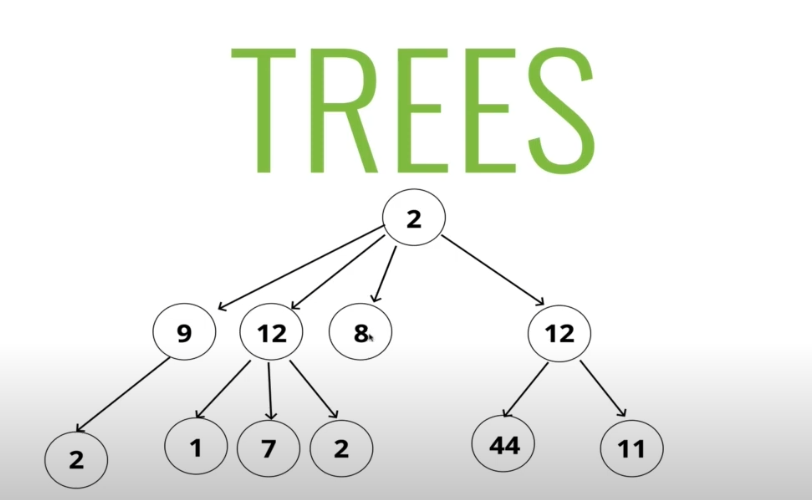
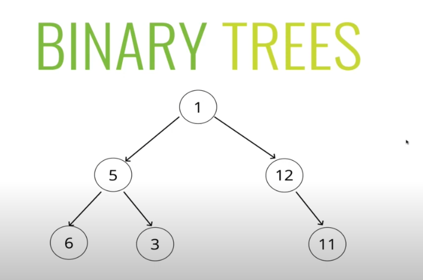
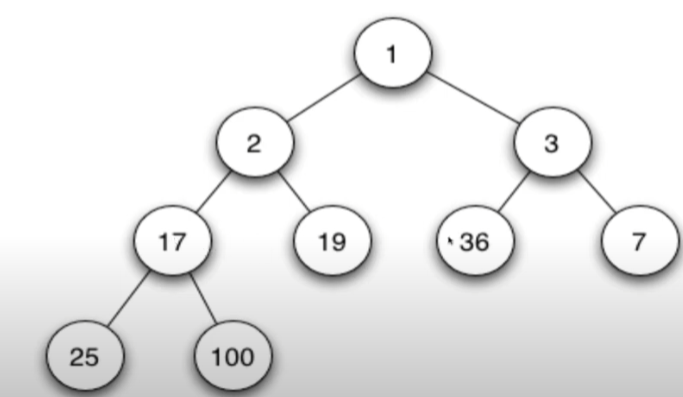
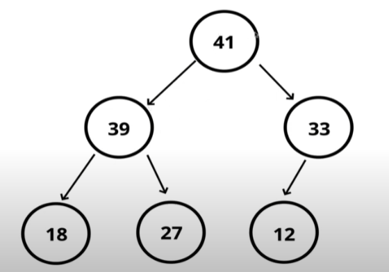

Big o notation - сложность алгоритма

Big O Notation - используется для описания (оценки) сложности алгоритма. Он показывает как будет меняться производительность алгоритма в зависимости от роста входящих данных. При увеличении входящих данных будет расти две вещи - время (за которое будет отрабатывать наш алгоритм) и кол-во памяти используемых для обработки этих данных.

Данная концепция:
- позволяет описывать скорость роста функции в зависимости от размера входных данных;
- может быть использована для оценки эффективности алгоритма по отношению к использованию как времени (временная сложность) так и памяти (пространственная сложность);
- полезна при сравнении различных алгоритмов и их потенциальной производительности при увеличении размера входных данных;

При разработке алгоритмов важно учитывать их о-нотацию:
- позволяет получить представление о том, как алгоритмы будут вести себя при больших объемах данных.
- позволяет нам работать с приближенными математическими выражениями, опуская меньшие слагаемые. Именно это причина позволяет нам не указывать основания по тому или иному критерию

- <strong>O(1)</strong> - константная сложность - код выполняется за одно и то же время, и никак не зависит от размера входных данных.
- <strong>O(n)</strong> - линейная сложность - время выполнения растет линейно с размером входных данных. Другими словами, чем больше входных данных (n), тем больше времени потребуется для выполнения алгоритма. Например используется в two pointers,
- <strong>O(log n)</strong> - логарифмическая сложность - ... . Например: бинарный поиск

--- 

Array (массив) - динамический и статический массив

В JavaScript массив — это особый тип объекта, предназначенный для хранения упорядоченных коллекций значений. Массивы позволяют хранить несколько значений в одной переменной и предоставляют множество методов для удобного управления этими значениями

Динамический массив — это структура данных, которая позволяет хранить элементы и изменять их количество в процессе выполнения программы. 
В JavaScript массивы по своей природе динамические, то есть их размер можно изменять без создания нового массива. 
Основные возможности динамических массивов в JavaScript включают добавление, удаление и изменение элементов

Статический массив в JavaScript относится к массиву фиксированного размера, где каждый элемент имеет один и тот же тип данных. В отличие от динамических массивов, 
которые могут изменять свой размер, статические массивы имеют заранее определенный 
размер, установленный во время инициализации.

Static array of 5 elements, это число фиксированное, создав один раз его потом нельзя 
будет изменить: `let numbers = new Array(5);`

Преимущество: 
1. Эффективное использование памяти . Статические массивы выделяют память только 
указанного размера, что приводит к предсказуемому использованию памяти.
2. Быстрый доступ : поскольку элементы хранятся последовательно, доступ к элементам 
в статическом массиве происходит быстро и эффективно.

Варианты использования статических массивов в JavaScript . Статические массивы полезны в различных сценариях, таких как:

1. Хранение коллекций данных фиксированного размера, таких как дни недели или месяцы года.
2. Реализация таблиц поиска или структур данных постоянного размера.
3. Обработка ситуаций, когда размер набора данных известен заранее, например сохранение результатов в таблице лидеров игры.

Более подробно здесь - [статический массив](https://medium.com/@manharsh1998/exploring-static-arrays-in-javascript-a-fundamental-data-structure-d401e437610f)

Hash-table - хеш-таблица

#### Различие между new Map и new Set

`Set` — это коллекция, которая хранит только уникальные значения. Основные случаи использования:

- Хранение уникальных элементов: Если вам нужно хранить набор данных, в котором все элементы должны быть уникальными, Set будет лучшим выбором. Например, если вам нужно хранить список всех уникальных слов в тексте.

- Быстрая проверка существования элемента: Set позволяет быстро проверять, существует ли элемент в коллекции. Операция проверки наличия элемента выполняется за время O(1).

- Удаление дубликатов: Если у вас есть список элементов с возможными дубликатами, и вы хотите получить только уникальные значения, Set поможет легко удалить дубликаты.

`Map` — это коллекция пар «ключ-значение», где каждый ключ уникален. Основные случаи использования:

- Ассоциативный массив: Если вам нужно хранить пары «ключ-значение», где каждый ключ ассоциирован с каким-то значением, используйте Map. Например, можно использовать Map для хранения телефонной книги, где ключом будет имя человека, а значением — его номер телефона.

- Быстрый доступ по ключу: Map позволяет быстро получить значение по ключу. Операция поиска по ключу также выполняется за время O(1).

- Подсчет количества встречаемых объектов: Если нужно подсчитать количество раз, сколько объект встречается, Map отлично подходит для этой задачи. Например, можно подсчитывать количество вхождений каждого слова в тексте, где слово будет ключом, а количество — значением.

Примеры использования:
- Если нужно хранить список уникальных чисел — используйте Set.
- Если нужно хранить соответствие ID и имен пользователей — используйте Map.
- Если нужно быстро проверять, присутствует ли элемент в коллекции — используйте Set.
- Если нужно подсчитать, сколько раз каждый элемент встречается в коллекции — используйте Map.
- Таким образом, Set используется для хранения уникальных элементов и проверки их наличия, а Map — для хранения ассоциативных пар, где важны и ключи, и значения.

#### Различие между weakMap и weakSet

WeakMap – это Map-подобная коллекция, позволяющая использовать в качестве ключей только объекты, и автоматически удаляющая их вместе с соответствующими значениями, как только они становятся недостижимыми иными путями.

Когда использовать:

- Хранение данных, ассоциированных с объектами, которые могут быть удалены сборщиком мусора: Например, если вы хотите добавить дополнительную информацию к DOM-элементам, но не хотите препятствовать их сбору мусора. Это полезно для предотвращения утечек памяти, особенно в приложениях с интенсивным использованием DOM.

- Кэширование: Когда нужно кэшировать данные, связанные с объектами, но при этом важно, чтобы сам объект мог быть удалён из памяти, если он больше нигде не используется.

WeakSet – это Set-подобная коллекция, которая хранит только объекты. Ссылки на объекты в WeakSet также являются слабыми, что позволяет удалять объекты из WeakSet, если они больше нигде не используются.

Когда использовать:

- Отслеживание объектов без предотвращения их удаления: Это полезно, если нужно отслеживать какие-то объекты, но при этом важно, чтобы сами объекты могли быть удалены из памяти, если они больше нигде не используются.

- Обработка данных без предотвращения их сбора мусора: Например, если нужно пометить объекты как "обработанные" в процессе, но при этом не препятствовать их удалению из памяти.

WeakMap и WeakSet используются как вспомогательные структуры данных в дополнение к «основному» месту хранения объекта. Если объект удаляется из основного хранилища и нигде не используется, кроме как в качестве ключа в WeakMap или в WeakSet, то он будет удалён автоматически.

#### Основные отличия от Map и Set:

- В Map и Set объекты остаются в памяти до тех пор, пока их явно не удалят. В WeakMap и WeakSet объекты могут быть удалены автоматически сборщиком мусора.

- WeakMap и WeakSet не поддерживают перебор элементов (forEach, for..of и т.д.), так как это могло бы нарушить их основную цель — слабые ссылки.

 Two pointers - метод двух указателей. Алгоритм: O(n)

Алгоритм для работы с массивами и строками. Суть данного алгоритма заключается в том, что он использует два индекса (указателя), которые двигаются по массиву. Например:

Этот метод позволяет эффективно решать задачи, которые требуют проверки пар элементов или подмассивов. Например сумма двух чисел которые эквиваленты общей сумме 40, или поиск палиндрома.

Stack and queue- стек и очередь 

Стек (stack) — структура данных, которая работает по принципу «последним пришёл, первым ушёл» (LIFO — last in, first out). Стек можно представить как некий контейнер, в котором элементы (например, числа, символы и так далее) могут быть добавлены в вершину, а затем извлечены только из вершины. В бытовом плане стек напоминает стопку тарелок. Тогда тарелка, которую положили первой, в самый низ, будет использована последней.

Существуют различные реализации стека. Например, стек может быть реализован на массиве, на односвязном списке, на двусвязном списке и так далее. Основные операции, которые можно производить со стеком, включают:

✅ Добавление элемента в вершину стека (push) - O(1)
✅ Удаление элемента из вершины стека (pop) - O(1)
✅ Возврат верхнего элемента без его удаления (peek) - O(1) 
✅ Проверка стека на пустоту (isEmpty) - O(1)

Стоит отметить, что стек представляет собой список с элементами и указателя на вершину стека, указывающего на последний элемент, добавленный в стек.

Каждый раз, когда в стек добавляется новый элемент, указатель на вершину смещается на следующий элемент. Когда элемент удаляется из вершины стека, указатель смещается на предыдущий элемент. Если указатель находится в конце стека, то стек пуст.

---

Очереди очень похожи на стеки. Они также не дают доступа к произвольному элементу. Очередь работает по принципу «первый вошел, первый вышел» (First-In-First-Out или FIFO). То есть забирать элементы из очереди мы будем в том же порядке, что и клали. Как реальная очередь или конвейер.

Очереди часто используются в программах для реализации буфера, в который можно положить элемент для последующей обработки, сохраняя порядок поступления. Например, если база данных поддерживает только одно соединение, можно использовать очередь потоков, которые будут, как ни странно, ждать своей очереди на доступ к БД.

Binary search - бинарный поиск

Бинарный поиск - это алгоритм поиска. С помощью него мы можем быстро и эффективно находить
необходимую нам информацию в больших объемах `отсортированных` данных. Например нам нужно найти
в словаре определенное слово или поиск по имени в контактном номере

Бинарный поиск имеет следующие сложности:
- Логарифмическая временная сложность — O(logN).
- Постоянная пространственная сложность по памяти — O(1).

Суть данного алгоритма заключается в следующем мы открываем нашу книгу по середине и смотрим
так как все отсортированы в алфавитном порядке, то мы сразу можем понять имя находится в левой
половине или в правой. Если мы понимаем, что она находится в левой половине, то всю левую часть мы 
выкидываем. Затем с правой части мы делаем все тоже самое мы делим ее на два и отбрасываем ту которая не подходит

Sliding window

Linked list - связанный список

Односвязный список - структура данных, в которых элементы хранятся линейно. Каждый элемент помимо того, что в себе хранит какие-то данные, он еще содержит ссылку на следующий элемент.

Стоит уточнить, что последний элемент ссылки равно null. У списка есть два свойства - Head (ссылка на самый первый элемент списка), Tail (ссылка на самый последний элемент списка)

Двусвязный список - отличается от односвязного списка тем, что он содержит ссылку на предыдущий элемент и на следующий элемент. 

Различие между списком и массивом
1. У списка нельзя найти элемент по индексу, в то время как у массива можно
2. Содержит ссылку на следующий элемент, в то время как у массива нет информа-
ции о следующем элементе

Trees

Trees - структура данных, которая состоит из узлов, связывающая между собой
в виде древовидной структуры. Состоит бинарное дерево из:
- root - начальный узел дерева, от которого исходят остальные узлы;
- parent - узел, который имеет дочерние узлы;
- child - узел, напрямую соединяенный с другим узлом при удалении от корня;
- leaf - узел, который не имеет детей
- siblings - группа узлов с одним родителям
- edge - направления 

Типы деревьев - trees, binary trees, binary search trees: 

Binary heap (двоичная/бинарное куча) - похож на бинарное дерево, отличительной чертой 
является то, что 
1. `MinHeap` - у нас на вершине дерево находится минимальное число, а в дочерних
максимальное.

2. `MaxHeap` -  у нас на вершине дерево находится максимальное число, а в дочерних минимальные.

Это не является binary-heap

