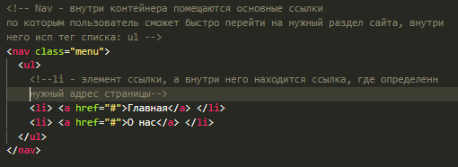
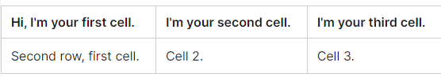
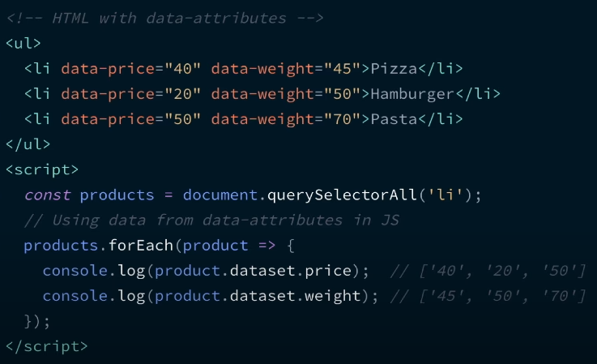
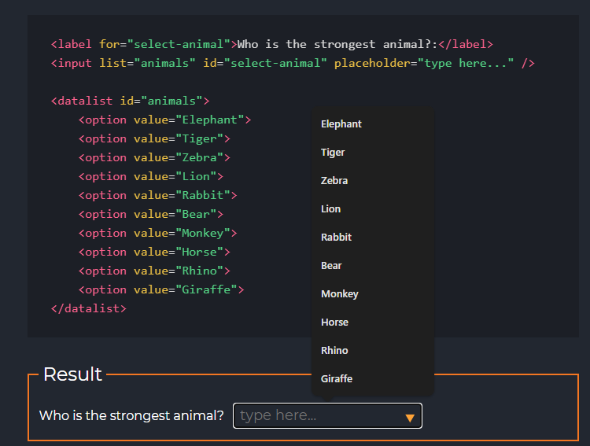
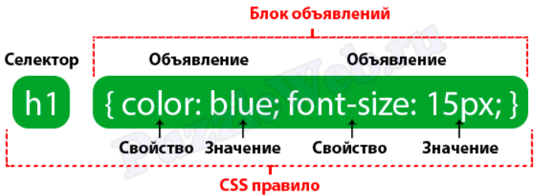
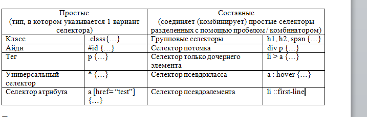
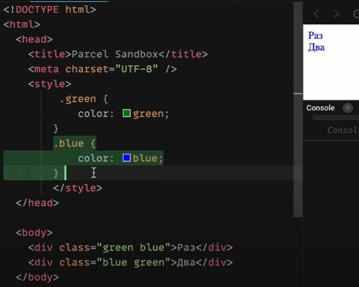

# Собеседование

<details>
<a id="question-from-hr"></a>
<summary> Какие вопросы задает HR и что можно у нее спросить?</summary>

### Какие вопросы задает HR

1\. `Почему вы решили покинуть компанию (ищите новое место)?` - Самая основная причина, что я на текущем месте работы уже больше 2 лет, новых проектов у нас не ожидается и все превращается в рутину. Сейчас как раз ищу новое место, чтобы не останавливать свое развитие и продолжать расти как специалист.

2\. `Чем вас заинтересовала наша вакансия?` - У вас команда большая (маленькая), люблю в таком кол-ве людей работать, так еще и интересный продукт (проект), который меня зацепил (заинтересовал) и я бы хотел бы как раз с этим продуктом поработать, также стек технологий, который описан у вас в вакансии схож с моим. 

3\. `Какая ЗП у вас на текущей работе?` - 220т на нынешнем, рассматриваю от 250т

4\. `У вас есть предложения от других компаний?` - Да, у меня есть один оффер и на следующей недели пару технических собесов, думаю до конца следующей недели уже решу куда. Я сейчас рассматриваю в основном либо ТК-РФ либо по ИП, а у вас как раз так.

5\. `С какими гибкими методологиями вы знакомы?` - Я работал с двумя методалогиями: это scrum - где было двухнедельная планирования задач. а рабочий процесс состоял из (бэклог -> в разработке -> ревью -> тестирование -> готово) и kanban где просто собирались и обсуждали текущие задачи в каждый день накидывали новые

6\. `Как Вы относитесь к работе в сверхурочное время?` - Если не успеваю и дедлайн горит, то я могу задержаться на работе. Но если это не каждый день конечно

7\. `Как вы оцениваете сроки выполнения задачи?` - Зависит от сложности самой задачи, обычно когда я вижу задачу, в начале обдумываю ее, обсуждаю что хотят от меня получить, изучаю проект и если есть какие-то стоперы, то беру и их в условия и так получаю оценку в задачи

8\. `Расскажите о ситуации, когда вы не укладывались в сроки?` - Обычно если я не успеваю завершить задачу в срок, то я предупреждаю об этом либо тим-лида либо проджект менеджера, и мы после созвона обсуждаем мои блоккеры и как их можно решить. Бывали много случаев как мы решали данные задачи - либо ко мне кто-то приходил на помощь и мы вместе думали как решить ту или иную задачу. Либо редкий кейс, но я работал сверхурочно, то есть знал, что это важная фитча и хотел поскорее его завершить.

9\. ` Расскажите о самых сложных проблемах, над которыми вы работали. Расскажите в подробностях, как вы их решали` - Когда я только пришел в ИТМО, меня попросили сделать редактор текста согласно определенной библиотеке, тогда половина команды уволилась, а другая половина была в отпуске из фронтов. Сроки были крайне малые, там просили сделать основных 4 расширения - жирность, курсив, надстрочный, подстрчоный текст и два дополнительных - гиперссылка и тултип. Основной трудностью было разобраться в механизме как работает данный редактор текста, и как добавлять туда дополнительные фитчи, но после пару дней внутри редактора текста и в гитхабе где разбирались те или иные вопросы - за 2 недели я смог реализовать основные расширения, и еще 2 недели ушло на реализацию оставшихся потому что они были неочивидные и сложные для понимания реализации. Также был опыт в полном переделывания легаси компонента из классовых компонентов в функциональных, там был достаточно большой проект со старым кодом и его было трудно поддерживать и компания решила его модернизировать на современный лад

10\. `Чем вы конкретно занимались?` - Если про текущее место работы, то у нас постоянное внедрения нового функционала - например завозили интерактивную карту для поиска ближайших отелей, создавали внутри компании специальный календарь по аналогии travelline где видели кто на какие даты забронировал номера. Работа с таблицами, с данными

11\. `Каким достижением на прошлой работе вы можете гордиться?` - Если про общую говорить, то благодаря полному переписыванию проекта с классов на функциональность и добавлением новых фитч, мы смогли увеличить кол-во пользователей из 2-3 заходов на сайт, до 150-200 ежедневных заходов. Также можно вспомнить, что у нас была проблема с организованностью кода, все писали по-разному. Я внедрил документацию по написанию кода и предложил единую архитектуру, что улучшило читаемость всего проекта.

### Что можно спросить у HR?

1\. Спросить про заработную плату (зп)? 

2\. Сколько длится испытательный срок? - 1-3 месяца норм. 

2.1. После испытательного срока увеличивается ли заработная плата или она остается такой же.

3\. Как часто поднимают заработную плату? - раз в пол года норм.

4\. Как я буду оформлен в компании? - Самозанятый, ИП, ГПХ, ТК РФ или без оформления

5\. Заключается ли NDA (соглашение о неразоглашении)?

6\. Выдают ли оборудование или мне необходимо со своим придти уже? - Если выдают то какое

7\. Можете рассказать по подробнее о проекте(ах) с которыми придется работать?

8\. Есть ли у компании какие-то цели на ближайшие годы? - Запуск новых проектов например

9\. Сколько времени приблизительно понадобится на принятие решение найма меня?

10\. Сколько будет этапов на собеседование?

11\. Если устраивается на позицию сеньора нужно уточнить сколько человек у тебя будет на попечении

12\. Сколько человек на проекте(ах)?

13\. Бывают ли переработки в компании и как часто бывают?

14\. По какому методологию работает - Scrum, canban, или таск треккер?

</details>

<details>
<a id="HTML"></a>
<summary>✅ HTML (HyperText Markup Language) - язык гипертекстовой разметки</summary>

<details>
<summary>Что такое HTML и опишите базовую структуру HTML-страницы? </summary>

HTML (Hypertext Markup language) – язык гипертекстовой разметки. Он используется для отображение веб-страницы в браузере. Базовая структура HTML состоит из 

1. `<!Doctype html>`, которая указывается в самом начале и сообщает browser, что мы используем последнюю версию HTML5

2. `<head>` - содержит информацию о документе, в нем может хранится заголовок, шрифты, стили и meta-tag. Meta-tag - дополнительная информация о веб-странице, которая затем передает информацию поисковой системе. Например:  

* кодировка: UTF-8; 
* имя автора страницы
* описание страницы;
* ключевые слова для продвижения. 
* `meta name="viewport"` - сообщает браузеру, как именно обрабатывать размеры страницы и изменять её масштаб.

```
`<meta name="viewport" content="width=device-width, initial-scale=1">`

1. meta name="viewport" -  сообщает браузеру о том, как именно обрабатывать размеры страницы,
и изменять её масштаб. 

2. content="width=device-width - ширина области просмотра, которая задает ширину в
соответствии с девайсом

initial-scale=1 - начальный масштаб страницы: 1.0 (обычно определяет). 
Свойство max-scale/min-scale – определяет как пользователям разрешено
увеличивать или уменьшать страницу. А если мы хотим запретить 
масштабирование используем user scalable: 0

```

3. `<body>` – содержит всю разметку html документа. Именно это разметка и будет отображается в браузере.

</details>


<details>
<summary>Есть ли у HTML – элементов свои дефолтные специфичные стили?</summary>

или: какие источники стилей применяется к веб-странице помимо наших.

Да, конечно есть, практически во всех: 
- У заголовках - это размер шрифта, отступ и жирность;
- У списков – маркеры и цифры; 

Однако стоит упомянуть, что в разных браузерах они могут отмечаться по разному, у кого-то размер шрифта побольше например, обычно прибегают к обнулению стилей (reset.css) или делает для всех стилей одинаковые стили (normalize.css)
</details>

<details>
<summary>Что такое inline стиль? Можно ли его переопределить?</summary>

Inline стиль – это стиль, который находится внутри определенного тега. У него вес 1000 и это самый большой вес селектора, которого крайне трудно переопределить. Переопределить его можно только с помощью !important, 
</details>
 

<details>
<summary>Что такое семантика? Какие семантические тэги вы знаете?</summary>

Раньше все программисты писали с помощью дивах и span, однако с появлением семантических тегов в HTML5, то много что поменялось. и они помогают браузеру и поисковым системам, анализировать и понимать структура, содержимое нашего веб-приложения. А также он повышает доступность (accessibility). Например для слабовидящих - screen-reader читает текст делая на каких-то словах акцент по типу strong или em. Вместо картинки, screen-reader читает поясняющий текст внутри img тега alt.
</details>


<details>
<summary>Какая разница между тэгами `strong` и `em` и `b` и `i`?</summary>

Теги: `strong` и `b` (bold) - делает текст жирным, 
Теги `em` (emphasis) и `i` (italic) - делает его курсивным. 

Основное отличие одни из них семантические (strong, em), а другие не семантические (b, i) - когда screen-reader читает теги strong и em он делает на них небольшой акцент, в то время как на b и i он не делает акцента

</details>

<details>
<summary>Как семантически верно сверстать навигационное меню?</summary>

</details>

<details>
<summary>Как можно скрыть элемент разметки не используя CSS и JS?</summary>

В html есть для этого специальный атрибут: hidden, однако это не самая лучшая практика влиять на страницу через разметку, так как он не виден не только для пользователя, но и для screen-reader. Данный тег глобальный и его можно добавлять везде. Его аналог в css – это display: none
</details>

<details>
<summary>Какой тег использовать для того, чтобы сверстать кнопку?</summary>

Обычная кнопка: `<button>Кнопка</button>`	

Кнопка подтверждения формы, используется:
```
<button type=”submit”>Иная кнопка</button>
<input type=”submit” value=”button>	

<input type = “button”>
```
</details>

<details>
<summary>Типы списков в HTML?</summary>

1. `<ul>` - маркированный список. Каждый элемент списка отмечается маркером: li;
2. `<ol>` - нумерованный список. Каждый элемент списка отмечается маркером: li;
3. Список определений, состоит он из следующих тегов: `dl` – основная обертка, `dt` – определения и `dd` – поясняющий текст;

</details>

<details>
<summary>Для чего используются тэги tr, th, td?</summary>

Данные теги используются внутри другого тега: `<table>`, а тот в свою очередь необходим для создания таблиц:

`<tr>` (table row) – контейнер для создания строки таблицы
`<th>` (table-header) – предназначен для создания одной ячейки таблицы в виде заголовка
`<td>` (table-data) – ячейка таблицы 

```
<tr>
  <td>Hi, I'm your first cell.</td>
  <td>I'm your second cell.</td>
  <td>I'm your third cell.</td>
</tr>
```


</details>

<details>
<summary>Для какого тэга используется атрибут alt и зачем он нужен?</summary>

Он пишется в img. Если вдруг у нас картинка не отобразится на странице, то вместо него отобразится (поясняющий) текст, тот который мы указали в alt. 

Данный атрибут также полезен для людей с ограниченными возможностями, когда страница будет читаться screen-reader, то при чтении и будет зачитываться то, что находится в alt. (Помимо этого использование атрибута улучшается accessibility (доступной страницы) так как различные screen-readers при чтении веб-страницы зачитывают его. В результате пользователи с ограниченными возможностями понимает контекст используемого изображения)

Она еще необходимо для валидации

</details>

<details>
<summary>Что такое валидация  HTML-разметки? И какие типы проверок HTML документа вы знаете?</summary>

Валидация HTML-разметки — это проверка написания кода согласно W3S (World Wide Web Consortium). Это платформу в которую мы можем перетащить наш html-код, чтобы он проверил его на ошибки. Ошибки могут быть разного вида, где то закрывающий тег не указал, где-то к картинке в атрибутах альт не указал. 
</details>


<details>
<summary>Почему хорошей практикой считается располагать link для подключения CSS стилей внутри тэга head, а script для подключения JS ставить перед закрывающим тегом body</summary>

1. Тег link внутри шапки сайта описана в спецификации HTML. Если в head находится stylesheet, то страница загружается быстрее 

2. Сначала подключаются html и css при первой загрузке страницы и они должны находится в самом header. После того как все загрузилось используется js, если мы поставим js в самое начало, то оно будет блокировать (загрузку) от рисовку html. Размещение скриптов внизу позволяет сперва распарсить и показать пользователю весь HTML, а затем уже добавить к нему логику.

</details>

<details>
<summary>Разница между `script`, `script async` и `script defer`? (Асинхронный и отложенный)</summary>

Обычно браузеры загружают `script` синхронно, во время разбора документа. Поэтому принято добавлять скрипты в конец документа, перед `</body>`, чтобы они не тормозили загрузку страницы. Но при помощи атрибутов defer и async можно явно управлять порядком загрузки и выполнения скриптов.

* `<script async src="...">` => скрипт выполняется параллельно c чтением html документа. Он не будет ждать когда произойдет загрузка и отображение веб-страницы. Он  хорош для независимых скриптов, например счётчиков и рекламы, порядок выполнения которых не играет роли.

* `<script defer src="...">` – указывает браузеру, что скрипт должен быть выполнен после того, как как произойдет полная загрузка html. 

На практике defer используется для скриптов, которым требуется доступ ко всему DOM-дереву или если важен их порядок выполнения.

Дополнительный вопрос: есть несколько идущих подряд скриптов с атрибутом async. Порядок их загрузки и выполнения будет соблюден ? А с defer

</details>


<details>
<summary>Для чего используют data-атрибуты?</summary>

Появился он в HTML-5 и data-атрибуты позволяют хранить дополнительную информацию прямо в тегах HTML-кода. Например: data-size, Также с помощью определенного синтаксиса можно легко стилизовать его. `[data-age="46"] {}`



</details>


<details>
<summary>Для чего используется элемент datalist? </summary>

Используется для создания выпадающего списка, которое можно выбирать при наборе в текстовом поле и datalist с атрибутом id должен полностью совпадать с содержимым: "" с input элементом атрибутом лист. 



</details>


<details>
<summary>Типы `input` элементов в HTML? (Необходимо перечислить их и назвать особенности)</summary>

Input – элемент необходим для общения (коммуникации) с пользователям, он предназначен для получение вводимых данных. У него есть атрибут type 

`input type = "text"` - предназначенный для ввода букв, цифр и специальных символов. 
`input type = "password"` – используется для паролей. Его особенность - отображаются как звездочки. 
`input type = "email"` - предназначен для ввода “email” пользователи.  
`input type = "number"` - позволяет вводить только числовое значение ну и при фокусировке на нем открывается клавиатура, содержащие только цифры. 
`input type = "button" (input type = "submit")` – поле для ввода. В этом случае превращается в кнопку, с помощью "submit” можно даже отправить форму. 
`input type = "checkbox" (radio)  button` - заменяет поле ввода на специальные элементы либо квадрат с галочкой либо кружок с точкой. 
`input type day month daytime local` - предназначены для ввода даты. 
</details>


<details>
<summary>Представьте HTML5 как открытую веб-платформу. Из каких блоков состоит HTML5?</summary>

•	Семантика (позволяет более точно описать из чего состоит контент);

•	Стилизация (позволяет создавать более сложные темы оформления);

•	Доступ к устройствам (позволяет взаимодействовать с различными устройствами ввода и вывода);

•	Связанность (позволяет общаться с сервером);

•	Офлайн и хранилище (позволяют страницам хранить данные локально на клиентской стороне и более эффективно работать в offline);

•	Мультимедиа (создание и подключение видео и аудио);

•	2D/3D-графика и эффекты (позволяет расширить возможности презентации);  

•	Производительность и интеграция (обеспечивает большую скорость оптимизации и лучшее использование аппаратных средств).
</details>
</details>

<details>
<a id="CSS"></a>
<summary> ✅ CSS (Cascading Style Sheets) - каскадная таблица стилей</summary>

<details>
<summary>Что такое CSS и для чего он используется? Что такое CSS-правило?</summary>

CSS (Cascading Style Sheets - каскадная таблица стилей), необходим для стилизации html-разметки. Существует несколько вариантов добавление стилей. Например: 

- inline-style - это когда внутри html тега пишется style и вес его слишком большой.   

- Внешние стили - когда в html, в хедере пишем стиль

- Создаем отдельный файл со стилями и подключаем через links, в элементе head, `<link rel="stylesheet" type="text/css" href="style.css">`

Мы выносим стили в отдельный css-файл, чтобы отделить логику и структуру веб-страницы (написанную на HTML) от описания её внешнего вида. Такое разделение дает больше гибкости и возможностей, а также позволяет уменьшить сложность и повторяемость в структурном содержимом.

СSS-правило относится к синтаксису CSS. Синтаксис состоит из селектора и блока объявлений, в котором описываются свойства со значениями:



CSS-правило сообщает браузеру, что и каким образом будет отформатировано тот или иной селектор. Например: изменить цвет текста заголовка, выделить изображение красной рамкой, установить ширину блока в 200 пикселей и т.д. 
</details>

<details>
<summary>Что такое селектор? И какие селекторы существуют? Специфичность селекторов</summary>

Селектор необходим для стилизации HTML-кода. Селектор сообщает браузеру к какому элементу(ам) будет применен стиль. Они делятся на простые (исп 1 селектора) и составные (объединяет простые селектора). Например к простым можно отнести - селектор класса, id или tag, `*` - универсальный селектор, который будет применять стиль ко всем. 

К составным: групповой селектор (когда мы пишем через запятую селектора), что в свою очередь избавляет от дублирования; есть также псевдокласс (определяет его особое состояние) и pseudo-elements (позволяет стилизовать определённую часть выбранного элемента). Есть селектор потомка, который будет стилизоваться только внутри родительского элемента без вложенности. 

 

Также стоит отметить, что есть такое понятие как специфичность селекторов. И из-за специфичность селекторов могут некоторые стили не применяться (конфликт стилей). Например у нас есть два css-правила один написанный через id, а другой через класс, и применится тот стиль, который написан в id - так как его вес больше. Если говорить иначе, то стили которые мы пишем внутри тега html - то есть inline-style имеют вес 1000, их переопределить можно через important; вес у ID - 100; классы,  pseudo-classes и атрибуты имеют вес 10, а элемент, звездочки и псевдоэлемент - 1. 

```
li	                                  => 1
ul li	                  1 + 1         => 2
#main .item	            100 + 10      => 110
h1 + *[href= “test”]	  10 + 1        => 11
#test p	                100 + 1       => 101
li. item.main	          1 + 10 + 10   => 21
#test	                                => 100
ul ol li .item	      1 + 1 + 1 + 10  => 13
ul ol+li	            1 + 1 + 1       => 3
a:hover	              1 + 10          => 11
```

Стоит отметить, что если специфичность одинаковая то срабатывает последний стиль


<details>
<summary>Разница между классом и идентификатором (id) в CSS? Когда что использовать</summary>

* id - должен быть уникальным и встречаться на странице 1 раз. Вес id - 100; и id у элемента должен быть только один. Для добавлении логики

* class - можно задавать и использовать много раза. Вес класса - 10; у одного элемента может быть несколько классов. Для добавление стилей

</details>
</details>

<details>
<summary>Что такое pseudo-elements (псевдоэлементы) и pseudo-classes (псевдоклассы)?</summary>

1. Псевдоэлемент – это кл.слово, которое добавляется к селектору, тем самым позволяет стилизовать определенную часть выбранного элемента. 

`::first-letter` – позволяет стилизовать первую букву в тексте, например сделав его красным;

`::first-line` - позволяет стилизовать первую строку в тексте, например сделать все буквы - большими через uppercase();

`::placeholder` - позволяет стилизовать input или textarea, изменив там цвет на красный;

`::marker` - позволяет стилизовать списки маркированные;

`::before и ::after` – который позволяет добавлять дополнительный контент до и после основного контента. Например мы можем написать кавычки перед и после основного контента;

2. Псевдокласс - это кл.слово, которое добавляется к селектору и работает с его состоянием. Например у нас есть абстрактная ссылка с помощью: 

`:hover` - мы можем изменить при наведении на ссылку;

`:active` - по клику мы можем изменять его цвет;

`:visited` - после того как зашли изменить цвет не на фиолетовый а на ярко-голубой;

`:disabled` - может любой input поле disable;

Например у нас есть 3 блока, и мы хотим скрыть 3 или первый и второй мы можем использовать `nth-last-child()`;
</details>


<details>
<summary>Что такое box-sizing в СSS? Блочная модель CSS?</summary>

Данное свойство определяет как вычисляется общая ширина и высота элемента. По умолчанию у box-sizing стоит content-box, он в свою очередь считает только ширину и высоту, если . Например у нас ширина 100 пикселей, и мы хотим добавить padding-left: 10px, ширина будет уже 120px и это ширина будет постоянно расти, увеличивать блок

Однако второе значения работает иначе, он считает вместе с высотой и шириной. Если в первом случае оно не считалось, то во втором оно считает. Тот же самый пример ширина 100 пикселей, добавим padding-left: 20 px - и изменения будут происходит внутри блока, а ширина останется таким же. 

Если мы начали говорить про box-sizing: border-box, то стоит упомянуть блочную модель CSS. Это правила, по которым браузер определяет размер элемента на странице, его ширину и высоту. Он состоит из следующих свойств: 

- содержимое (это может быть текст, изображение, видео и др.), ширина (содержимого), которого задается свойством width, а высота (содержимого) через height;
- padding — внутренний отступ;
- border - границы 
- margin - внешние отступы
</details>

<details>
<summary> Что такое схлопывания внешних отступов (margin collapsing)? </summary>

Схлопывание границ (margin collapsing) - это когда margin-top и bottom
объединяются в один общий отступ. Например у нас есть 2 margin: 10 и 50 пикселей. И будет не 60 пикселей отступа, а 50. 

Существует достаточно много способов как решить данную проблему. Например написав вместо margin - paddings или через псевдокласс last-child с нулевым margin
</details>

<details>
<summary> Разница между относительными и абсолютными величинами?</summary>

1. Абсолютные единицы имеют фиксированное значение. К нему относятся: px (`пиксели`), cm (`сантиметры`), mm (`миллиметр`), in (`дюймы`). 

2. Относительные определяют размер какого-либо элемента относительно другого размера. К нему относятся: 

- em (п.с. относительно родительского элемента, если установлен размер шрифта родительского элемента равный 18 пикселей, то 1em будет равно 18 пикселям)

- rem (п.с. относительно корневого элемента. Например: в html, font-size будет 16 пикселей. Если мы каком-то блоке напишем 2 рема, то будет 32 пикселя. Он унаследуется от корневого элемента)

- vh (viewport height) и vw (viewport width) - это высота и ширина области просмотра (окна браузера), где 1vh = 1% от высоты viewport, а 1vw = 1% от ширины viewport.

- % - процент от значения того же свойства у родительского элемента (например, width: 50% будет равна половине ширины родителя).

</details>

<details>
<summary> Типы позиционирования в CSS?</summary>

* Static position (нормальное / статическое позиционирование) - значение по умолчанию, свойства top, right, bottom, left игнорирует;

* Relative position (относительное позиционирование) - элемент сдвигается относительно его обычного положения. Его можно менять с помощью top, right, bottom, left. 

* Absolute position (абсолютное позиционирование) - исчезает из того места в котором был и позиционируется заново. Остальные элементы располагаются так, как буд-то этого элемента и не было. Координаты: top, right, bottom, left отчитываются от ближайшего позиционированного родителя или от всего документа. Он работает с z-index. 

* Fixed position (фиксированное позиционирование) - когда нам необходимо зафиксировать какой-то контейнер в одном месте и при scroll он будет идти вместе с нами.

* Sticky position (липкое позиционирование) - похож на фиксированное позиционирование. Отличие от него, то что он крепится в рамках какого-то блока, а не всего документа. Нельзя позиционировать элемент по горизонтали, а может только по вертикале через свойства (top, bottom) - относительно вверха низа страницы 

--- 

Дополнительный вопрос: Что такое z-index, как он работает, с какими position он работает?

Он работает с относительным, абсолютным и фиксированным позиционирование. Когда нам необходимо какой-то элемент поставить поверх другого элемента, то с помощью z-index мы можем это сделать. У него работают как положительные, так и отрицательные значения. Максимальное число 9 999 999 999
</details>

<details>
<summary> Свойство display - какие значение принимают и как они работают?</summary>

1. None - это когда элемент не показывается на экране вообще;

2. Block - это блочные элементы, которые располагаются вертикально один за другим. Он стремится расширится на всю доступную ширину;

3. Inline - они располагаются на одной строке, последовательно одним за одним. Ширина и высота по содержимому и менять высоту и ширину нельзя;

4. Inline-block - элемент является строчным, но при этом ему можно задавать ширину и высоту;

5. Flex;

6. Grid;

7. Table;

8. List-item

Есть еще глобальные ключевые слова: 

8. initial - стандартное поведение свойства. То есть говорит браузеру использовать значение по умолчанию для заданного CSS-свойства. Например, для свойства color значение initial всегда будет black;

9. inherit - наследует свойство из родительского элемента;

10. unset - если оно наследуется, то ведет себя как inherit, а если нет, то как initial;

11. revert - сбрасывает стили до первоначального заданных браузером значений;
</details>

<details>
<summary>Расскажите про поток документов в CSS</summary>

Это порядок вывода элементов на страницу.  В обычном виде все блоки выводятся в том порядке, в котором они записаны внутри HTML-документа без стилей. 

нормальный поток документа - это тот поток документа у которого нет стилей вообще
</details>

<details>
<summary> Как с помощью CSS определить, поддерживается ли свойство в браузере?</summary>

Для этого есть специальная директива @supports(){}. Она проверяет, поддерживается ли свойство, правило, или css-селектор в браузере. В круглых скобках пишется условие проверки, а в фигурных скобках код, который выполнится, если условие поддерживается. Пример:
</details>


<details>
<summary> Какие фильтры есть в CSS?</summary>

1. `Blur (px,em)`	- размытие по Гауссу к исходному изображению. Чем больше радиус, тем больше размытие. Начальное значение: 0
2. `Brightness (%, 10-дробь)` - изменяет яркость изображение. Также чем больше, тем ярче. Начальное значение: 1
3. `Contrast (%, 10-дробь)` -	регулирует контрастность между самым темным и светлым участком фона. Начальное значение: 100%, ниже будут уменьшать контрастность, а выше будут увеличивать
4. `Drop-shadow`		Смещение по оси Х смещение по оси Y размытость растяжение цвет тени
5. `Grayscale (%, 10-дробь)` - извлекает все цвета из картинки, делая на выходе черно-белое изображение.
</details>

<details>
<summary> Для чего используется ключевое слово currentColor в CSS?</summary>

Current color работает как переменная, , которая всегда содержит текущее значение свойства color элементаесли у нас у кнопки есть цвет синий, то он наследует этот цвет. И если поменяется основной цвет, то поменяются и все остальные

</details>


<details>
<summary> Что такое CSS-атрибут (attr)?</summary>

CSS-атрибут (attr) - с помощью данной CSS-функции, мы можем брать значении из HTML атрибутов и добавлять в стили

```js
// HTML
<button data-tooltip="Добавить в корзину">Купить</button>
<a href="#" title="Перейти на главную">Главная</a>

// CSS
button::after {
    content: attr(data-tooltip);
    display: none;
}

a::before {
    content: "Подсказка: " attr(title);   // Выводим значение title в подсказке
}
```
</details>

<details>
<summary>Что такое CSS-спрайт? И для чего он используется?</summary>

CSS-спрайт — это техника, когда множество небольших изображений (обычно иконок) объединяются в один большой файл.


Плюсы:

- Сокращает кол-в запрос на сервер - из 20 картинок условно отправляем 1
- Значительно ускоряет загрузку страницы
- Бандл становится меньше

</details>

<details>
<summary>	Что такое вендорные префиксы (vendor prefix)? И для чего они используются?</summary>

Вендорные префиксы – это приставка к названию CSS – свойства, которые добавляют производители браузеров для не стандартизированных (специфических) свойств.

```
-o-	Opera
-moz-	Mozilla
-ms-	Microsoft
-webkit-	Apple
```

Работают они следующим образом: для элемента прописывается CSS свойство в прямом виде для браузеров, которые его понимают. Следом за ним через точку с запятой перечисляется то же самое свойство, но с разными вендорными префиксами для разных браузеров. Браузер из такого кода интерпретирует только то свойства, которое написано под него, а написанные для других браузеров игнорирует.
Может быть вопрос: где можно посмотреть, как поддерживается то или иной свойство? -  Ответ: https://caniuse.com/flexbox

</details>

<details>
<summary> Разница между reset.css / normalize.css</summary>

Практически все html-элементы содержат дефолтные стили: размер и жирность шрифта, внутренние и внешние отступы и др. Основной нюанс заключается в том, что каждый браузер применяет разные стили. И для того, чтобы вверстка выглядела одинокого, используют обнуления стилей: reset.css / normalize.css

Они подключаются в самом начале css-файла. И reset.css сбрасывает все дефолтные стили на ноль, а normalize – нормализует (стабилизирует) для различных браузеров – сохраняет дефолтные стили и делает их везде одинаковым. Недостатком reset.css – это то, что мы стили пишем заново. История: https://www.youtube.com/watch?v=KGYmOlNteas

</details>
</details>

<details>
<summary>Задачи по HTML и CSS, а также БЭМ и методологии KISS, DRY, YAGNI</summary>


<details>
<summary>Как сделать с помощью html и css: круг, прямоугольник, квадрат, треугольник, стрелу
</summary>

`Круг` - border-radius: 50%

`Прямоугольник` - ширина должна быть больше высоты

`Квадрат` - ширина и высота должны быть одинакового размера

`Треугольник` 

```
border-left: 50px solid transparent;
border-right: 50px solid transparent;
border-bottom: 100px solid red;
```

`Стрела`

Стрела направо - transform: rotate(-45deg);
Стрела налево - transform: rotate(135deg);
Стрела вверх - transform: rotate(-135deg);
Стрела вниз -  transform: rotate(45deg);
</details>

<details>
<summary>Перечислите способы центрирования блока</summary>

1. Через флексбокс: 
```
display: flex;
justify-content: center
align-items: center

```
2. Через margin: 0 50; а также margin: auto
3. Через абсолютное позиционирование
4. Через vertical-align: middle
</details>

<details>
<summary>Как изменить направления оси flex-контейнера?</summary>

display: flex;
flex-direction: column
</details>

<details>
<summary>Как сделать анимацию бесконечно повторяющейся?</summary>

Animation-duration: infinite
</details>


<details>
<summary>У нас есть список из пяти скажем так блоков, как сделать так, чтобы 5 блок был не виден</summary>


Через псевдокласс nth-child или last-child
</details>

<details>
<summary>Как сделать кастомный чекбокс</summary>

</details>

#### Методологии

<details>
<summary>1. БЭМ</summary>

БЭМ - методология, которая расшифровывается как блок, элемент, модификатор, разработан он яндексам и решает проблему naming, то есть делает имена CSS-классов максимально информативными для разработчиков, но это больше рекомендации naming. 

--- 

Блоки - это независимые единицы, которые могут состоять из других блоков или элементов. Элемент является его дочерним элементом. А модификатор - класс, который позволяет стилизовать элемент, который отличается от других элементов этого порядка

Например у нас есть меню на сайте - блок; ссылки в меню - это элемент; а разный цвет ссылок в зависимости от темы - модификатор

</details>

<details>
<summary>2. DRY, KISS, YAGNI</summary>

DRY (Don't repeat yourself) - данный принцип говорит о том, чтобы мы не повторяли код. А написали его в одном месте, а потом использовали бы в разных логику его. 

KISS (Keep it short simple / keep it simple, stupid) - делайте код было легким для понимания, а не сложным.

YAGNI (You ain't gonna need it) - не стоит писать код, который может не понадобится в будущем. 
</details>
</details>

<details>
<summary>✅ Вопросы по GIT</summary>

1. Как можно минимизировать кол-во merge конфликтов ? git

2. Расскажи про git хуки

3. Расскажи что знаешь про методологии git flow и github flow
</details>

<details>
<summary>✅ JS (JavaScript) - Основы</summary>

<details>
<summary>Перечислите типы данных в JavaScript? </summary>

В JavaScript существует 8 типов данных, их можно разделить на примитивные и ссылочные. К примитивным относятся: `string; number; bigInt; boolean; symbol (unical id); null и undefined`. А к ссылочному относится `object (объекты)`. 

Функции, массивы также относится к объекту из-за прототипа и прототипного наследования

Если говорить про объекты то они передаются по ссылке, а примитивы по значению

<details>
<summary>Доп.вопрос: В чем разница между null и undefined?</summary>

В том, что `Undefined` - это когда переменная объявлена, но мы ей не присвоено значение, а `null` - когда мы присвоили значение специально, и как бы говорим, что у нас есть переменная и она пустая.

Кстати при нестрогом сравнение undefined и null дает true, а при строгом false, а также при сравнение null == 0 дает false
</details>

<details>
<summary>Доп.вопрос: Как мы можем определить к какому типу данных относится та или иная переменная?</summary>

А определить тип данных можно с помощью typeOf.

Typeof возвращает следующие значения - "undefined", "boolean", "number", "string", "bigint", "symbol", "function", "object"


```js
console.log(typeof 0)                               // * number
console.log(typeof true)                            // * boolean
console.log(typeof 'Javascript')                    // * string
console.log(typeof undefined)                       // * undefined
console.log(typeof Math)                            // * object, так как встроенный глобальный объект
console.log(typeof Symbol('JS'))                    // * symbol
console.log(typeof null)                            // * object
console.log(typeof function() {})                   // * function
console.log(typeof NaN)                             // * number
console.log(typeof typeof 100)                      // * string
```

</details>

<details>
<summary>Доп.вопрос: JavaScript статически, или динамически типизированный язык?</summary>

Динамически типизированный язык, так как происходит автоматическое преобразование типов
</details>

<details>
<summary>Доп.вопрос: Как превратить любой тип данных в булевое и разница между явным и неявным преобразованием?</summary>

В JS мы можем явно преобразовать типы, всего их три: String(), Boolean(), Number() - и все они являются функциями.

Чтобы превратить тип данных в булевый можно использовать:

1. Функцию Boolean(null)
2. !! (Двойное логическое не), `Допилить идею: Если мы применим его к не пустой строке, то оно сначала станет false, а затем true`

Чтобы превратить тип данных в числовое можно использовать:

1. Функцию Number('5')
2. метод parseInt("5")

Что превратить тип данных в строку можно использовать:

1. Функцию String(null)
2. Или через метод Object.prototype.toString(43)

Разница заключается в том, что неявное преобразование происходит автоматически путем арифметических действий, а явное когда мы указываем тип специально через функции Number или ParseInt, функцию String или метод toString, Boolean или двойное логическое !!


```js
console.log(Boolean("0"))             // true
console.log(Number(" 123 "))          // 123
console.log(Number(true))             // 1
console.log(Number(false))            // 0
console.log(Number(' 123z '))         // NaN
```

</details>

<details>
<summary>Доп.вопрос: Перечислите все ложные (falsy) значение? </summary>

Falsy - это следующие значение: "", 0, null, undefined, NaN, false. А все остальное уже true

</details>

<details>
<summary>Доп.вопрос: Что такое NaN?</summary>

NaN (not-a-number) - не является числом. Мы получаем его когда выполняем математическую операцию неправильно. Например, если мы infinity разделим на infinity, то оно нам даст NaN. Для того, чтобы проверить, что число не является числом использует функцию isNaN().
А его особенностью можно выделить то, что она не равна ничему даже самому себе как в строгом, так и в нестрогом сравнении.

</details>
</details>

<details>
<summary> Какие операторы есть в JavaScript? </summary>

`Арифметические операторы`: сложения; вычитания; умножения; делание; возведение в стене `**`; взятия от остатка `%`.

`Операторы сравнения`: > (больше); < (меньше); = (равно); != (не равно), == (нестрогое сравнения) и === (строгое сравнения)

`Логические операторы:`: || (или), && (и), ! (логическое не) 

<details>
<summary>Доп.вопрос: Чем отличается строгое сравнения от нестрогого?</summary>

Нестрогое сравнивает только значения без приведения типов, а строгая сравнивает и значения и типы

</details>

<details>
<summary>Доп.вопрос: Расскажи про логические операторы и их способности?</summary>

К особенностям можно отнести приоритетность, то есть `И` будет выполнятся раньше `Или`, но если мы обернем в скобки то данная приоритетность уже не будет иметь разницы.

- || (Или) - ищет первое истинное значение и возвращает его. А если его не находит, то возвращает последнее значение. У него приоритетность - 5
- && (И) - ищет первое ложное значение и возвращает его. А если оба значения являются истинными, то возвращает последнее. Приоритетность - 6
- ! (Логическое не) - меняет значение на противоположное. Например если строку мы обернет в логическое !'str', то у нас false. Приоритетность - 15
</details>

<details>
<summary>Доп.вопрос: Что такое оператор нулевого слияния ??</summary>

Он возвращает значение правого операнда, если левый операнд содержит null или undefined, в противном случае возвращается значение левого операнда. Он похож на || (Или), так как он возвращает правый операнд если в левом хранится ложное значение, а не только null / undefined
</details>

</details>

<details>
<summary> Расскажите про циклы в JavaScript?</summary>

Циклы нужны для того, чтобы повторить какое-то действие несколько раз. Существует несколько видов циклов: 

1. Классический цикл `for (let i = 0; i > str; i++) {...}` 
2. Цикл через `for in` ==> `for (const name in obj) {...}` служит для перебора объекта и возвращает нам ключи. Если нам необходимо получить значения, внутри цикла нам необходимо в квадратных скобках написать значения. А если мы решим использовать их в массиве, то получим индексы.
3. for ... of - служит для перебора массива и возвращает нам значения.

<details>
<summary> Доп.вопрос: Что такое выражения (expression) и инструкции (statement)</summary>

I. Выражение - это арифметическое действие. Например:`+, -, *, /, %, >, =, ==, i++, --i`, `Math.random - случайное число`.

II. Инструкция - это фрагмент кода, который выполняет определенное действие. К инструкциям относятся: `if, if-else, while, for, for..in, for..of switch, for-in, объявления переменных`
</details>

<details>
<summary> Доп.вопрос: Что такое switch/case и где он используется? </summary>

Switch + case - это по сути аналог if ... else, где выражение switch сравнивается с различными значениями case. 
Внутри каждого case используется break, чтобы выйти из конструкции и избежать выполнения следующих блоков. А
также есть default, который означает что не одно из условий не выполнено

Если говорить про react, то используется он в reducer (redux). И например когда нам нужно именно точное сравнения
</details>

<details>
<summary> Доп.вопрос: Отличие while и do while</summary>

do ... while - должен выполнится хотя бы один раз и не важно верны ли условия или нет, в то время как while может и не выполнится если условия не подходят

`while (условие) { // тело цикла }`
`do { // тело цикла } while (условие);`
</details>


</details>

<details>
<summary>Какие ты знаешь методы у строк JavaScript?</summary>

- `.toUpperCase()` - берет строку и пишет ее с большой буквы (преобразованное в верхний регистр).
- `.toLowerCase()` - берет строку и пишет ее с маленькой буквы (преобразованное в нижний регистр).
- `.split()` - делает из строки массив
- `.trim()` - удаляет пробельные символы с начало и конца строки
- `.startsWith()` проверяют начинается-ли строка с определенного символа который мы укажем внутри
- `.endsWith()` делает противоположное, то есть заканчивается строка c определенным символом
- `.repeat()` - повторяет строку указанное количество раз
- `.includes()` - проверяет, есть ли внутри строки указанная подстрока (часть текста). Возвращает true или false.
- `.replace()` - находит в строке первое совпадение с шаблоном (или строкой) и заменяет его на указанную новую строку.
- `.slice()` - вырезает часть строки и возвращает ее, не меняя оригинал. Можно указать с какого индекса начать и где закончить.

<details>
<summary>Доп.вопрос: Расскажи какие знаешь методы чисел (number) и математические (math) </summary>

#### 1. Number method

- `.toString()` - число преобразовывает в строку
- `.parseInt()` - берет строку и возвращает целое число
- `.isNaN()` - проверяет, является ли значения числа NaN
- `.isFinite()`- проверяет, является ли число конечным;

#### 2. Math method

- `.min(1, 2, 3)` - вернуть минимальное число
- `.max(2, 3, 4)` - вернуть максимальное число
- `.random(1, 2, 3)` - можно получить рандомное число
- `.floor()` - округляет в меньшую степень
- `.ceil()` - округляет в большую степень
- `.pow(2, 3)` - принимает два значения и возвращает возведенную степень `(3, 3) // 27`
- `.abs()` - возвращает абсолютное значение числа. Если это пустые кавычки или пустой массив, то это 0

Ну и другие по типу косинуса, синуса метода
</details>

<details>
<summary>Доп.вопрос: Расскажи какие знаешь методы массива (array)</summary>

`.filter()`
`.map()` 
`.forEach()`
`.sort()` 
`.reduce()` 
`.concat()` - когда есть два разных массива и нам нужна их объединить
`.isArray()` => проверяет является ли значение массивом
`.find()` - вернёт первый найденный в массиве элемент, который подходит под условие.
`.findIndex()` - возвращает уже не найденный элемент, а индекс

Следующие 4 метода меняют исходных массив

`.push()` - добавляет элементы в конец массива и возвращает новую длину массива.
`.pop()` - удаляет из массива последний элемент и возвращает его значение.
`.unshift()` - добавляет элементы в начало массива и возвращают новую длину массива.
`.shift()` - удаляет из массива первый элемент и возвращает его значение.

<details>
<summary>Доп.вопрос: Что будет работать быстрее `pop`, `push` shift и unshift</summary>
</details>

Что будет работать быстрее? => Pop и push - так как их задача лишь добавить или удалить элемент в конце массива, а shift и unshift медленнее так как помимо удаление или добавления первого элемент они будут сдвигать массив вправо или влево.
</details>

<details>
<summary>Доп.вопрос: Что ты можешь рассказать о методах .splice(), .slice()</summary>

`.splice()` - меняет исходный массив, добавив либо удалив по индексу данные

`.slice()` - возвращает новый массив, содержащий какую-то определенную часть исходного массива. Например когда нам надо вернуть не весь массив, а только первые 2 элемента
</details>


<details>
<summary>Доп.вопрос: Какие методы мутируют и не мутирует исходный массив?</summary>

Мутирует - .sort, .reverse, .push. .pop, .shift, unshift, .splice

Не мутируют - map, filter, slice, concat,
</details>

</details>

<details>
<summary>Расскажите про объект?</summary>

Объект в JavaScript — это тип данных, который используется для хранения коллекций значений в виде пары ключ: значение. Ключи — это обычно строки (или символы), а значения могут быть любыми типами данных, включая другие объекты. И объекты никогда не равны друг другу, так как имеет ссылочный тип данных.

<details>
<summary>Доп.вопрос: какая разница между объектом и массивом</summary>

- У массивов есть методы тех, которых нет у объекта, также и наоборот
- Чтобы обратится к какому-то элементу в массиве мы должны использовать индекс от нуля. А у объекта обращение идет через точку
- Также у массива есть свойство length - делает подсчет всех элементов внутри массива.
</details>

<details>
<summary>Доп.вопрос: как мы можем определить наличие св-в в объекте</summary>

- `hasOwnProperty()` - проверяет наличие свойств только в самом объекте
- `in` - проверяет наличие свойств как в самом объекте, так и в прототипах
- Обратится к объекты напрямую с помощью индексовой нотации: `console.log(obj['prop1']); => foo`

```js
let value = {
  prop1: "foo",
  prop2: "bar",
};

console.log(obj.hasOwnProperty("prop1"))        // True
console.log(obj.hasOwnProperty("prop3"))        // False
console.log("prop1" in obj)                     // True
console.log("prop3" in obj)                     // False
console.log(obj["prop1"])                       // foo
console.log(obj["prop3"])                       // undefined
```

</details>


<details>
<summary> Доп.вопрос: В чем отличие методов объекта: key(), values(), entries(), fromEntries() </summary>

1. `Object.keys()` - возвращает массив ключей
2. `Object.values()` - возвращает массив значений
3. `Object.entries()` - возвращает массив ключей и массив значения
4. `Object.fromEntries()` - он преобразует список пар: ключ и значение в объект

```
let user = {
  name: "John",
  age: 30,
}

Object.keys(user);          // ["name", "age"]
Object.values(user);        // ["John, 30]
Object.entries(user);       // _0: (2) ['name', 'John']; _1: (2) ['age', 30]
```

```js
let user = [
  [0, 2],
  [1, 3],
  ["vulgar", true],
]
console.log(Object.fromEntries(user))       // {0: 2, 1: 3, vulgar: true}
```

</details>
</details>

<details>
<summary> Для чего нужен строгий режим в JavaScript?</summary>

Строгий режим помогает писать более безопасный код, и помогает находить потенциальные ошибки 

- Например мы обратились к переменной, но самой переменной нету. 
- Говорит о том, что нельзя дублировать параметры внутри функции - `function(a, a, b)`
- Например по умолчанию this ссылается на window, а при строгом режиме вернет undefined

</details>

<details>
<summary>Какие существуют типы всплывающих окон и типы ошибок в JavaScript?</summary>

Типы всплывающих окон: 

`alert` - выводить информацию во всплывающем окне;

`confirm` - спрашивать соглашение во всплывающем окне; подтвердить по ОК или Отмену

`prompt` - всплывающем окно, где просят написать что-то в инпут поле

Типы ошибок: 

`SyntaxError` - синтаксическая ошибка возникает когда мы написали неправильно какое-то слово: return

`ReferenceError` - возникает когда js не может найти какую-то ссылку в которой мы пытаемся получить доступ. Например хотим определенную переменную найти а его нет

`TypeError` - ошибка в типе - например у нас есть переменная, а мы к нему обращаемся через объект или пытаемся вызвать его.
</details>
</details>

<details>
<summary>✅ JS (JavaScript) - Переменные и функции</summary>

<details>
<summary> Разница между переменными: var, let и const?</summary>

1. `Let` и `const` появились в ES6, а `var` был еще до него;
2. `Let` и `const` имеют блочную область видимости, а var - глобальную (или локальную);
3. `Let` мы можем присвоить новое значение, однако не можем создать переменную с тем же именем, у `const` мы не можем присвоить новое значение. У `var` мы можем как присвоить новое значение, так и повторно объявить. Раньше чтобы решить проблему области видимости у `var` люди оборачивали в так называемые анонимные самовызывающиеся функции;
4. Есть такое понятие как временная мертва зона (temporal dead zone), что означает мы не можем вызвать переменная до его инициализации, и она появилась с let и const. Если мы попытаемся вызвать их то получаем ошибку, однако в случае с var у нас просто выведется undefined, это связано с всплытием. 
5. Var сплывает, а let и const нет

<details>
<summary>Доп.вопрос: А что если мы не объявили переменную?</summary>

`Необъявленная переменная` - это когда мы написали какое-то значение `a = 20` без переменных var, let либо const. Область видимости у необъявленных переменных - глобальная, что означает, что они доступны из любого места кода, что не очень хорошая практика как и var. Если мы будем использовать строгий режим, то получим ошибку ReferenceError, а в нестрогом undefined
</details>

<details>
<summary>Доп.вопрос: А какие есть правила задавания имен переменных и функций</summary>

Если мы говорим задание имен переменных, то

1. Они должны содержать буквы на латинице, он должен отражать смысл того, что он хранит: `let age = 20`;

2. Цифр: `let user2 = 'Antony';`

3. Символы доллара: `let $user = 'Alice';`

4. Нижнего подчеркивания: `let _user = 'Pete';`

Если мы говорим то, что как не стоит начинать, то - первый символ не должен быть цифрой: `let 10user = 'Nick';`

Имя функции должно понятно и четко отражать что она делает и что возвращает. Функция - это действия по этому её имя
обычно является глаголом: `function checkValue() {}`
</details>
</details>

<details>
<summary>Расскажите про область видимости (scope)?</summary>

`Глобальная область видимости` - это когда мы объявляем переменную внутри самого файла js (внутри скрипта) не оборачивая ни функцией, циклом. Они доступны из любого места в коде.

`Функциональная область видимости` - переменные объявленные внутри функций

`Блочная область видимости` - это когда переменная доступна только внутри блока, за пределами блока она не доступна.

</details>

<details>
<summary> Разница между function declaration и function expression? </summary>

Выделяют два способа объявлении функции:
1. Через ключевое слово: function =>  `function multyple() {...}` 
2. Через переменную `let multiply = function () {...}`

Ключевое отличие: Function declaration можно вызывать до объявления благодаря всплытию (hoisting), а function expression — нет.

Подробнее: 

Отличие заключается в том, что к function declaration можно вызвать до того как объявить. Так как JS собирает все строчки где объявляется function, а также через Hoisting (поднимает) их самый вверх, что позволяет нам сначала вызвать их, а потом объявить. Еще наверное стоит отметить, что если мы объявим function expression через переменную var, то и она будет всплывать

<details>
<summary> Доп.вопрос: Как передаются параметры в функцию: по ссылке или по значению?</summary>

Когда мы передаем значения в функцию, то создается копия этого значение, в то время как объект передает ссылку на участок памяти где был вызван объект

```js
var n = 1;

function f(n) {
  n = 3;
}
f(n)
console.log(n)     // 1
```

```js
var obj = { a: 1 };

function f1(o) {
  o.a = 5;
}

f1(obj)
console.log(obj)  // { a: 5 } 

// Во второй случае передается уже ссылка на объект. По этому ответ 5
```


</details>

<details>
<summary> Доп.вопрос: Разница между параметром и аргументом функции? </summary>

Когда мы пишем функцию и внутри обычных скобок указываем a, b: `function value (a, b) {...}`, то это параметры.
После того как мы передали параметры мы пишем код например `return a + b`. После вызываем этой функцию через запятую,
так вот значения, которые передаются при вызове функции называются аргументами: foo (5, 7).

</details>
</details>

<details>
<summary>Что такое всплытие (Hoisting)?</summary>

`Всплытие` — это механизм в JavaScript, при котором объявления переменных (var) и функций (function declaration) "поднимаются" в начало своей области видимости, что позволяет использовать их до фактического объявления в коде.
</details>

<details>
<summary> Что такое замыкание (Closure)? </summary>

`Замыкание` - это функция вместе со своим лексическим окружением. Когда внутри этой функции мы обращаемся к переменной, которой нету в нашем лексическом окружении, то он идет вверх пока не найдет эту переменную, в худшем случае ошибка при включенном 'use strict'
</details>

<details>
<summary> Разница между обычными функциями и стрелочными? </summary>

1. Синтаксис;
2. Обычные функции всплывают, а стрелочные нет, если конечно они не объявлены через var;
3. У обычных функций this динамический и зависит от того где была вызвана, в то время как у стрелочных нет своего this и берет он из лексического окружении функции откуда была вызвана;
4. В обычных функция можно использовать arguments, а у стрелочных нет аргумента - `вместо этого можно использовать spread-оператор`
5. Обычные функции могут быть вызваны с конструктором new, а стрелочные нет. Если мы попытаемся использовать стрелочную функцию как конструктор, то получим ошибку
</details>

<details>
<summary>Что такое this (контекст) и для чего нужен .call(), .apply() и bind()?</summary>

This - специальное ключевое слово в JavaScript, которое указывает на контекст, и он является динамическим. В зависимости от того, где мы его вызываем, на то он и будет ссылаться. Например, если мы вызовем его глобально, в браузере или внутри обычной функции не используя 'use strict', то ссылка будет указывать на объект window, а с использованием вернет ошибку. Если как метод объекта будет ссылается на этот объект

---

Методы .call(), .apply() и bind() используются для управления значением this, отличие в том, что:

`.call()` и `.apply()` - вызываются сразу, а `.bind()` - привязывает к контексту и вызывается позже, и если `.bind` у нас много, то сработает только первый. 
Также стоит отметить, что аргументы у `.call(obj, '', '')` указываются через запятую, а у `.apply(obj, ['', ''])` в виде массива

```js
const person1 = { name: 'Алиса', age: 25 };
const person2 = { name: 'Боб', age: 30 };

function introduce(greeting, punctuation) {
  console.log(`${greeting}, меня зовут ${this.name}${punctuation}`);
}

introduce.call(person1, 'Привет', '!');             // "Привет, меня зовут Алиса!"
introduce.apply(person1, ['Привет', '!']);          // "Привет, меня зовут Алиса!"
introduce.call(person2, 'Здравствуйте', '.');       // "Здравствуйте, меня зовут Боб."
introduce.apply(person2, ['Добрый день', '...']);   // "Добрый день, меня зовут Боб..."

const introduceAlice = introduce.bind(person1);
const introduceBob = introduce.bind(person2);
// Теперь можем вызывать их когда угодно
introduceAlice('Хай', '!');                         // "Хай, меня зовут Алиса!"
introduceBob('Привет', '.');                        // "Привет, меня зовут Боб."
```

</details>

<details>
<summary> Что такое чистая функция? (Pure Function) </summary>

Чистая функция - это та функция, у которой нет побочных эффектов. К побочным эффектом относится: `Запросы на сервер`, `Изменения входных параметров`, `Обращение к дому (query selector), если говорим про JS.`

А также всегда возвращает один и тот же результат для одних и тех же аргументов.

Плюсы чистых функций:

- Уменьшает кол-во багов (так как он максимально низко влияет на остальную систему. Если я знаю, что у меня есть баг в функции, то он внутри него)
- Легче тестировать
- Легче понимать, поскольку все что она делает заключено внутри нее и не нужно никуда бегать.
</details>

<details>
<summary> Что такое функция генератор?</summary>

Генераторы — это функции, которые могут приостанавливать своё выполнение и возвращает значение через yield и возобновлять его позже через next().

У next кстати два состояние value и done, если он не конечный, то done: false, а если завершен то done: true

```js
function* generatorFunction() {
  yield 'Первое значение';
  yield 'Второе значение';
  return 'Финал';
}

const gen = generatorFunction();

console.log(gen.next()); // { value: 'Первое значение', done: false }
console.log(gen.next()); // { value: 'Второе значение', done: false }
console.log(gen.next()); // { value: 'Финал', done: true }
```

</details>

<details>
<summary>* Разница между синхронными и асинхронными функциями?</summary>

Синхронные функции являются блокирующими, а асинхронные нет. Когда интерпретатор натыкается на синхронную функцию, он блокирует дальнейшее выполнения операции прежде чем данная функция будет выполнения. По этому набор таких функций выполняется последовательно - одна за другой. Асинхронные функции наоборот не блокирует дальнейшие выполнения скрипта. По этой причине различные тяжелые операции по типу запроса данных делают асинхронными. Обычно такие функции в качестве аргумента принимают callback - это еще одна функции, которая выполнится как только будет выполнено асинхронная функция и которая сможет обработать полученный результат

</details>

<details>
<summary>* Типы функций по способности принимать другие функции? </summary>

В JS можно выделить 3 основные типов функций в зависимости от принимаемых данных:

- Функция первого класса (first-class functions) – это функция, которая не принимает другую функцию в качестве аргумента и не возвращает функцию как значения

`const firstOrder = () => console.log( “Hello”)`

- Функции высшего порядка (HOF) – это функция, которая принимает другую функцию в качестве аргумента или возвращает функцию как значение

`const higherOrder = firstOrderReturn => firstOrderReturn()`

- Унарная функция – это функция, которая принимает только 1 аргумент, который не является функцией.

`const unaryFunction = (a) => console.log(${a} + world!)`

</details>

<details>
<summary>* Что такое мемоизация? Реализуйте базовую логику функции для мемоизации? </summary>

Это прием создании функции способность запомнить ранее вычисленное значение, а также результат. В результате при повторном вызове функции с одинаковыми аргументами она не будет выполнена, а результат работы вернется из кеша.

В программировании мемоизация — это метод оптимизации , который делает приложения более эффективными и, следовательно, более быстрыми. Он делает это, сохраняя результаты вычислений в кеше и извлекая ту же информацию из кеша в следующий раз, когда она потребуется, вместо того, чтобы вычислять ее снова.

</details>

<details>
<summary>* Что такое функции высшего порядка (Higher Order Functions)?</summary>

HOF - обычная функция, которая принимает в качестве аргумента другую функцию, добавляет в эту функцию так скажем новый функционал и возвращает его - это map, filter, reduce


</details>

</details>
</details>


<details>
<summary>✅ JS (JavaScript) - Асинхронный код и прототип</summary>

### Асинхронный код (подходы к работе: promise, callback, async/await) и прототипы наследование

<details>
<summary>Что такое callback-функцию? Что такое Callback Hell?</summary>

Сallback - это функция, которая передается в другую функцию в качестве аргумента, что является одним из способов работы с асинхронным кодом. Однако есть такое понятие как callback heck, когда внутри одного callback есть еще один callback, а внутри него еще один, а внутри этого еще один. И это очень трудно читать и понимать. Но позже придумали promise в ЕС6 и чуть позже async...await в ЕС8.

</details>

<details>
<summary>Что такое Promise?</summary>

Promise - это объект и один из способов работы с асинхронным кодом и promise содержит в себе 3 состояния: `pending` - ожидания; `resolved (fulfilled)` - выполнено успешно; `rejected` - выполнено с ошибкой. И в качестве аргумента функции принимает: resolve и reject.

<details>
<summary>Доп.вопрос: Какие есть методы у Promise?</summary>

`Promise.all()` - дожидается выполнения ВСЕХ promises, если успешно вернет массив, если нет, то вернет последний promise с ошибкой

`Promise.allSettled()` - дожидается выполнения ВСЕХ promise, и не важно выполнятся они успешно или нет он вернет массив полученных значение (ответов)

`Promise.any()` - дожидается выполнения ПЕРВОГО УСПЕШНОГО promise и если он находится его, то он возвращает данные результат, а если нет, то выводит ошибку. Если первым promise есть reject, он идет дальше пока не найдет его. 

`Promise.race()` - дожидается выполнения ПЕРВОГО promise и возвращает результат. Все последующие будут игнорироваться. Не важно успешный или отклоненный
</details>

<details>
<summary>Доп.вопрос: Преимущества использовании promise вместо callback</summary>

- Помогает избежать callback-hell который может быть нечитаемым

- Упрощает последовательное написание последовательного читаемого async кода с помощью then, а также обработку ошибок с помощью catch()

- Есть методы

- С использованием promise можно избежать следующих проблем: callback-функция была вызвана слишком рано, поздно или вовсе не была вызвана; функция была вызвана слишком мало или слишком много раз; не удалось передать необходимую среду/параметры; были пропущены ошибки/исключения.
</details>

<details>
<summary>Доп.вопрос: Например есть promise и мы вызываем какую-то функцию которая возвращает promise. Мы на него подписались через .then, .catch и т.д. Теперь вопрос а может ли быть ситуация когда promise никогда не закончится не then, не catch не вызовутся? Нам нужно чтобы оно было бесконечное как это сделать</summary>

```
const neverEndingPromise = new Promise((resolve, reject) => {
  // ничего не делаем
});
```
</details>

<details>
<summary>Доп.вопрос: Есть ли у promise какой-то функционал, что если через 5 секунд он ничего не сделал, то как принудительно зарезолвились или заречеджектились promise</summary>

Promise.race c SetTimeOut

```
function withTimeout(promise, timeout) {
    return Promise.race([
        promise,
        new Promise((_, reject) =>
            setTimeout(() => reject(new Error('Timeout exceeded')), timeout)
        )
    ]);
}

// Использование
const somePromise = new Promise((resolve) => {
    // Симуляция долгой операции
    setTimeout(() => resolve('Done!'), 10000); // завершится через 10 секунд
});

withTimeout(somePromise, 5000) // Таймаут 5 секунд
    .then(result => console.log(result))
    .catch(error => console.error(error.message));
```

</details>

</details>

<details>
<summary>Что такое async/await? И что у него общего у promise </summary>

Async является еще одним способом написание асинхронного кода, который всегда возвращает promise, await добавляется в тело функции и ждет выполнения promise. Если какой-то из await не выполнится, то дальше он не пойдет и поместится в catch, а это обработчиком ошибок

```
async function getMainActorProfileFromMovie(id) {
  try {
    const movieResponse = await fetch(`https://swapi.dev/api/films/${id}/`);
    const movie = await movieResponse.json();
    return characterResponse.json();
  } catch (err) {
    console.error('Произошла ошибка!', err);
  }
}
```

</details>

<details>
<summary>Что такое Eventloop (цикл событий) и как он работает?</summary>

Eventloop - это бесконечный цикл, который решает проблему однопоточности, он ждет поступления задач, выполняет их и затем снова ждет поступления новых задач.  У него есть callstack (стек вызовов). Если очередь пустой, то туда сначала попадают micro-task (promise, консоли), так как у них приоритетность больше, а затем уже macro-task (setTimeOut и SetTimeInterval.)

<details>
<summary>Доп.вопрос: если все micro-task выполнятся а дальше пойдут macro-task внутри которого есть micro-task , что вызовется микро или макро</summary>

Сначала выполнится внутри micro-task , а затем уже macro-task

</details>

<details>
<summary>Доп.вопрос: какие типы таймеров есть в JavaScript?</summary>

В JS есть два основных типа таймеров:

- `setTimeout(...)` - позволяет вызвать переданную функцию один раз через определенное время
- `setInterval(...)` - позволяет вызвать переданную функцию много раз через определенный интервал времени. Чтобы отменить `setInterval` мы можем использовать тип: `clearInterval()` и внутрь передаем переменную, где использовали `setInterval`.

</details>
</details>

<details>
<summary>Что такое прототип в JS? А также расскажите по подробней про прототипное наследование</summary>

Прототип — это объект, который содержит свойства и методы, доступные другим объектам через механизм прототипного наследования. Каждый объект в JavaScript может иметь скрытое внутреннее свойство [[Prototype]] (доступное через __proto__ или устанавливаемое с помощью Object.setPrototypeOf), которое указывает на другой объект-прототип. Что позволяет избежать дублирования кода
</details>

<details>
<summary>Как работает цепочка прототипов (prototype chain)</summary>

Когда мы обращаемся к св-в внутри объекта, то он в начале ищет
его внутри самого объекта, если не находит, то ищет внутри прототипа, 
а потом внутри него пока не дойдет до null, что означает больше искать не куда и прототипной цепочки нет


- Что произойдет если запрашиваемая св-в не найдено в объекте? - Вернет undefined
</details>

<details>
<summary>В чём разница между __proto__ и prototype?</summary>

__proto__  - ссылка на прототип объекта у любого объекта
prototype - свойство функции, задающее прототип у функций конструктора

</details>
</details>

<details>
<summary>✅ JS (JavaScript) -  DOM-дерево</summary>

<details>
<summary>Что такое DOM (document object model) ?</summary>

DOM (Document Object Model) — это специальная древовидная структура, которая позволяет управлять HTML-разметкой из JavaScript-кода. Управление обычно состоит из добавления и удаления элементов, изменения их стилей и содержимого.

<details>
<summary>Доп.вопрос: какие ты знаешь методы поиска элементов в DOM?</summary>

`document.getElementById('id')` - поиск по Id, если он есть;

`querySelector('class')` - возвращает первые найденный элемент по классу;

`querySelectorAll('class')` - возвращает все элементы, который подходят классу

Есть также другие способы (они более старые)

`elem.getElementsByTagName(tag)` поиск по тегу;

`elem.getElementsByClassName(className)` поиск по имени класса;
</details>
</details>

<details>
<summary>Что такое распространение события (Event Propagation)?</summary>

Дополнить ....
</details>

<details>
<summary>Что такое делегирование событий (Event Delegation)?</summary>

Дополнить ....
</details>

<details>
<summary>Что такое всплытие и погружение?</summary>

Всплытие событие 

<details>
<summary>Доп.вопрос: что делает event.preventDefault()</summary>

</details>

<details>
<summary>Доп.вопрос: что делает event.stopPropagation()</summary>

...
</details>

<details>
<summary>Доп.вопрос: что делает event.stopImmediatePropagation()</summary>

...
</details>

<details>
<summary>Разница между e.preventDefault() и e.stopPropagation() и e.stopImmediatePropagation()?</summary>

</details>

</details>

<details>
<summary>Разница между event.target и event.currentTarget?</summary>

Переделать ....

`event.target` - элемент на котором произошло событие
`event.currentTarget` - элемент на котором висит обработчик.
</details>

<details>
<summary>Виды (обработчик) событий в JavaScript?</summary>

Есть несколько видов событий: 

1. Событие по мыши - `click` (клик мышки), `dblclick` (двойной клик), `mouseover` (навели на элемент), mouseout (увели от элемента мышь)

2. События клавиатуру - `keydown` и `keyup` - когда клавиша нажата и опущена

3. События формы - `change` (изменения значения), `focus`, `blur`, `submit`

<details>
<summary>Доп.вопрос: Для чего используется метод .focus() и blur()?</summary>

Например когда у нас загрузилась страница, то с помощью метода `focus()` мы можем сразу же попросить пользователя ввести необходимые данные. Ему не нужна будет кликать на определенный input. Метод focus() устанавливает focus на элемент

`.blur()` - снимает фокус с элемента. Например когда мы отправили форму либо кликнули за пределами input поля
</details>

<details>
<summary>Доп.вопрос: Как называется события которое свидетельствует о том, что наш дом полностью загружен?</summary>

domContentLoaded
</details>

</details>

<details>
<summary>Для чего используется свойство window.navigator?</summary>

Необходим для получения информации о браузере и его среде исполнения

`navigator.userAgent` - информацию о браузере и операционной системе
`navigator.language` – основной язык браузера (например, "ru-RU").
`navigator.languages` – массив предпочтительных языков.
`navigator.geolocation` – доступ к геолокации.
`navigator.mediaDevices` – доступ к камере и микрофону.
`navigator.bluetooth`, navigator.usb – доступ к устройствам Bluetooth и USB.
</details>

<details>
<summary>Разница между методами Light dom и shadow dom?</summary>

Дополнить ....
</details>

<details>
<summary>Какие ещё способы назначить обработчик, кроме addEventListener?</summary>

- Через onclick когда инлайного мы пишем в HTML коде. 

- Либо пишем квериселектор, а потом вызываем onclick и вешаем его на кнопку
</details>
</details>


<details>
<summary>✅ JS (JavaScript) - ООП и SOLID</summary>

<details>
<summary>Что такое Solid и расшифруйте его?</summary>

- S `(single responsibility principle)` - принцип единственной ответственный. Функция, метод внутри класса должен выполнять лишь 1 задачу. Например - отсортировать массив или отфильтровать его 

- O `(open-closed principle)` - принцип открытости и закрытости. Код должен быть открыт для добавления нового функционала, но при этом исходный код не должен быть изменен. На классах мы можем это сделать через extends

- L `(liskov substiution)` - принцип подставки Барбары Лисков.

- I `(interface segregation)` - принцип разделения интерфейса.

- D `(dependency inversion)` - принцип инверсии зависимостей

---

L => `Liskov substitution` (принцип подстановки Барбары Лисков) => сущности (классы, функции), которые использует родительский тип должны точно также работать с дочерними классами, при этом ничего не должно ломатся в логике программы и она не должна нарушаться. Наследуемый класс должен дополнять, а не замещать поведение базового класса, при работе с дочерними классами мы должны быть уверены, что у нас ничего не сломается

I => `Interface segregation` (принцип разделения интерфейса) => програмные сущности не должны зависеть от методов, которые они не используют. Основная суть заключается в том, чтобы разбивать наши толстые интерфейсы наши програмные сущности на более маленькие узкоспециализированные решающие одну задачи. Нельзя заставлять клиента реализовывать интерфейс, которым он не пользуется.

D => `Dependency inversion` (принцип инверсии зависимостей) => модули высокого уровня не должны зависеть от модулей более низкого уровня, все они должны зависеть от абстракций, а они в свою очередь не должны зависеть от деталей, а детали как раз должны зависеть от абстракции. 

У нас есть завод, внутри завода есть станки, работники, электричество = они между собой связаны, в свою очередь станки также могут иметь детали: скажем наручник №1, крутилка №007. Представим себе что одна из деталей сломалось, мы меняем эту деталь в станке и оказывается, что логика работы станка меняется. Наши работники с этим станком теперь работать не могут, или для другой детали нужна будет более мощное электричество и здесь как раз происходит принцип инверсии зависимостей. У нас модули высокого уровня зависят от модулей низкого уровня. Чтобы этого избежать - можно исп так называемый трансформатор (некая абстракция), который сам подберет напряжения

</details>

<details>
<summary>Что такое ООП?</summary>

Полиморфизм - способность функции работать с различными типами данных. Например есть функция, которые может принимать разные типы данных: string и number, но функция одна.

</details>
</details>

<details>
<summary>✅ Работа с браузером</summary>

<details>
<summary>Что так Babel?</summary>

Babel - преобразует современный код ЕС6 в более старую спецификацию, для того, чтобы увеличить поддержку браузеров. Просто старые браузеры не понимают современный язык ЕС6 и babel выступает в качестве переводчика. Также он может преобразовать JSX под которым внутри `React.createElement`
</details>

<details>
<summary> Что такое полифил (polyfill)? </summary>

Например у нас есть современный код написанный на ЕС6, однако он не работает в старых браузерах, так вот с помощью полифила мы можем преобразовать наши функции для старых браузеров. Вот пример: sessionStorage доступно во всех последних браузерах (IE8 и выше), но не в IE7 и ниже. Полифилл можно использовать для включения поддержки старых браузеров, которые не предоставляют файлы sessionStorage.

</details>

<details>
<summary>Какие этапы отрисовки есть у страницы браузера?</summary>

</details>

<details>
<summary>Что происходит когда в адрес браузера вбиваешь какой-либо текст и нажимаешь enter?</summary>

</details>

<details>
<summary>Какие инструменты откладки ты знаешь</summary>
- console.log();
- через инструмент разработчика Chrome() - когда мы пишем в коде debugger (некая точка останова) и проверяем в хроме передаются ли значение в дочерний компонент. Либо можем просто внутри браузера ставить эти точки остановы под цифрами. Есть также нетворк где можно узнать какие запросы литеть и правильно ли мы передали какой-либо запрос
- React Developer Tools и postman
</details>

</details>

<details>
<summary>✅ Вопросы связанные с тестированием</summary>

<details>
<summary>Какие ты знаешь виды тестов?</summary>

`Unit-test` - это когда мы проверяем какой-то кусочек кода отдельно от всего приложения. Например при сложении двух чисел или написать тест, которая проверяет на наличие пробелов, проверить на наличие какого-то айтема в списке.

Библиотеки: Jest, Vitest

`Integration-tests` - интеграционные тесты - проверить как несколько частей программы работают вместе. Например: 
- Форма логина - когда человек пишет имя, а потом пароль, а потом нажимает отправить. И приходит ответ вы вошли
- Пример магазин - человек добавляет в корзину товар, там счетчик увеличивается, потом сумма пересчитывается и обновляется страница

`E2E (End-to-End tests)` - проверяет как работает все приложение от начало до конца, как будто им пользуется настоящий человек. Прям каждый пункт мы описываем

Библиотека Cypress
</details>

<details>
<summary>Какие есть методы у vitest / jest?</summary>

`describe('')` - когда мы хотим тесты объединить в один общий блок. Ну и внутри написать `test('')` и что мы тестируем. Мы например можем скипнуть какой-то определенный тест через метод
`.skip`, с помощью метода `.todo` - мы можем выделить какой тест еще предстоит нам писать

Всякие beforeAll, afterAll - выполняются перед или после завершение всех тестово. Например когда у нас есть фейковый сервер, то мы один раз к нему можем обратится. 

Есть также методы всякие через expect() 
.toBe() - проверяет на строгое равенство,
.toBeTruthy, toBeFalse - проверяет является ли значение истинные или ложным
.toBeNull(), toBeUndefined() - проверка на undefined
.resolves.toBe() - проверка успешного промиса
</details>
</details>

<details>
<summary>✅ Вопросы по TS (TypeScript)</summary>

### Секция TypeScript

<details>
<summary>Что такое TypeScript и какие преимущество и недостатки у него?</summary>

</details>

<details>
<summary>Перечислите основные типы TypeScript?</summary>

В typescript есть 3 примитивных типа: string, number, boolean. Также мы эти примитивы можем обернуть в массив через квадратные скобки или Array<number> или объект через фигурные

- `Any` - работает по принципу, что его тип может быть любым, это все равно, что писать на чистом JavaScript.

- `unknown` похож на тип any, но он более безопасный, то есть мы не можем ему сразу присвоить новый тип нам нужно сделать некую проверку через typeOf, instanceof и уже внутри написать тип который мы хотим сделать. Результаты JSON.parse

- `void` - это тип, который предназначен только для того, чтобы показывать, что функция не возвращает никакое значение, то есть нет return

- `never` использует тогда когда мы доходим до случая, который не может никогда произойти как в switch...case или reducer: default. Я его использую для доп.проверки компилятором, что какая-то ситуация реально не может произойти

- Чем отличаются друг от друга такие типы как: :never, :void

```
never - гарантия того что функция не вернет вообще ничего
void - когда функция ничего не возвращает
```

</details>

<details>
<summary> Чем отличается type/interface?</summary>

- Синтаксис

- Если у нас есть тип и интерфейс, то интерфейс может наследоваться от типа, а тип через extends не может наследоваться.

- Если мы хотим взять какой-то примитивный тип у type, то внутри interface мы можем обратится к типу объявленный через type

- Если у нас есть два типа, то мы можем объединить через | (палочку), у интерфейса такой функции нету.

- Типы с одинаковыми именами мы не можем писать, так как будет ругаться, а вот интерфейс можно и тем самым мы можем их расширять

</details>

<details>
<summary>Чем отличается union-(I) и intersection-(&) типы</summary>

union типы применяются когда значения может быть одного из нескольких типов
intersection когда необходимо объединить свойства нескольких типов в один
</details>

<details>
<summary> Что такое type-guard?</summary>

TypeGuard - это runtime проверка, которая передается компилятору typescript и информирует о том, что дальше будут определенные типы (или мы попробуем сузить типы до определенных). К type-guard можно отнести - `typeof; instanceOf; in (проверяет есть определенное св-в в объекте); if...else; строгое сравнения`

</details>

<details>
<summary> Что такое generic?</summary>

Generic нужны нам тогда, когда мы не знаем четкий тип, которые передаются к нам в параметры. C помощью generic мы говорим ТС определи сам тип `переданного нам аргумента`.

Где можно использовать generic? - Типы, интерфейс, классы, функции

Также есть ограничение, например он (generic) определяет string и не разделяет, что это может быть даже в массиве string, в этом случае нам нужно extends.

</details>

<details> 
<summary> Перечислите utility types </summary>

Utility `[juː'tɪlətɪ]` types - это встроенные типы, которые помогают, как-то манипулировать типами

1. `Partial` - делает все поля (типы) необязательным
2. `Required` - делает все поля (типы) обязательными


0. Record - создает тип, который представляют объекты с заданными ключами и значениями. Она позволяет определить тип объекта, где все ключи имеют один и тот же тип значения.

1. Pick - нужен когда у нас есть тип, и мы хотим создать новый тип со свойствами другого типа

2. Omit - создает тип, исключая набор свойств из другого типа

3. Extract - создает тип, выбирая набор свойств из другого типа с union type (объединением стилей)

4. Exclude - создает тип, исключая набор свойств из другого типа с union type (объединением стилей)

5. NonNullable - создает тип, исключая набор свойств из другого типа null и undefined с union type (объединением стиля)

8. Readonly - создает тип, свойства которых нельзя изменить

9. Parameters - работает с функциями, он достает аргумент и добавляет в кортеж(tuple) похожий на массив, где хранят разные типы значений

10. ReturnType - достает возвращаемое значение.

11. Awaited - позволяет получить тип, который будет возвращен после ожидания(awaiting) promise.

</details>

<details>
<summary>Что такое type assertion</summary>
...
</details>

<details>
<summary>Зачем нужны condition and mapped types</summary>
...
</details>


<details>
<summary>В чем разница между enum и const enum?</summary>

...
</details>

<details>
<summary>Дополнительные архивные вопросы, которые будут добавлены в последующем</summary>

В чем отличие типов от интерфейса

- В интерфейсах наследование есть, а в типах нет
- В типах мы можем записать в одну строчку (пересечение типов), а интерфейс больше для объектов
- Если мы напишем два интерфейса с одинаковыми именами, то они объедяняться в то время как типы выдаст ошибку

---

Доп.вопрос - 

1. Будут ли какие-то отличия для типизации, если поля будут идти не в том порядке, вак у нас описано в типе? - Для ТС нет разницы
2. Для чего используется keyof и typeof -
keyof возвращает ключи нашаего типа
typeof показывает выражение, которое в скобках мы подставляем
3. Что такое дженерики - типизация входных параметров - обобщенный тип. У нас есть дженерик Т, и чтобы передать второй дженерик можно использовать K
4. Как мы можем в ТС сужить дженерик - extends 

---

что такое условные типы и перегрузка

перегрузка - одной функцией в TS можно сколько угодно задать типов и потом оно одному из них должно удовлетворять

перегрузка - когда под одним именем типа пишешь несколько сигнатур (типы входных параметров и возвращаемое значение и затем) последствие TS может подогнять любой из типов под код. Перегрузка должна называть как и наша функция

--- 

отличие extends от implements? - Extends - наследование, а Implements используется для реализации. То есть мы можем реализовать класс с помощью какого-то интерфейса

В интерфейсе мы можем задать только структуру, что хотим реализовать, а в классе пишем саму реализацию. У нас класс может только наследоваться один, а для интерфейсов у нас есть множественное наследование 

#5. Нужно описать общий тип valueOf (может быть и объектом и массивом), чтобы данные типы были верными

---

Доп.вопрос - что такое infer  

Оператор infer используется в контексте типовых параметров для "вывода" типа данных из другого типа. Это позволяет явно указывать тип данных, когда TypeScript не может самостоятельно его определить

---

Доп.вопрос - Какие утилитарные типы используется для функций? - Parameters, return type, awaited (условный промис)

---

Что такое extract (берет то, что соответствует условию) и exclude (берет не то, что соответствует условию). Похож на pick и omit, только здесь идет работа с ключами уже

---

Что такое record (для описания типов) - подходит для описания пар ключ значения. Первым передаем тип для ключ, а вторым для нашего значения
</details>
</details>

<details>
<summary>Задачи по TypeScript</summary>

<details>
<summary>Необходимо протипизировать функцию, которая принимает два параметра: obj, key и возвращает значения по ключу объекта.</summary>

```js
const X = { a: 1, b: 2, с: 3, d: 4 }

function getProperty(obj, key) {
  return obj[key]
}

getProperty(X, "a");
getProperty(X, 'm')
```

### Решение

```js
function getProperty<T, K extends keyof T>(obj: T, key: K): T[K] {
  return obj[key]
} 

getProperty(X, "a");
getProperty(X, 'm');

// Объяснения
1. Есть параметры типа T, это тип объекта, которую мы будем передавать в эту функцию в данном случае это X;
2. Второй параметр K - здесь мы используем ограничения и оно говорит, что K у нас должен быть одним из ключей объекта Т. Если мы передаем 'a', то проверка сработает, так как ключ у нас есть, а если нет, то выдаст ошибку, а вот ключа 'm' у нас нет по этому и выведится такая ошибка
```
</details>

<details>
<summary>Написать реализацию существующего утилитарного типа - partial и pick</summary>

## Partial (все св-в делает необязательными)

```ts
type MyPartial<Type> = {
  [Key in keyof Type]? = Type[key];
}
interface User { id: number; name: string; email: string }
const user: MyPartial<User> = { name: "John" }

// Объяснения
Создаем новый тип, в котором необходимо перебрать все ключи исходного типа и каждому ключу применить определенные изменения. В данном случае мы применяем опциональность просто добавляем знак вопроса
```

## Pick

```ts
type MyPick<T, Keys extends keyof T> = {
  [k in Keys]: T[k];
};

// Объяснения
1. T - исходный тип, из которого будем выбирать свойства
2. Keys extends keyof T - ограничение, которое гарантирует, что мы можем выбирать только те ключи, которые действительно существуют в типе T
```
</details>

<details>
<summary>Необходимо ограничить user по объекту</summary>

Реализуйте и строго типизируйте универсальную функцию 'updateEntity', которая:
1. Принимает два аргумента:
- entity - объект сущности, который нужно обновить;
- updates - объект с обновлениями, содержащий часть свойств из `entity`
2. Возвращает новый объект, который объединяет `entity` и `updates`.

```js
interface User { id: number; name: string; email: string }
interface Post { id: number; title: string; content: string, published: boolean } 

const user: User = { id: 1, name: "Alice", email: "alice@example.com"},
const updateUser = updateEntity(user, {name: "Bob"}) // Корректно
// Ожидаемый результат: {id: 1, name: "Bob", email: "alice@example.com"}

const post: Post = { id: 1, title: "hello", content: 'world', published: true},
const updatePost = updateEntity(user, { published: true }) // Корректно
// Ожидаемый результат: { id: 1, title: "hello", content: 'world', published: true}

updateEntity(user, { age: 30 })     // Ошибка "age" не существует в типе User
```

### Решение

```js
// ... Типы User, Post

function updateEntity<T extends object>(entity: T, updates: Partial<T>):T {
  return {...entity, ...updates }
}

// Объяснения 
1. Создаем функцию updateEntity, внутри которого дженериком пишем параметр типа Т, и он ограничен будет только объектом. То есть Т будет объектом
2. updates: Partial<T> - все свойства делаем необязательными, то есть updates тоже объект, но у этого объекта должны быть свойства того объекта (сущности), которого мы обновляем, но мы же хотим обновить только одно свойства соответсвенно мы должны иметь возможность передавать не все свойства в интерфейс для этого мы используем утилитарный тип.

// Внизу находятся user, updateUser, post, updatePost
```
</details>

<details>
<summary>Есть 4 кода, необходимо разобрать его</summary>

#### 4. Есть 4 кода, необходимо разобрать его

```ts
// 1. Определите функционально утилитарного типа
type Some<T, U extends keyof T> = { [key in U]: T[key] };

// Объяснения
1. Кастомный Some позволяет создать новый тип, который содержит только выбранные свойства из исходного типа Т
2. U extends keyof T - множество ключей из параметра типа Т
3. [key in U]: T[key] - маппинг типа, создается новый тип, где значения совпадают с исходным типом, то есть из Т (исходного объекта) мы берем только те ключи, которые есть в нашем параметре типа U

interface User { id: number; name: string; email: string }
type UserPreview = Some<User, 'id' | 'name'>;
```

```ts
// 2. Что выведет в консоль следующий код?
enum NUMBERS { ONE, TWO, THREE };
console.log(NUMBERS.ONE);       // 0

// Объяснения
По умолчанию enum нумеруется с нуля => ONE (0), TWO (1), THREE (2) 
```

```ts
// 3. Чему будет равен тип U?
type T = "a" | "b" | "c";
type U = Extract<T, "a" | "d">;

// Объяснения
Утилитарный тип extract работает как фильтр. Если значение совпало со вторым значение ("a") то он оставляет этот тип, а если нет, то он исключает его
```

```ts
// 4. Чему будет равен тип Answer?
type ObjectType = { a: string; b:boolean }
type Answer = ObjectType['a'];

// Объяснения
Извлекаю тип 'a' из ObjectType. У него свойства `a` равно string и поэтому Answer равен string
```
</details>

<details>
<summary>Преобразование типа</summary>

Дан код, необходимо написать свой тип так, чтобы каждое св-в внутри Status был в квадратных скобках, то есть так ["new"] | ["waiting_load"] | ['in_work'] | ['done']

```ts
type Status = "new" | "waiting_load" | 'in_work' | 'done' | 'cert_ready';
type StatusWithBrackets = Status;
const val: StatusWithBrackets = '[waiting_load]';
```

```ts
// 1. Первый способ решение задачи - через шаблонную строку, чтобы обернуть каждый элемент в квадратные скобки
type Status = "new" | "waiting_load" | 'in_work' | 'done' | 'cert_ready';
type StatusWithBrackets = `[${Status}]`;
const val: StatusWithBrackets = '[waiting_load]';


// 2. Маппинг типов - проходимости по каждому значению и по статусу и оборачиваем в квадратные скобки, то есть для каждого ключа K мы генерируем строку в виде K и квадратные скобки
type Status = "new" | "waiting_load" | 'in_work' | 'done' | 'cert_ready';
type StatusWithBrackets = {
  [K in Status]: `[${K}]`;
}[Status]
const val: StatusWithBrackets = '[waiting_load]';
```
</details>

<details>
<summary>Необходимо записать правильный тип для MYType, чтоб переменные, которым это тип будет присвоем имели тип состоящий из ключей объекта obj</summary>

```ts
const obj = { name: "Nik", age: 25 };
type MYType = any;          // Вместо any нужный тип

const var1: MYType = "name";            // Correct
const var2: MYType = "age";             // Correct
const var3: MYType = "test";            // Error
const var4: MYType = 25;                // Error
```

### Решение

```ts
type MYType = keyof typeof obj;

// Объяснения
1. typeof obj - получает тип объекта obj (в данном случае { name: string; age: number; })
2. keyof typeof obj - получает объединение всех ключей этого типа (в данном случае "name" | "age")
```
</details>

<details>
<summary>Как можно улучшить типизацию в TypeScript</summary>

```ts
interface User { name: string; age: number };
interface UserWithRole { name: string; age: number, role: string }

// role - 'admin' или 'user'
const admin: UserWithRole = { name: "Alice", age: 30, role: "admin" }
```

### Решение

```js
interface User { name: string; age: number };
interface UserWithRole extends User { 
  role: Role
}
type Role = "admin" | "user"

// Объяснения
1. Можно использовать extends (наследование), чтобы не дублировать использующий тип
2. И в роли можно указать, что она не просто строка, а 'admin' | 'user'. => пересечение типов. 
3. Ну и можно вынести в отдельный тип роль
```
</details>

<details>
<summary>Необходимо исправить типизацию</summary>

```ts
interface Todo { id: number; title: string; done: boolean}

const createNewTodo = (todo: Todo) => {
  const id = useId();

  return ({ ...todo, id})
}
```

### Решение

```ts
interface Todo { id: number; title: string; done: boolean}

const createNewTodo = (todo: Omit<Todo, 'id'>): Todo => {
  const id = useId();

  return ({ ...todo, id})
}

1. Нет возвращаемого типа
2. Можно использовать Omit, который удалит тип
```
</details>

<details>
<summary>Напишите и типизируйте функцию, рассчитывающую стоимость с учетом скидки и рассрочки на заданное кол-в месяцев</summary>

```ts
const totalPrice = ( {price, discount, isInstallment, months } => {
  // Your code here
})

const price = totalPrice({ price: 10000, discount: 25, isInstallment: true, months: 12 })
console.log(price)   // 6250
```

### Решение

```ts
interface totalPriceParams {
  price: number, 
  discount: number, 
  isInstallment: boolean, 
  months?: number 
}

const totalPrice = (props: totalPriceParams) => {
  // Your code here
}

const price = totalPrice({ price: 10000, discount: 25, isInstallment: true, months: 12 })
console.log(price)   // 6250
```
</details>

<details>
<summary>Типизировать функцию, чтобы возвращаемое значение было противоположным входящему. У нас на вход приходит string или number, если приходит string вернуть number и наоборот</summary>

```ts
function test(a) {}
const result1 = test('123');        // result1 будет number
const result2 = test(456);          // result2 будет string
```

### Решение

```ts
type findStrOrNum = string | number
// Простое решение
function test(a: findStrOrNum) : findStrOrNum extends string ? number : string {}
// Через дженерик
function test2<T extends string | number>(a: T): T extends string ? number : string
// Через перегрузку
test3 = {
  (a: number): string
  (a: string): number
}
const test4 = function (a) {
  return 1;
} as test3;

const result1 = test('123');        // result1 будет number
const result2 = test(456);          // result2 будет string

// Объяснения
1. Напишем общий тип findStrOrNum;
2. Если он экстендится от строки то возвращаем number, а если нет то строку
```
</details>

<details>
<summary>Необходимо описать общий тип valueOf (может быть и объектом и массивом), чтобы данные типы были верными </summary>

```ts
type obj = { key1: string; key2: number };
type Arr = number[];
type ValueOfObj = ValueOf<Obj>;         // ? type ValueOfObj = string | number;
type ValueOfArr = ValueOf<Arr>          // ? type ValueOfArr = number
```

### Решение

```ts
type obj = { key1: string; key2: number };
type Arr = number[];
type ValueOfObj = ValueOf<Obj>;         // ? type ValueOfObj = string | number;
type ValueOfArr = ValueOf<Arr>          // ? type ValueOfArr = number

type ValueOf<T> = T extends Arr ? number : T extends Obj ? T[keyof T]: never
```  

### Решение через infer:
```ts
type obj = { key1: string; key2: number };
type Arr = number[];
type ValueOfObj = ValueOf<Obj>;         // ? type ValueOfObj = string | number;
type ValueOfArr = ValueOf<Arr>          // ? type ValueOfArr = number

type ValueOf<T> = T extends Arr<infer U> ? U : T extends Obj ? T[keyof T]: never
```  
</details>

<details>
<summary>Необходимо протипизировать данную функцию</summary>

```ts
interface User { age: number, name: string };

function createAndValidate(name, age) {
  const newUser = {};

  if (name.length = 0) {
    newUser.name = name
  }
  
  if (age > 18) {
    newUser.age = age
  }

  return newUser
}
```

### Решение

```ts
interface User { age: number, name: string };

function createAndValidate(name: string, age: number) {
  const newUser: Partial<User> = {};

  if (name.length === 0) {
    newUser.name = name
  }
  
  if (age > 18) {
    newUser.age = age
  }

  return newUser
}
```
</details>

<details>
<summary>Что будет содержать Type1 и Type2</summary>

```ts
interface User { name: string; age: number; hobbies: string[] };

type Type1 = Extract<'age' | 'some' | 'hobbies', keyof User>
type Type2 = Exclude<'a' | 'b' | User, string>
```

### Решение

```ts
interface User { name: string; age: number; hobbies: string[] };

type Type1 = Extract<'age' | 'some' | 'hobbies', keyof User>    // age, hobbies
type Type2 = Exclude<'a' | 'b' | User, string>                  // User

// Extract берет то что соответствует условию - в начале у нас есть тип из объединения строк 'age' | 'some' | 'hobbies', keyof тоже возвращает ключи - name, age, hobbies и возвращает age и hobbies, так как они одинаковые
// В начале в Exclude у нас будет тип, из которого мы будем исключать - 'a' | 'b' | User, и исключаем мы все типы string и остается только User
```
</details>

<details>
<summary>Необходимо получить тип функции и тип возвращаемого значения</summary>

```ts
function log(data: string[], num: number): boolean {
  console.log(data, num)
  return false;
}
```

### Решение

```ts
function log(data: string[], num: number): boolean {
  console.log(data, num)
  return false;
}

type LogReturn = ReturnType<typeof log>
type LogParams = Parameter<typeof log>[1]
```
</details>

<details>
<summary>Задача: как описать объект `obj` так, что бы `values` были только <string | boolean>. А при обращении к любому `keys` объекта `obj` не терялся тип значения</summary>

```ts
const obj = {
  hello: 'world',
  enable: true,
  whatAboutNumber: 0,
  // ...other keys values
}

console.log('obj', obj.hello.toLocaleUpperCase())
console.log('obj', obj.enable)
```

### Решение

```ts
const obj: Record<string, string | boolean> = {
  hello: 'world',
  enable: true,
  // whatAboutNumber: 0,
  // ...other keys values
}

console.log('obj', obj.hello.toLocaleUpperCase())
console.log('obj', obj.enable)
```
</details>

<details>
<summary>Напишите и типизируйте функцию, выполняющую запрос за данными по переданному URL. Выведите их в консоль в формате: "ID: id", Email: email".</summary>


```ts
const COMMENTS_URL = "https://jsonplaceholder.typicode.com/comments";
/** 
 * Id: 1, Email: Eliseo...
 * Id: 2, Email: Eliseo_2...
*/

const getData = ( url ) => {
  // Your code here
}

// 10.1. Необходимо получить тип возвращаемого значение функции (не Promise, а массив комментов)

getData(COMMENTS_URL).then((data) => {
  // Your code here
})
```

### Решение

```ts
const COMMENTS_URL = "https://jsonplaceholder.typicode.com/comments";

interface Comment {
  post: number;
  id: number;
  name: string;
  email: string;
  body: string
}

const getData = async ( url: string ): Promise<Comment[]> => {
  const response = await fetch(url);
  const data = await response.json();

  return data
}

// Если мы хотим получит тип возвращаемого значение функции (не Promise, а массив комментов), то можем использовать
type res = Awaited<ReturnType<typeof getData>>
```
</details>


<details>
<summary>Написать типизацию подходящего для двух объектов, не потерять типизацию "за" ключами в endpoints, то есть key: string и Record<string> не подходят.</summary>

Принять, что сами ключи endpoint нам известны на этапе типизации каждого объекта: "getVtemplates" и "postVtemplates" для vtemplateObject, getReports и putReports для reportObject

Подсказка - у нас должен быть общий тип

```ts
// --- 1 --- Задает структуру объектов, не знает про конкретные объекты, и их методы
```


```ts
// --- 2 --- Не может менять базовый тип, но знает про структуру объекта который типизирует
```

```js
const templateObject = {
  entity: 'template',
  endpoints: {
    getTemplates: {
      method: "GET",
      url: "template"
    }
    postTemplates: {
      method: "POST",
      url: "template"
    }
  }
}

const reportObject = {
  entity: 'report',
  endpoints: {
    getReports: {
      method: "GET",
      url: "report"
    }
    postReports: {
      method: "POST",
      url: "report"
    }
  }
}
```

### Решение

```ts
// --- 1 --- 
interface Endpoint {
  method: string;
  url: string;
}

interface ApiObject<T extends string> {
  entity: string,
  endpoints: Record<T, Endpoint>
}

const templateObject: ApiObject<'getTemplates' | 'postTemplates'> = {
  entity: 'template',
  endpoints: {
    getTemplates: {
      method: "GET",
      url: "template"
    }
    postTemplates: {
      method: "POST",
      url: "template"
    }
  }
}

const reportObject: ApiObject<'getReports' | 'postReports'> = {
  entity: 'report',
  endpoints: {
    getReports: {
      method: "GET",
      url: "report"
    }
    postReports: {
      method: "POST",
      url: "report"
    }
  }
}
```
</details>

<details>
<summary>Мы должны проверять, если мы передали isTeamMember, то обязательно должен быть передан и yearsOfExperience</summary>

isTeamMembers и yearsOfExperience должны идти парами, если нет isTeamMembers, то и не должно быть yearsOfExperience, то есть должно вывестись ошибка

```ts
interface AvatarProps {
  imgSrc: string;
  isTeamMembers?: boolean;
  yearsOfExperience?: number;
}

const avatarProps1: AvatarProps = { imgSrc: '...' }
// @ts-expect-error
const avatarProp2: AvatarProps = { imgSrc: '....'; isTeamMembers?: true; }

const avatarProp3: AvatarProps = {
  imgSrc: '-----';
  isTeamMembers?: true;
  yearsOfExperience?: 3;
}
```

### Решение

```ts
type AvatarProps = {
  imgSrc: string;
} & (
  | { isTeamMember?: never; yearOfExperience?: never}
  | { isTeamMember: true; yearOfExperience: true}
)

// Объяснения imageSource будет постоянным и мы этот интерфейс через пересечение & выбираем с чем объединить либо с вариантом isTeamMember и тогда не yearsOfExperience либо с тем и с тем
```
</details>
</details>

<details>
<summary>✅ HTTP</summary>

<details>
<summary>Что такое HTTP? Как работает (этот протокол передачи) он?</summary>

HTTP (HyperText Transfer Protocol) - это протокол для передачи гипертекстовых документов по типу:
html. Создан он был для связи между веб-сервером и веб-браузером. <br/>

HTTP - это протокол без сохранения состояния, то есть сервер не сохраняет никаких данных (состояние между двумя парами "запрос-ответ", а также он следует классической: клиент-серверной модели. Это когда клиент (компьютер, телефон, ноутбук - удаленная система) отправляют запросы и получают ответ от сервера (поставщик услуг). Однако стоит упомянуть что между ними существует посредник, которого называют прокси (облегчает доступ, перехватывает запросы и возвращает его)

</details>

<details>
<summary>Расскажи про разные версии протокола? - HTTP3, HTTP2, HTTP1</summary>

</details>

<details>
<summary>Разница между http/https?</summary>

Https - это расширение протокола http для поддержки шифрования в целях повышениях безопасности. Он обеспечивает защиту от атак, основанных на прослушивание сетевого соединения.

Https использует SSL (Secure Sockets Layer) и TLS (Transport Layer Security) для шифрования соединения между клиентом и сервером. Оно позволяет безопасно обмениваться (конфиденциальными) данными с сервером.

Однако стоит упомянуть, что SSL и TLS - один и тот же сертификат, однако SSL более поздняя версия А вот TLS на сегодняшний момент поддерживаются всеми современными браузерами. Он защищает данные через интернет. Предотвращает взлом. Переписки

У http порт 80 и он не защищен, а у https по умолчанию используется 443 порт-тсп

</details>

<details>
<summary>Из чего состоит (структура) http-запроса?</summary>

Http-запрос делится на 2 составляющие основное и дополнительное. К основному относится:

- http-method: get (_получить данные_), post (_отправить данные_), put (_обновляет данные_), delete (_удалить их_) и т.д. Метод помогает определить какой тип операции хочет выполнить пользователь;
- Запрос содержит путь к ресурсу;
- В запросе указывается http-протокол;


К дополнительному относится:

- Различные заголовки, которые отправляют доп.информацию на сервер
- В запросе может быть тело, которая содержит информацию. Например, если используется запрос: put (_предназначенные для обновления данных_), то в теле запроса могут быть указаны ключи и значение, которые должны быть обновлены

Еще стоит отметить, что http-request равен http-request

</details>

<details>
<summary>Какие методы может иметь HTTP-запрос?</summary>
Основных методов: 9, разделим на основные и дополнительные. К основным относятся:

- `GET` - запрос на получения данных. Данные метод только может получать данные
- `POST` - используется для отправки данных. Например: когда мы регистрируемся где-то, то отправляет запрос с post; когда создаем формочку отправляем запрос
- `PUT` - когда мы хотим обновить (изменить) текущий ресурс.
- `DELETE` - когда мы хотим удалить указанные данные.

К дополнительным относится:

- `HEAD` - запрашивает заголовки, похож на get с отличием то что сервер не посылает ничего в информациюонной части ответа. Он запрашивает только информацию заголовка о файле или ресурса
- `CONNECT` - устанавливает связь с ресурсом,организовывает своеобразный “туннель”. Клиент отправляет запрос прокси-сервер, который устанавливает зашифрованное соединение с сервером, устанавливая канал, по которому клиент и сервер могут безопасно обмениться сообщениями
- `TRACE` - позволяет следить за тем, что происходит с сообщением в промежуточных узлах. Он применяется для диагностики. Он позволяет видеть клиенту, что происходит в каждом звене цепочки между компьютером клиента и конечным получателем. Ответы сервера на метод TRACE не кэшируются.
- `PATCH` - используется для частичного изменения ресурса.
- `OPTIONS` - позволяет получить сведения о деталях соединения с ресурсом. Благодаря данному методу можно узнать какие другие методы допустимы при обращении к ресурсу (передается в ответе в хэдере Allow).

</details>

<details>
<summary>Разница между PUT- и POST-запросами?</summary>

1. Post необходим для отправки каких-то данных. Например сообщения. А put для изменения каких-то данных. То есть человек отправил какое-то сообщение через post. Увидел в нем ошибку, решил изменить букву через put, тот в свою очередь удаляет старую запись и добавляет новую при этом он будет доступен через тот же url.
2. Post в случае успеха возвращает 201 и location на новый ресурс, а put может вернуть 201 (если ресурс не найден) так и 204 (no content, если ресурс обновлялся). В любом случае успешно обновили сообщения
3. Метод PUT должен быть `идемпотентным`, то есть несколько одинаковых PUT на один endpoint не меняют состояния API. POST не обязан быть идемпотентным
4. Метод POST подразумевает, что Вы передаёте данные в теле запроса. Метод PUT подразумевает, что Вы передаёте всё, что нужно в URL. Тела запроса нет.

Дополнительная информация:

Если многократное повторение одних и тех же запросов возвращает одинаковые результаты, то метод считается **идемпотентным**. К нему также относятся следующие методы: `GET, HEAD, OPTIONS, PUT, TRACE`

</details>

<details>
<summary> Разница между GET- и POST-запросами?</summary>

1. `GET` в основном используется для получения информации, а `POST` для отправки данных
2. У `GET-запроса` нет тела (как правило, но в теории никто не запрещает отправить с телом).
3. `Get` - кешируется, а `Post` - нет

</details>

<details>
<summary>Можем ли мы закешировать POST? Что такое кешировать и перечислите кешируемые и не кишируемые методы
</summary>

Кешируемые ответы - это HTTP-ответы, которые могут быть закешированы, то есть сохранены для дальнейшего восстановления и использования позже, тем самым снижая число запросов к серверу.

Post можно закешировать, если указан признак "свежести" данных и установлен заголовок Content-Location (en-US). Заголовок Content-Location указывает альтернативное место для возвращаемых данных.


Стоит отметить, что FireFox не поддерживает это

К кешируемый методам относится: `GET/HEAD`; `POST/PATCH`, но признаком "свежести" данных и установлен заголовок Content-Location (en-US). К некишируемым относится: `PUT/DELETE`

</details>

<details>
<summary>Что такое HTTP cookie? Для чего они используются?</summary>

Куки – это небольшие строки данных, которые хранятся непосредственно в браузере. Когда сервер отправляет браузеру фрагмент каких-либо данных, то браузер может сохранить их у себя. Куки обычно устанавливаются веб-сервером с помощью set-cookie, а затем браузер будет добавлять с помощью заголовка cookie. Одно куки вмещает до 4kb данных, разрешается более 20 куки на сайт (зависит от браузера).


Куки могут использовать для:

- управления сеансом - логины, корзины для вирт.покупок;
- монеторинга - отслеживания поведения пользователей;
- персонализация - пользовательские предпочтения.

Стоит отметить, что с каждым новым запросом к одному и тому же серверу, для них можно создать срок действия, после которого они будут перезапрошены или не будут отправляться, а также можно указать ограничение на путь или домен.

</details>

<details>
<summary>Что такое веб-хранилище (web storage)?</summary>

Инструмент для хранения данных в виде пары: ключ-значение в браузере. Существует два вида хранения информации: sessionStorage и localStorage. Основное отличие их:

- localStorage (локальное хранилище) - предназначена для хранения данных текущего пользователя не ограниченная кол-во времени
- sessionStorage (сессионное хранилище) - служит для хранения данных пока в браузере не закроем вкладку, а затем данные будут потеряны

Объекты хранилища localStorage и sessionStorage предоставляют одинаковые методы и свойства:

- setItem(key, value) – сохранить пару ключ/значение.
- getItem(key) – получить данные по ключу key.
- removeItem(key) – удалить данные с ключом key.
- clear() – удалить всё.
- key(index) – получить ключ на заданной позиции.
- length – количество элементов в хранилище.
</details>

<details>
<summary>Разница между cookie, sessionStorage и localStorage?</summary>

Local Storage (локальное хранилище)

- Хранит данные долго.
- Очищается только с помощью JavaScript или очистки кэша браузера.
- Хранит данные объёмом до 5 МБ, это самый большой объём из трёх вариантов хранилища.
- Не поддерживается старыми браузерами, например, IE 7 и ниже.
- Работает по правилу ограничения домена (same origin policy). То есть сохранённые данные доступны только для одного источника.

Session Storage (сессионное хранилище)

- Хранит данные, пока не закроется браузер, и затем данные становятся недоступными.
- Используется контекст браузера верхнего уровня, поэтому каждая вкладка браузера хранит уникальные данные.
- Объём данных больше чем в Cookie.
- Не поддерживается старыми браузерами, например, IE 7 и ниже.

Cookie

- Хранит данные, которые можно передавать на сервер через заголовки.
- Локальное и сессионное хранилище доступны только на клиентской стороне.
- Срок хранения устанавливается при создании cookie.
- Объём данных не превышает 4 Кбайт.
- Cookie могут быть защищёнными, в этом случае их содержимое нельзя получить на стороне клиента. Это важно для аутентификации при хранении пользовательских токенов


</details>

<details>
<summary>Что такое CORS? </summary>

Он дает доступ к выбранным ресурсам с сервера на источнике (домене), отличном от того, что сайт использует в данный момент.

На что ругается CORS? - Только на аякс запросы - джаваскриптовые запросы, а точнее XML-

</details>

<details>
<summary>Что такое WebSocket? В чем принцип его работы?</summary>

Вебсокет - это протокол для реал-тайм взаимодействия когда клиент и сервер (двухстороняя связь) за счет постоянного соединения непрерывно обменяются какими-то данным

<details>
<summary>Когда нужны вебсокеты</summary>

Например в чатах мы юзаем их, графики в которых необходимо быстро показывать измениния, биржи когда ценники всегда скачут

</details>

</details>

<details>
<summary>Разница между протоколами TCP и UDP?</summary>

Различая заключается в том, что у TCP мы получили целостный документ, но скорость передачи страдает, а UDP он уже быстрее получает данные

</details>
</details>