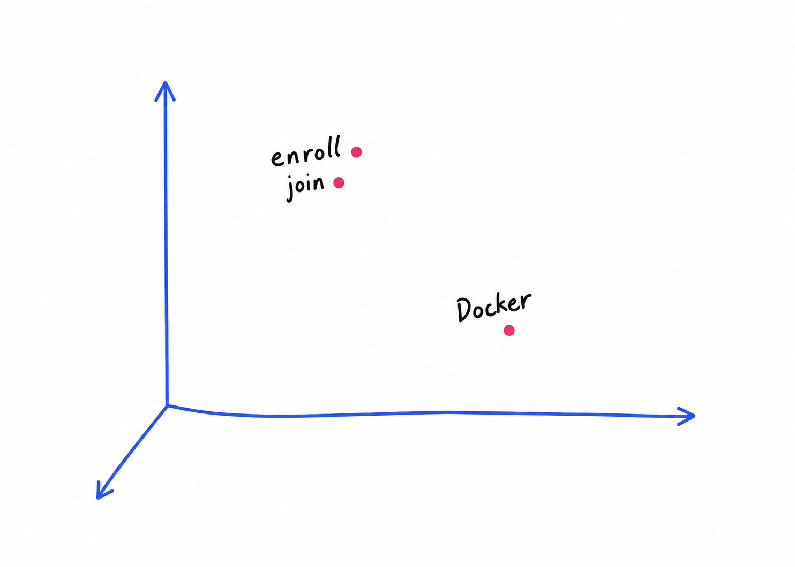

`Текстовый поиск` это когда мы берем запрос и разбиваем его на значимые части. Например: I just discovered the course, can i sill join? - discover, course, join. Затем мы ищем слова в документах, которые в идеале содержит все 3 слова, ну или 1-2

А что если пользователь скажет - I just found out about the program, can i still enroll? - У нас хоть и есть похожие слова - found, program и enroll, но если условно их нет в базе данных (именно эти слова), то у нас ничего не вернет, хоть и слова похожие

И в этом нам поможет `векторный поиск` и он проходит в 2 этапа:
- офлайн (индексированный) - мы преобразуем все документы в векторы (массивы чисел) и сохраняем их в индексе. Но чтобы понять в начале необходимо представить себе двумерное пространство, где кнопки «зарегистрироваться» и «присоединиться» находятся близко друг к другу, а «Docker» — далеко:

А после того как уже представили и поняли что означает вектор, то можно приступать к делу - мы обучим LLM, чтобы тексты со схожим смыслом получал схожие вектора

Эмбеддинг - слово встраивается в векторное пространство

- онлайн (при выполнении запросов) - мы преобразуем запрос пользователя в вектор с использованием той же модели, а затем находим наиболее близкие векторы документов по сходству.

Модель встраивания создает эти векторы. Это нейронная сеть, обученная улавливать смысл, поэтому тексты, имеющие схожее значение, попадают на похожие векторы. Мы измеряем близость двух векторов с помощью метрики расстояния. Наиболее распространенной является косинусное сходство.

Показатель косинусного сходства измеряет угол между двумя векторами:

- Векторы, направленные в одном направлении: степень сходства близка к 1 (похожи).
- Векторы, расположенные под прямым углом: степень сходства близка к 0 (не связаны).
- Векторы, указывающие в противоположных направлениях: сходство близко к -1 (противоположное значение)

Чем больше коэффициент косинусного сходства, тем больше сходство в смысле двух текстов.

Стоит отметить, что поиск по ключевым словам не находит синонимов и перефразирований. Векторный поиск не находит точных совпадений.