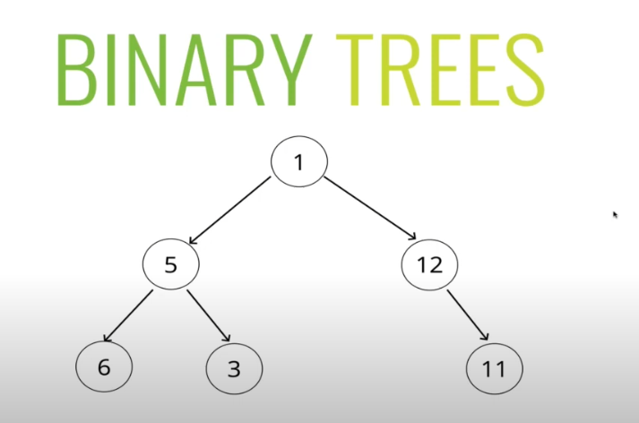
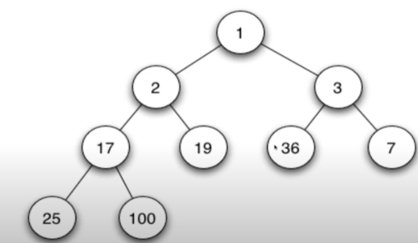
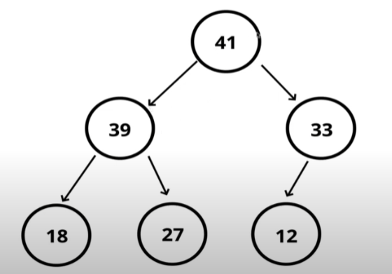

Trees - структура данных, которая состоит из узлов, связывающая между собой
в виде древовидной структуры. Состоит бинарное дерево из:
- root - начальный узел дерева, от которого исходят остальные узлы;
- parent - узел, который имеет дочерние узлы;
- child - узел, напрямую соединяенный с другим узлом при удалении от корня;
- leaf - узел, который не имеет детей
- siblings - группа узлов с одним родителям
- edge - направления 

Типы деревьев - trees, binary trees, binary search trees: 

Binary heap (двоичная/бинарное куча) - похож на бинарное дерево, отличительной чертой 
является то, что 
1. `MinHeap` - у нас на вершине дерево находится минимальное число, а в дочерних
максимальное.

2. `MaxHeap` -  у нас на вершине дерево находится максимальное число, а в дочерних минимальные.

Это не является binary-heap

