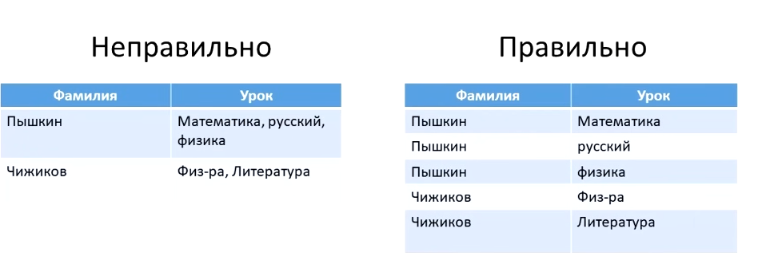
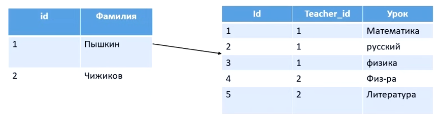
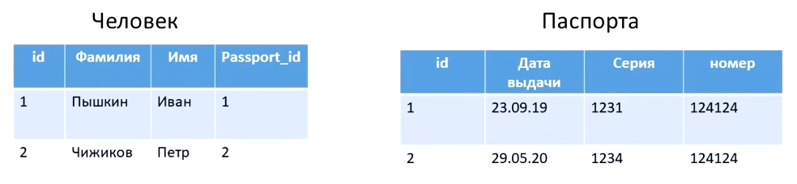
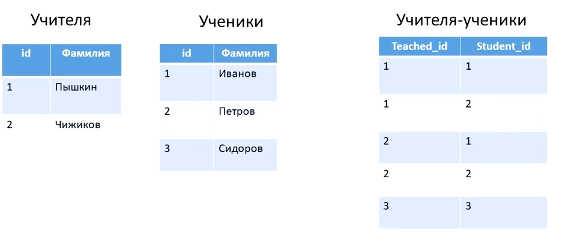

- [Что такое база данных]()
- [Виды баз данных]()
- [SQL - Реляционные базы данные]()

---

База данных предназначена для того, чтобы хранить какие-то данные и связи между этими данными. Существует два вида базы данных - это SQL (реляционные базы данных) и noSQL (нереляционные базы данных) 

SQL (реляционная базы данных) строго хранят структурированные данные, которые обычно представляют объекты реального мира - сведения о человеке, содержимом корзины в магазине и эти строго структурированные данные хранятся в сгруппированных таблицах. Структура этих таблиц задается на этапе проектирования. Примеры реляционных баз данных - это MySql, PostgreSQL.

noSQL (нереляционные базы данных) работают по документоориентированные принципу. Они хранят информацию в виде иерархических структур данных - например как в json формат, то есть данные представлены в виде объекта, еще один вариант хранения таких данных это пары ключ и значения, то есть по какому-то ключу мы сохраняем данные, а потом по этому ключу эти данные извлекаем. Примеры нереляционных баз данных - это MongoDB (json/bson), Redis (ключ - значения), Cassandra (данные хранятся по колонкам)

### SQL - Реляционные базы данные

Реляционная база данных представляет из себя связанных между собой таблиц, и существует определенные нормы по которым эти таблицы должны создаваться - нормальные формы:

1. Нормальная форма - одна ячейка содержит одно значение. 

2. Нормальная форма - каждая запись должна иметь уникальный идентификатор (первичный ключ, id)

Например Пышкинов может быть 5 человек в базе данных, в него мы присваиваем первичный ключ - id (teacher_id - ссылка на учителя который этот предмет преподает)

Существует несколько связей между таблицами:

1. Связь один ко многим (one-to-many) - один учитель может преподавать несколько предметов. В таблице где указывается many, указывается внешний ключ на таблицу которая указывается one (teacher_id)

2. Связь один к одному (one-to-one) - есть две таблицы одна таблица с данными человеке, а вторая с паспортами. И очевидно, что один человек может иметь лишь один паспорт. По этому в первой таблице человек мы указываем ссылку в виде внешнего ключа на таблицу с паспортом

3. Связь много-ко-многим (many-to-many) - есть две независимые таблицы с учителями и с учениками при этом каждый студент может обучаться у нескольких учителей и каждый учитель может преподавать нескольким студентам. В таком случае создается отдельная таблица - учителя и ученики в котором обозначается какой учитель преподает у какого-то студента и какой студент учится у какого учителя

