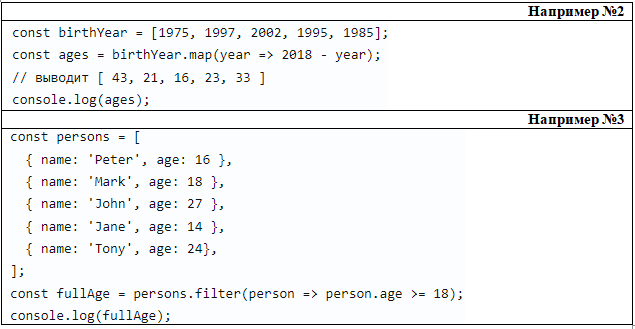

### Основы

<details>
<summary>Перечислите типы данных в JavaScript? </summary>

В JavaScript существует 8 типов данных, их можно разделить на примитивные и ссылочные. К примитивным относятся следующие типы: `string; number; bigInt; boolean; symbol (unical id); null и undefined`. А к ссылочному относится `object (объекты)`. Если говорить про объекты то они передаются по ссылке, а примитивы по значению

<details>
<summary>Доп.вопрос: В чем разница между null и undefined?</summary>

В том, что `Undefined` - это когда переменная объявлена, но мы ей не присвоено значение, а `null` - когда мы присвоили значение специально, и как бы говорим, что у нас есть переменная и она пустая.

Кстати при нестрогом сравнение undefined и null дает true, а при строгом false, а также при сравнение null == 0 дает false
</details>

<details>
<summary>Доп.вопрос: Как мы можем определить к какому типу данных относится та или иная переменная?</summary>

А определить тип данных можно с помощью typeOf.

</details>

<details>
<summary>Доп.вопрос: JavaScript статически, или динамически типизированный язык?</summary>

Динамически типизированный язык, так как происходит автоматическое преобразование типов
</details>

<details>
<summary>Доп.вопрос: Как превратить любой тип данных в булевое и разница между явным и неявным преобразованием?</summary>

В JS мы можем явно преобразовать типы, всего их три: String(), Boolean(), Number() - и все они являются функциями.

Чтобы превратить тип данных в булевый можно использовать:

1. Функцию Boolean(null)
2. !! (Двойное логическое не), `Допилить идею: Если мы применим его к не пустой строке, то оно сначала станет false, а затем true`

Чтобы превратить тип данных в числовое можно использовать:

1. Функцию Number('5')
2. метод parseInt("5")

Что превратить тип данных в строку можно использовать:

1. Функцию String(null)
2. Или через метод Object.prototype.toString(43)

Разница заключается в том, что неявное преобразование происходит автоматически путем арифметических действий, а явное когда мы указываем тип специально через функции Number или ParseInt, функцию String или метод toString, Boolean или двойное логическое !!

</details>

<details>
<summary>Доп.вопрос: Перечислите все ложные (falsy) значение? </summary>

Falsy - это следующие значение: "", 0, null, undefined, NaN, false. А все остальное уже true

</details>

<details>
<summary>Доп.вопрос: Что такое NaN?</summary>

NaN (not-a-number) - не является числом. Мы получаем его когда выполняем математическую операцию неправильно. Например, если мы infinity разделим на infinity, то оно нам даст NaN. Для того, чтобы проверить, что число не является числом использует функцию isNaN().
А его особенностью можно выделить то, что она не равна ничему даже самому себе как в строгом, так и в нестрогом сравнении.

</details>
</details>

<details>
<summary> Какие операторы есть в JavaScript? </summary>

`Арифметические операторы`: сложения; вычитания; умножения; делание; возведение в стене `**`; взятия от остатка `%`.

`Операторы сравнения`: > (больше); < (меньше); = (равно); != (не равно), == (нестрогое сравнения) и === (строгое сравнения)

`Логические операторы:`: || (или), && (и), ! (логическое не) 

<details>
<summary>Доп.вопрос: Чем отличается строгое сравнения от нестрогого?</summary>

Нестрогое сравнивает только значения без приведения типов, а строгая сравнивает и значения и типы

</details>

<details>
<summary>Доп.вопрос: Расскажи про логические операторы и их способности?</summary>

К особенностям можно отнести приоритетность, то есть `И` будет выполнятся раньше `Или`, но если мы обернем в скобки то данная приоритетность уже не будет иметь разницы.

- || (Или) - ищет первое истинное значение и возвращает его. А если его не находит, то возвращает последнее значение. У него приоритетность - 5
- && (И) - ищет первое ложное значение и возвращает его. А если оба значения являются истинными, то возвращает последнее. Приоритетность - 6
- ! (Логическое не) - меняет значение на противоположное. Например если строку мы обернет в логическое !'str', то у нас false. Приоритетность - 15
</details>

<details>
<summary>Доп.вопрос: Что такое оператор нулевого слияния ??</summary>

Он возвращает значение правого операнда, если левый операнд содержит null или undefined, в противном случае возвращается значение левого операнда. Он похож на || (Или), так как он возвращает правый операнд если в левом хранится ложное значение, а не только null / undefined
</details>

</details>

<details>
<summary> Расскажите про циклы в JavaScript?</summary>

Циклы нужны для того, чтобы повторить какое-то действие несколько раз. Существует несколько видов циклов: 

1. Классический цикл `for (let i = 0; i > str; i++) {...}` 
2. Цикл через `for in` ==> `for (const name in obj) {...}` служит для перебора объекта и возвращает нам ключи. Если нам необходимо получить значения, внутри цикла нам необходимо в квадратных скобках написать значения. А если мы решим использовать их в массиве, то получим индексы.
3. for ... of - служит для перебора массива и возвращает нам значения.

<details>
<summary> Доп.вопрос: Что такое выражения (expression) и инструкции (statement)</summary>

I. Выражение - это арифметическое действие. Например:`+, -, *, /, %, >, =, ==, i++, --i`, `Math.random - случайное число`.

II. Инструкция - это фрагмент кода, который выполняет определенное действие. К инструкциям относятся: `if, if-else, while, for, for..in, for..of switch, for-in, объявления переменных`
</details>

<details>
<summary> Доп.вопрос: Что такое switch/case и где он используется? </summary>

Switch + case - это по сути аналог if ... else, где выражение switch сравнивается с различными значениями case. 
Внутри каждого case используется break, чтобы выйти из конструкции и избежать выполнения следующих блоков. А
также есть default, который означает что не одно из условий не выполнено

Если говорить про react, то используется он в reducer (redux). И например когда нам нужно именно точное сравнения
</details>

<details>
<summary> Доп.вопрос: Отличие while и do while</summary>

do ... while - должен выполнится хотя бы один раз и не важно верны ли условия или нет, в то время как while может и не выполнится если условия не подходят

`while (условие) { // тело цикла }`
`do { // тело цикла } while (условие);`
</details>


</details>

<details>
<summary>Какие ты знаешь методы у строк JavaScript?</summary>

- `.toUpperCase()` - берет строку и пишет ее с большой буквы (преобразованное в верхний регистр).
- `.toLowerCase()` - берет строку и пишет ее с маленькой буквы (преобразованное в нижний регистр).
- `.split()` - делает из строки массив
- `.trim()` - удаляет пробельные символы с начало и конца строки
- `.startsWith()` проверяют начинается-ли строка с определенного символа который мы укажем внутри
- `.endsWith()` делает противоположное, то есть заканчивается строка c определенным символом
- `.repeat()` - повторяет строку указанное количество раз
- `.includes()` - проверяет, есть ли внутри строки указанная подстрока (часть текста). Возвращает true или false.
- `.replace()` - находит в строке первое совпадение с шаблоном (или строкой) и заменяет его на указанную новую строку.
- `.slice()` - вырезает часть строки и возвращает ее, не меняя оригинал. Можно указать с какого индекса начать и где закончить.

<details>
<summary>Доп.вопрос: Расскажи какие знаешь методы чисел (number) и математические (math) </summary>

#### 1. Number method

- `.toString()` - число преобразовывает в строку
- `.parseInt()` - берет строку и возвращает целое число
- `.isNaN()` - проверяет, является ли значения числа NaN
- `.isFinite()`- проверяет, является ли число конечным;

#### 2. Math method

- `.min(1, 2, 3)` - вернуть минимальное число
- `.max(2, 3, 4)` - вернуть максимальное число
- `.random(1, 2, 3)` - можно получить рандомное число
- `.floor()` - округляет в меньшую степень
- `.ceil()` - округляет в большую степень
- `.pow(2, 3)` - принимает два значения и возвращает возведенную степень `(3, 3) // 27`
- `.abs()` - возвращает абсолютное значение числа. Если это пустые кавычки или пустой массив, то это 0

Ну и другие по типу косинуса, синуса метода
</details>

<details>
<summary>Доп.вопрос: Расскажи какие знаешь методы массива (array)</summary>

`.filter()`
`.map()` 
`.forEach()`
`.sort()` 
`.reduce()` 
`.concat()` - когда есть два разных массива и нам нужна их объединить
`.isArray()` => проверяет является ли значение массивом
`.find()` - вернёт первый найденный в массиве элемент, который подходит под условие.
`.findIndex()` - возвращает уже не найденный элемент, а индекс

Следующие 4 метода меняют исходных массив

`.push()` - добавляет элементы в конец массива и возвращает новую длину массива.
`.pop()` - удаляет из массива последний элемент и возвращает его значение.
`.unshift()` - добавляет элементы в начало массива и возвращают новую длину массива.
`.shift()` - удаляет из массива первый элемент и возвращает его значение.

<details>
<summary>Доп.вопрос: Что будет работать быстрее `pop`, `push` shift и unshift</summary>
</details>

Что будет работать быстрее? => Pop и push - так как их задача лишь добавить или удалить элемент в конце массива, а shift и unshift медленнее так как помимо удаление или добавления первого элемент они будут сдвигать массив вправо или влево.
</details>

<details>
<summary>Доп.вопрос: Что ты можешь рассказать о методах .splice(), .slice()</summary>

`.splice()` - меняет исходный массив, добавив либо удалив по индексу данные

`.slice()` - возвращает новый массив, содержащий какую-то определенную часть исходного массива. Например когда нам надо вернуть не весь массив, а только первые 2 элемента
</details>


<details>
<summary>Доп.вопрос: Какие методы мутируют и не мутирует исходный массив?</summary>

Мутирует - .sort, .reverse, .push. .pop, .shift, unshift, .splice

Не мутируют - map, filter, slice, concat,
</details>

</details>

<details>
<summary>Расскажите про объект?</summary>

Объект в JavaScript — это тип данных, который используется для хранения коллекций значений в виде пары ключ: значение. Ключи — это обычно строки (или символы), а значения могут быть любыми типами данных, включая другие объекты. И объекты никогда не равны друг другу, так как имеет ссылочный тип данных.

<details>
<summary>Доп.вопрос: какая разница между объектом и массивом</summary>

- У массивов есть методы тех, которых нет у объекта, также и наоборот
- Чтобы обратится к какому-то элементу в массиве мы должны использовать индекс от нуля. А у объекта обращение идет через точку
- Также у массива есть свойство length - делает подсчет всех элементов внутри массива.
</details>

<details>
<summary>Доп.вопрос: как мы можем определить наличие св-в в объекте</summary>

- `hasOwnProperty()` - проверяет наличие свойств только в самом объекте
- `in` - проверяет наличие свойств как в самом объекте, так и в прототипах
- Обратится к объекты напрямую с помощью индексовой нотации: `console.log(obj['prop1']); => foo`

</details>


<details>
<summary> Доп.вопрос: В чем отличие методов объекта: key(), values(), entries(), fromEntries() </summary>

1. `Object.keys()` - возвращает массив ключей
2. `Object.values()` - возвращает массив значений
3. `Object.entries()` - возвращает массив пар ключ и значения
4. `Object.fromEntries()` - он преобразует список пар: ключ и значение в объект

```
const object1 = {
  a: 'smth',
  b: 42,
  c: false
};

console.log(Object.keys(object1));   // ["a", "b", "c"]
console.log(Object.values(object1)); // ["smth, 42, false"]
```

</details>
</details>

<details>
<summary> Для чего нужен строгий режим в JavaScript?</summary>

Строгий режим помогает писать более безопасный код, и помогает находить потенциальные ошибки 

- Например мы обратились к переменной, но самой переменной нету. 
- Говорит о том, что нельзя дублировать параметры внутри функции
- Например по умолчанию this ссылается на window, а при строгом режиме вернет undefined

</details>

<details>
<summary>Какие существуют типы всплывающих окон и типы ошибок в JavaScript?</summary>

Типы всплывающих окон: 

`alert` - выводить информацию во всплывающем окне;

`confirm` - спрашивать соглашение во всплывающем окне; подтвердить по ОК или Отмену

`prompt` - всплывающем окно, где просят написать что-то в инпут поле

Типы ошибок: 

`SyntaxError` - синтаксическая ошибка возникает когда мы написали неправильно какое-то слово: return

`ReferenceError` - возникает когда js не может найти какую-то ссылку в которой мы пытаемся получить доступ. Например хотим определенную переменную найти а его нет

`TypeError` - ошибка в типе - например у нас есть переменная, а мы к нему обращаемся через объект или пытаемся вызвать его.
</details>

---

### Переменные и функции

<details>
<summary> Разница между переменными: var, let и const?</summary>

1. `Let` и `const` появились в ES6, а `var` был еще до него;
2. `Let` и `const` имеют блочную область видимости, а var - глобальную (или локальную);
3. `Let` мы можем присвоить новое значение, однако не можем создать переменную с тем же именем, у `const` мы не можем присвоить новое значение. У `var` мы можем как присвоить новое значение, так и повторно объявить. Раньше чтобы решить проблему области видимости у `var` люди оборачивали в так называемые анонимные самовызывающиеся функции;
4. Есть такое понятие как временная мертва зона (temporal dead zone), что означает мы не можем вызвать переменная до его инициализации, и она появилась с let и const. Если мы попытаемся вызвать их то получаем ошибку, однако в случае с var у нас просто выведется undefined, это связано с всплытием. 
5. Var сплывает, а let и const нет

<details>
<summary>Доп.вопрос: А что если мы не объявили переменную?</summary>

`Необъявленная переменная` - это когда мы написали какое-то значение `a = 20` без переменных var, let либо const. Область видимости у необъявленных переменных - глобальная, что означает, что они доступны из любого места кода, что не очень хорошая практика как и var. Если мы будем использовать строгий режим, то получим ошибку ReferenceError, а в нестрогом undefined
</details>

<details>
<summary>Доп.вопрос: А какие есть правила задавания имен переменных и функций</summary>

Если мы говорим задание имен переменных, то

1. Они должны содержать буквы на латинице, он должен отражать смысл того, что он хранит: `let age = 20`;

2. Цифр: `let user2 = 'Antony';`

3. Символы доллара: `let $user = 'Alice';`

4. Нижнего подчеркивания: `let _user = 'Pete';`

Если мы говорим то, что как не стоит начинать, то - первый символ не должен быть цифрой: `let 10user = 'Nick';`

Имя функции должно понятно и четко отражать что она делает и что возвращает. Функция - это действия по этому её имя
обычно является глаголом: `function checkValue() {}`
</details>
</details>

<details>
<summary>Расскажите про область видимости (scope)?</summary>

`Глобальная область видимости` - это когда мы объявляем переменную внутри самого файла js (внутри скрипта) не оборачивая ни функцией, циклом. Они доступны из любого места в коде.

`Локальная область видимости` - переменные и функции объявленные внутри функций, доступны только внутри этой функции и всем вложенным в неё функциям. За ее пределами, при обращении к переменной, мы получаем ошибку.

`Блочная область видимости` - это когда переменная доступна только внутри блока, за пределами блока она не доступна.

</details>

<details>
<summary> Разница между function declaration и function expression? </summary>

Выделяют два способа объявлении функции через кл.слово function `function multyple() {...}` и через переменную `let multiply = function () {...}`

Отличие заключается в том, что к function declaration можно вызвать до того как объявить. Так как JS собирает все строчки где объявляется function, а также через Hoisting (поднимает) их самый вверх, что позволяет нам сначала вызвать их, а потом объявить. Еще наверное стоит отметить, что если мы объявим function expression через переменную var, то и она будет всплывать


<details>
<summary> Доп.вопрос: Как передаются параметры в функцию: по ссылке или по значению?</summary>

Примитивы передаются в функцию по значению, а объекты и массив уже по ссылке. Стоит отметить, что когда в функции передается примитивное значение, то функция получает копию, а не примитивное значения, в то время как объект и массив передаются сам уже (оригинал) грубо говоря.

</details>

<details>
<summary> Доп.вопрос: Разница между параметром и аргументом функции? </summary>

Когда мы пишем функцию и внутри обычных скобок указываем a, b: `function value (a, b) {...}`, то это параметры.
После того как мы передали параметры мы пишем код например `return a + b`. После вызываем этой функцию через запятую,
так вот значения, которые передаются при вызове функции называются аргументами: foo (5, 7).

</details>

</details>

<details>
<summary>Что такое всплытие (Hoisting)?</summary>

Всплытие - такое механизм, который поднимает вверх переменную var и функцию объявленную через function, что позволяет нам сначала вызвать их, а потом объявить. К всплытию можно отнести функцию объявленные через var
</details>

<details>
<summary> Что такое замыкание (Closure)? </summary>

Замыкание - функции со своим лексическое окружение. И когда за пределами функции есть переменная, которого внутри нашего лексического окружения нет, то он дает доступ обращаться к этой переменной.
</details>

<details>
<summary> Разница между обычными функциями и стрелочными? </summary>

1. Синтаксис;
2. Обычные функции всплывают, а стрелочные нет, если конечно они не объявлены через var;
3. Контекст this - контекст, который является динамическим. В зависимости от того, где мы его вызываем, на то он и будет ссылаться. Например, если мы вызовем его глобально, то ссылка будет указывать на объект window (в браузере). Если же вызов будет внутри метода объекта, то this будет ссылаться на сам объект. Если внутри обычной функции — то также на глобальный объект window. Однако у стрелочных функций нет собственного this, и они заимствуют его из внешнего контекста, в котором были определены.
4. В обычных функция можно использовать arguments, а у стрелочных нет аргумента
5. Стрелочные функции не могут быть вызваны с конструктором new, в то время как обычные могут

<details>
<summary>Доп.вопросы: Как можно имитировать поведение arguments в стрелочных функциях?</summary>

Через spread-оператор
</details>

<details>
<summary>Доп.вопросы: Что будет, если попробовать использовать стрелочную функцию как конструктор?</summary>

Будет ошибка
</details>
</details>

<details>
<summary>Что такое this (контекст)?</summary>

This — контекст, который является динамическим. В зависимости от того, где мы его вызываем, на то он и будет ссылаться. Например, если мы вызовем его глобально, то ссылка будет указывать на объект window (в браузере). Если же вызов будет внутри метода объекта, то this будет ссылаться на сам объект. Если внутри обычной функции — то также на глобальный объект window. Однако у стрелочных функций нет собственного this, и они заимствуют его из внешнего контекста, в котором были определены.

<details>
<summary> Доп.вопрос: Разница между .call(), .apply() и bind()? </summary>

Все эти методы используются для управления значением this, отличие в том, что:
- call() и apply() - вызываются сразу, а .bind() - привязывает к контексту и вызывается позже;

- call() - принимает аргумент через запятую
- apply() - аргументы передаются в виде массива
- bind() - просто переопределяет и если bind у нас много, то сработает только первый
</details>
</details>

<details>
<summary>* Что такое чистая функция? (Pure Function) </summary>

Чистая функция - это та функция, у которой нет побочных эффектов и это функция, результаты которой зависят только от входных параметров. К побочным эффектом относится: `Запросы на сервер`, `Изменения входных параметров`, `Обращение к дому (query selector), если говорим про JS.`

Плюсы чистых функций:

- Уменьшает кол-во багов (так как он максимально низко влияет на остальную систему. Если я знаю, что у меня есть баг в функции, то он внутри него)
- Легче тестировать
- Легче понимать, поскольку все что она делает заключено внутри нее и не нужно никуда бегать.
</details>

<details>
<summary>* Что такое функция генератор?</summary>

</details>

<details>
<summary>* Разница между синхронными и асинхронными функциями?</summary>

Синхронные функции являются блокирующими, а асинхронные нет. Когда интерпретатор натыкается на синхронную функцию, он блокирует дальнейшее выполнения операции прежде чем данная функция будет выполнения. По этому набор таких функций выполняется последовательно - одна за другой. Асинхронные функции наоборот не блокирует дальнейшие выполнения скрипта. По этой причине различные тяжелые операции по типу запроса данных делают асинхронными. Обычно такие функции в качестве аргумента принимают callback - это еще одна функции, которая выполнится как только будет выполнено асинхронная функция и которая сможет обработать полученный результат

</details>

<details>
<summary>* Типы функций по способности принимать другие функции? </summary>

В JS можно выделить 3 основные типов функций в зависимости от принимаемых данных:

- Функция первого класса (first-class functions) – это функция, которая не принимает другую функцию в качестве аргумента и не возвращает функцию как значения

`const firstOrder = () => console.log( “Hello”)`

- Функции высшего порядка (HOF) – это функция, которая принимает другую функцию в качестве аргумента или возвращает функцию как значение

`const higherOrder = firstOrderReturn => firstOrderReturn()`

- Унарная функция – это функция, которая принимает только 1 аргумент, который не является функцией.

`const unaryFunction = (a) => console.log(${a} + world!)`

</details>

<details>
<summary>* Что такое мемоизация? Реализуйте базовую логику функции для мемоизации? </summary>

Это прием создании функции способность запомнить ранее вычисленное значение, а также результат. В результате при повторном вызове функции с одинаковыми аргументами она не будет выполнена, а результат работы вернется из кеша.

В программировании мемоизация — это метод оптимизации , который делает приложения более эффективными и, следовательно, более быстрыми. Он делает это, сохраняя результаты вычислений в кеше и извлекая ту же информацию из кеша в следующий раз, когда она потребуется, вместо того, чтобы вычислять ее снова.

</details>

<details>
<summary>* Что такое функции высшего порядка (Higher Order Functions)?</summary>

HOF - обычная функция, которая принимает в качестве аргумента другую функцию, добавляет в эту функцию так скажем новый функционал и возвращает его - это map, filter, reduce



</details>

</details>

---

### Асинхронный код (подходы к работе: promise, callback, async/await) и прототипы наследование

<details>
<summary>Что такое callback-функцию? Что такое Callback Hell?</summary>

Сallback - это функция, которая передается в другую функцию в качестве аргумента, что является одним из способов работы с асинхронным кодом. Однако есть такое понятие как callback heck, когда внутри одного callback есть еще один callback, а внутри него еще один, а внутри этого еще один. И это очень трудно читать и понимать. Но позже придумали promise в ЕС6 и чуть позже async...await в ЕС8.

</details>

<details>
<summary>Что такое Promise?</summary>

Promise - это объект и один из способов работы с асинхронным кодом и promise содержит в себе 3 состояния: `pending` - ожидания; `resolved (fulfilled)` - выполнено успешно; `rejected` - выполнено с ошибкой. И в качестве аргумента функции принимает: resolve и reject.

<details>
<summary>Доп.вопрос: Какие есть методы у Promise?</summary>

`Promise.all()` - дожидается выполнения ВСЕХ promises, если успешно вернет массив, если нет, то вернет последний promise с ошибкой

`Promise.allSettled()` - дожидается выполнения ВСЕХ promise, и не важно выполнятся они успешно или нет он вернет массив полученных значение (ответов)

`Promise.any()` - дожидается выполнения ПЕРВОГО УСПЕШНОГО promise и если он находится его, то он возвращает данные результат, а если нет, то выводит ошибку. Если первым promise есть reject, он идет дальше пока не найдет его. 

`Promise.race()` - дожидается выполнения ПЕРВОГО promise и возвращает результат. Все последующие будут игнорироваться. Не важно успешный или отклоненный
</details>

<details>
<summary>Доп.вопрос: Преимущества использовании promise вместо callback</summary>

- Помогает избежать callback-hell который может быть нечитаемым

- Упрощает последовательное написание последовательного читаемого async кода с помощью then, а также обработку ошибок с помощью catch()

- Есть методы

- С использованием promise можно избежать следующих проблем: callback-функция была вызвана слишком рано, поздно или вовсе не была вызвана; функция была вызвана слишком мало или слишком много раз; не удалось передать необходимую среду/параметры; были пропущены ошибки/исключения.
</details>

<details>
<summary>Доп.вопрос: Например есть promise и мы вызываем какую-то функцию которая возвращает promise. Мы на него подписались через .then, .catch и т.д. Теперь вопрос а может ли быть ситуация когда promise никогда не закончится не then, не catch не вызовутся? Нам нужно чтобы оно было бесконечное как это сделать</summary>

```
const neverEndingPromise = new Promise((resolve, reject) => {
  // ничего не делаем
});
```
</details>

<details>
<summary>Доп.вопрос: Есть ли у promise какой-то функционал, что если через 5 секунд он ничего не сделал, то как принудительно зарезолвились или заречеджектились promise</summary>

Promise.race c SetTimeOut

```
function withTimeout(promise, timeout) {
    return Promise.race([
        promise,
        new Promise((_, reject) =>
            setTimeout(() => reject(new Error('Timeout exceeded')), timeout)
        )
    ]);
}

// Использование
const somePromise = new Promise((resolve) => {
    // Симуляция долгой операции
    setTimeout(() => resolve('Done!'), 10000); // завершится через 10 секунд
});

withTimeout(somePromise, 5000) // Таймаут 5 секунд
    .then(result => console.log(result))
    .catch(error => console.error(error.message));
```

</details>

</details>

<details>
<summary>Что такое async/await? И что у него общего у promise </summary>

Async является еще одним способом написание асинхронного кода, который всегда возвращает promise, await добавляется в тело функции и ждет выполнения promise. Если какой-то из await не выполнится, то дальше он не пойдет и поместится в catch, а это обработчиком ошибок

```
async function getMainActorProfileFromMovie(id) {
  try {
    const movieResponse = await fetch(`https://swapi.dev/api/films/${id}/`);
    const movie = await movieResponse.json();
    return characterResponse.json();
  } catch (err) {
    console.error('Произошла ошибка!', err);
  }
}
```

</details>

<details>
<summary>Что такое Eventloop (цикл событий) и как он работает?</summary>

Eventloop - это бесконечный цикл, который решает проблему однопоточности, он ждет поступления задач, выполняет их и затем снова ждет поступления новых задач.  У него есть callstack (стек вызовов). Если очередь пустой, то туда сначала попадают micro-task (promise, консоли), так как у них приоритетность больше, а затем уже macro-task (setTimeOut и SetTimeInterval.)

<details>
<summary>Доп.вопрос: если все micro-task выполнятся а дальше пойдут macro-task внутри которого есть micro-task , что вызовется микро или макро</summary>

Сначала выполнится внутри micro-task , а затем уже macro-task

</details>

<details>
<summary>Доп.вопрос: какие типы таймеров есть в JavaScript?</summary>

В JS есть два основных типа таймеров:

- `setTimeout(...)` - позволяет вызвать переданную функцию один раз через определенное время
- `setInterval(...)` - позволяет вызвать переданную функцию много раз через определенный интервал времени. Чтобы отменить `setInterval` мы можем использовать тип: `clearInterval()` и внутрь передаем переменную, где использовали `setInterval`.

</details>
</details>

<details>
<summary>Что такое прототип в JS? А также расскажите по подробней про прототипное наследование</summary>

Прототип — это объект, который содержит свойства и методы, доступные другим объектам через механизм прототипного наследования. Каждый объект в JavaScript может иметь скрытое внутреннее свойство [[Prototype]] (доступное через __proto__ или устанавливаемое с помощью Object.setPrototypeOf), которое указывает на другой объект-прототип. Что позволяет избежать дублирования кода
</details>

<details>
<summary>Как работает цепочка прототипов (prototype chain)</summary>

Когда мы обращаемся к св-в внутри объекта, то он в начале ищет
его внутри самого объекта, если не находит, то ищет внутри прототипа, 
а потом внутри него пока не дойдет до null, что означает больше искать не куда и прототипной цепочки нет


- Что произойдет если запрашиваемая св-в не найдено в объекте? - Вернет undefined
</details>

<details>
<summary>В чём разница между __proto__ и prototype?</summary>

__proto__  - ссылка на прототип объекта у любого объекта
prototype - свойство функции, задающее прототип у функций конструктора

</details>

---

### DOM-дерево

<details>
<summary>Что такое DOM (document object model) ?</summary>

DOM (Document Object Model) — это специальная древовидная структура, которая позволяет управлять HTML-разметкой из JavaScript-кода. Управление обычно состоит из добавления и удаления элементов, изменения их стилей и содержимого.

<details>
<summary>Доп.вопрос: какие ты знаешь методы поиска элементов в DOM?</summary>

`document.getElementById('id')` - поиск по Id, если он есть;

`querySelector('class')` - возвращает первые найденный элемент по классу;

`querySelectorAll('class')` - возвращает все элементы, который подходят классу

Есть также другие способы (они более старые)

`elem.getElementsByTagName(tag)` поиск по тегу;

`elem.getElementsByClassName(className)` поиск по имени класса;
</details>
</details>

<details>
<summary>Что такое распространение события (Event Propagation)?</summary>

Дополнить ....
</details>

<details>
<summary>Что такое делегирование событий (Event Delegation)?</summary>

Дополнить ....
</details>

<details>
<summary>Что такое всплытие и погружение?</summary>

Всплытие событие 

<details>
<summary>Доп.вопрос: что делает event.preventDefault()</summary>

</details>

<details>
<summary>Доп.вопрос: что делает event.stopPropagation()</summary>

...
</details>

<details>
<summary>Доп.вопрос: что делает event.stopImmediatePropagation()</summary>

...
</details>

<details>
<summary>Разница между e.preventDefault() и e.stopPropagation() и e.stopImmediatePropagation()?</summary>

</details>

</details>

<details>
<summary>Разница между event.target и event.currentTarget?</summary>

Переделать ....

`event.target` - элемент на котором произошло событие
`event.currentTarget` - элемент на котором висит обработчик.
</details>

<details>
<summary>Виды (обработчик) событий в JavaScript?</summary>

Есть несколько видов событий: 

1. Событие по мыши - `click` (клик мышки), `dblclick` (двойной клик), `mouseover` (навели на элемент), mouseout (увели от элемента мышь)

2. События клавиатуру - `keydown` и `keyup` - когда клавиша нажата и опущена

3. События формы - `change` (изменения значения), `focus`, `blur`, `submit`

<details>
<summary>Доп.вопрос: Для чего используется метод .focus() и blur()?</summary>

Например когда у нас загрузилась страница, то с помощью метода `focus()` мы можем сразу же попросить пользователя ввести необходимые данные. Ему не нужна будет кликать на определенный input. Метод focus() устанавливает focus на элемент

`.blur()` - снимает фокус с элемента. Например когда мы отправили форму либо кликнули за пределами input поля
</details>

<details>
<summary>Доп.вопрос: Как называется события которое свидетельствует о том, что наш дом полностью загружен?</summary>

domContentLoaded
</details>

</details>

<details>
<summary>Для чего используется свойство window.navigator?</summary>

Необходим для получения информации о браузере и его среде исполнения

`navigator.userAgent` - информацию о браузере и операционной системе
`navigator.language` – основной язык браузера (например, "ru-RU").
`navigator.languages` – массив предпочтительных языков.
`navigator.geolocation` – доступ к геолокации.
`navigator.mediaDevices` – доступ к камере и микрофону.
`navigator.bluetooth`, navigator.usb – доступ к устройствам Bluetooth и USB.
</details>

<details>
<summary>Разница между методами Light dom и shadow dom?</summary>

Дополнить ....
</details>

<details>
<summary>Какие ещё способы назначить обработчик, кроме addEventListener?</summary>

- Через onclick когда инлайного мы пишем в HTML коде. 

- Либо пишем квериселектор, а потом вызываем onclick и вешаем его на кнопку
</details>

---

### Секция дополнительных вопросов

<details>
<summary>Что так Babel?</summary>

Babel - преобразует современный код ЕС6 в более старую спецификацию, для того, чтобы увеличить поддержку браузеров. Просто старые браузеры не понимают современный язык ЕС6 и babel выступает в качестве переводчика. Также он может преобразовать JSX под которым внутри `React.createElement`
</details>

<details>
<summary> Что такое полифил (polyfill)? </summary>

Например у нас есть современный код написанный на ЕС6, однако он не работает в старых браузерах, так вот с помощью полифила мы можем преобразовать наши функции для старых браузеров. Вот пример: sessionStorage доступно во всех последних браузерах (IE8 и выше), но не в IE7 и ниже. Полифилл можно использовать для включения поддержки старых браузеров, которые не предоставляют файлы sessionStorage.

</details>

<details>
<summary>Что такое Solid и расшифруйте его?</summary>

- S `(single responsibility principle)` - принцип единственной ответственный. Функция, метод внутри класса должен выполнять лишь 1 задачу. Например - отсортировать массив или отфильтровать его 

- O `(open-closed principle)` - принцип открытости и закрытости. Код должен быть открыт для добавления нового функционала, но при этом исходный код не должен быть изменен. На классах мы можем это сделать через extends

- L `(liskov substiution)` - принцип подставки Барбары Лисков.

- I `(interface segregation)` - принцип разделения интерфейса.

- D `(dependency inversion)` - принцип инверсии зависимостей

---

L => `Liskov substitution` (принцип подстановки Барбары Лисков) => сущности (классы, функции), которые использует родительский тип должны точно также работать с дочерними классами, при этом ничего не должно ломатся в логике программы и она не должна нарушаться. Наследуемый класс должен дополнять, а не замещать поведение базового класса, при работе с дочерними классами мы должны быть уверены, что у нас ничего не сломается

I => `Interface segregation` (принцип разделения интерфейса) => програмные сущности не должны зависеть от методов, которые они не используют. Основная суть заключается в том, чтобы разбивать наши толстые интерфейсы наши програмные сущности на более маленькие узкоспециализированные решающие одну задачи. Нельзя заставлять клиента реализовывать интерфейс, которым он не пользуется.

D => `Dependency inversion` (принцип инверсии зависимостей) => модули высокого уровня не должны зависеть от модулей более низкого уровня, все они должны зависеть от абстракций, а они в свою очередь не должны зависеть от деталей, а детали как раз должны зависеть от абстракции. 

У нас есть завод, внутри завода есть станки, работники, электричество = они между собой связаны, в свою очередь станки также могут иметь детали: скажем наручник №1, крутилка №007. Представим себе что одна из деталей сломалось, мы меняем эту деталь в станке и оказывается, что логика работы станка меняется. Наши работники с этим станком теперь работать не могут, или для другой детали нужна будет более мощное электричество и здесь как раз происходит принцип инверсии зависимостей. У нас модули высокого уровня зависят от модулей низкого уровня. Чтобы этого избежать - можно исп так называемый трансформатор (некая абстракция), который сам подберет напряжения

</details>

<details>
<summary>Что такое ООП?</summary>

Полиморфизм - способность функции работать с различными типами данных. Например есть функция, которые может принимать разные типы данных: string и number, но функция одна.

</details>

<details>
<summary>Какие этапы отрисовки есть у страницы браузера?</summary>

</details>

<details>
<summary>Что происходит когда в адрес браузера вбиваешь какой-либо текст и нажимаешь enter?</summary>

</details>

<details>
<summary>Какие инструменты откладки ты знаешь</summary>
- console.log();
- через инструмент разработчика Chrome() - когда мы пишем в коде debugger (некая точка останова) и проверяем в хроме передаются ли значение в дочерний компонент. Либо можем просто внутри браузера ставить эти точки остановы под цифрами. Есть также нетворк где можно узнать какие запросы литеть и правильно ли мы передали какой-либо запрос
- React Developer Tools и postman
</details>

<details>
<summary>Какие ты знаешь виды тестов?</summary>

`Unit-test` - это когда мы проверяем какой-то кусочек кода отдельно от всего приложения. Например при сложении двух чисел или написать тест, которая проверяет на наличие пробелов, проверить на наличие какого-то айтема в списке.

Библиотеки: Jest, Vitest

`Integration-tests` - интеграционные тесты - проверить как несколько частей программы работают вместе. Например: 
- Форма логина - когда человек пишет имя, а потом пароль, а потом нажимает отправить. И приходит ответ вы вошли
- Пример магазин - человек добавляет в корзину товар, там счетчик увеличивается, потом сумма пересчитывается и обновляется страница

`E2E (End-to-End tests)` - проверяет как работает все приложение от начало до конца, как будто им пользуется настоящий человек. Прям каждый пункт мы описываем

Библиотека Cypress
</details>

<details>
<summary>Какие есть методы у vitest / jest?</summary>

`describe('')` - когда мы хотим тесты объединить в один общий блок. Ну и внутри написать `test('')` и что мы тестируем. Мы например можем скипнуть какой-то определенный тест через метод
`.skip`, с помощью метода `.todo` - мы можем выделить какой тест еще предстоит нам писать

Всякие beforeAll, afterAll - выполняются перед или после завершение всех тестово. Например когда у нас есть фейковый сервер, то мы один раз к нему можем обратится. 

Есть также методы всякие через expect() 
.toBe() - проверяет на строгое равенство,
.toBeTruthy, toBeFalse - проверяет является ли значение истинные или ложным
.toBeNull(), toBeUndefined() - проверка на undefined
.resolves.toBe() - проверка успешного промиса
</details>

---

### Секция TypeScript

<details>
<summary>Что такое TypeScript и какие преимущество и недостатки у него?</summary>

</details>

<details>
<summary>Перечислите основные типы TypeScript?</summary>

В typescript есть 3 примитивных типа: string, number, boolean. Также мы эти примитивы можем обернуть в массив через квадратные скобки или Array<number> или объект через фигурные

- `Any` - работает по принципу, что его тип может быть любым, это все равно, что писать на чистом JavaScript.

- `unknown` похож на тип any, но он более безопасный, то есть мы не можем ему сразу присвоить новый тип нам нужно сделать некую проверку через typeOf, instanceof и уже внутри написать тип который мы хотим сделать. Результаты JSON.parse

- `void` - это тип, который предназначен только для того, чтобы показывать, что функция не возвращает никакое значение, то есть нет return

- `never` использует тогда когда мы доходим до случая, который не может никогда произойти как в switch...case или reducer: default. Я его использую для доп.проверки компилятором, что какая-то ситуация реально не может произойти

- Чем отличаются друг от друга такие типы как: :never, :void

```
never - гарантия того что функция не вернет вообще ничего
void - когда функция ничего не возвращает
```

</details>

<details>
<summary> Чем отличается type/interface?</summary>

- Синтаксис

- Если у нас есть тип и интерфейс, то интерфейс может наследоваться от типа, а тип через extends не может наследоваться.

- Если мы хотим взять какой-то примитивный тип у type, то внутри interface мы можем обратится к типу объявленный через type

- Если у нас есть два типа, то мы можем объединить через | (палочку), у интерфейса такой функции нету.

- Типы с одинаковыми именами мы не можем писать, так как будет ругаться, а вот интерфейс можно и тем самым мы можем их расширять

</details>

<details>
<summary>Чем отличается union-(I) и intersection-(&) типы</summary>

union типы применяются когда значения может быть одного из нескольких типов
intersection когда необходимо объединить свойства нескольких типов в один
</details>

<details>
<summary> Что такое type-guard?</summary>

TypeGuard - это runtime проверка, которая передается компилятору typescript и информирует о том, что дальше будут определенные типы (или мы попробуем сузить типы до определенных). К type-guard можно отнести - `typeof; instanceOf; in (проверяет есть определенное св-в в объекте); if...else; строгое сравнения`

</details>

<details>
<summary> Что такое generic?</summary>

Generic нужны нам тогда, когда мы не знаем четкий тип, которые передаются к нам в параметры. C помощью generic мы говорим ТС определи сам тип `переданного нам аргумента`.

Где можно использовать generic? - Типы, интерфейс, классы, функции

Также есть ограничение, например он (generic) определяет string и не разделяет, что это может быть даже в массиве string, в этом случае нам нужно extends.

</details>

<details> 
<summary> Перечислите utility types </summary>

Utility `[juː'tɪlətɪ]` types - это встроенные типы, которые помогают, как-то манипулировать типами

0. Record - создает тип, который представляют объекты с заданными ключами и значениями. Она позволяет определить тип объекта, где все ключи имеют один и тот же тип значения.

1. Pick - нужен когда у нас есть тип, и мы хотим создать новый тип со свойствами другого типа

2. Omit - создает тип, исключая набор свойств из другого типа

3. Extract - создает тип, выбирая набор свойств из другого типа с union type (объединением стилей)

4. Exclude - создает тип, исключая набор свойств из другого типа с union type (объединением стилей)

5. NonNullable - создает тип, исключая набор свойств из другого типа null и undefined с union type (объединением стиля)

6. Partial - делает все свойства необязательным

7. Required - делает все свойства обязательными

8. Readonly - создает тип, свойства которых нельзя изменить

9. Parameters - работает с функциями, он достает аргумент и добавляет в кортеж(tuple) похожий на массив, где хранят разные типы значений

10. ReturnType - достает возвращаемое значение.

11. Awaited - позволяет получить тип, который будет возвращен после ожидания(awaiting) promise.

</details>

<details>
<summary>Что такое type assertion</summary>
...
</details>

<details>
<summary>Зачем нужны condition and mapped types</summary>
...
</details>


<details>
<summary>В чем разница между enum и const enum?</summary>

...
</details>