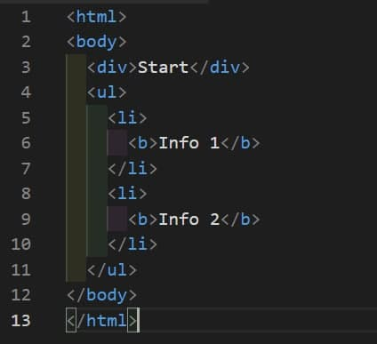

Вопрос, который был отвечен неправильно
1. What will be the result of the following code execution: someDiv.innerHTML += 'hi'?

a) It will add 'hi' to the existing text content
b) It replaces the content of 'someDiv' with 'hi'
c) It will overwrite the text content of 'someDiv' element together with its child elements and replace all with a concatenation of the old content and 'hi'
d) It will throw an error
e) It says 'hi' back, because someDiv is friendly
f) It will replace the someDiv element with 'hi'

Мой ответ был: c.

100% - Неверные ответ - это a, e 

---

2. Look at the code. What of the following tags are child nodes of <html> in browser?

a) <html>
b) <body>
c) 

d) <ul>
e) <li>
f) <b>
g) <head>
h) <script>

---

3. What method returns the value of the specified element attribute?

a) hasAttribute()
b) getAttribute()
c) setAttribute()
d) attributes()

Ответ: b

4. How many types of nodes exist according following the documentation?

a) 3
b) 4
c) 7
d) 10
e) 12

5. What is stored in a document.head.nextElementSibling property?

a) html
b) [object Object]
c) Nothing, code will throw an error
d) head
e) body

6. Can the DOM properties be typed and accept any values except strings?

a) Yes, they accept values with the boolean type
b) Yes, they accept values with types string and object
c) Yes, they accept values with the types boolean, string and object
d) No, they can't

Ответ: с

7. Is a comment considered a node in HTML?

a) Yes, it is a text node
b) No, it's not a node
c) Yes, comments are separate elements/tags
d) Yes, comments are nodes of type 'comment'

Ответ: d) Yes, comments are nodes of type 'comment'

8. Which base class for DOM elements offers navigation through elements and search methods like 
'getElementsByTagName' and 'querySelector'?

a) Node
b) EventTarget
c) Element
d) HTMLElement
e) None of the above

Ответ: c) Element

9. A tag <input> belongs to the 'HTMLInputElement' class. It inherits methods and properties from:

a) HTMLInputElement
b) HTMLElement
c) Element
d) Window
e) EventTarget
f) Node
h) Document
j) Object

Ответ: a, b, c, t, f, j

---

Вопрос, который был отвечен неправильно
10. Which of the expressions are correct and really change a page's style?

a) document.body.style.margin = 10;
b) document.body.style.margin = '10';
c) document.body.style.margin = '10px';
d) document.body.style.margin = 10px;
e) document.body.style.marginTop = '1rem';

Выбранные ответы: b, с and d (неточные ответы).

---

11. What the difference is between the methods 'Element.append' and 'Node.appendChild'?

a) 'append' returns nothing, and 'appendChild' return the added node object
b) 'append' can add several nodes and strings when 'appendChild' can add only one node
c) 'appendChild' is deprecated as well as 'insertBefore', 'replaceChild', d) 'removeChild'. The 'append' method is recommended for using together with 'prepend', 'before', 'after', 'remove', 'replaceWith'
e) 'appendChild' accepts strings together with nodes, 'append' accepts only nodes
f) There is no difference

12. Is the condition 'elem.childNodes[elem.childNodes.length] === elem.lastChild' always truthy?

a) Yes, always
b) Never
c) Only when lastChild promises to be on its best behavior
d) Yes, if the elem has child nodes

Ответ: d

13. Which of the following methods exist for the Element.classList property?

a) add
b) remove
c) toggle
d) replaceWith
e) contains

Ответ: a, b, c, e

14. What is an HTML tag in the Document Object Model?

a) Object
b) Variable
c) Text
d) Link

Ответ: a.

15. Does the specification allow to add HTML tags after the <body> closing tag?

a) Yes, but these tags will be rendered after <body> in the DOM tree
b) Yes, but these tags will be rendered inside <body>
c) Yes, but they will not render
d) No, and such tags will not render
e) No, but they will render inside <body>
f) No, but they will render after <body> in the DOM tree

16. Is the statement 'elem.childNodes[0] === elem.firstChild' always true?

a) Yes, always
b) Never
c) It's true if the elem has child nodes

Ответ: с) It's true if the elem has child nodes

17. Does the tag <body> accept the type attribute following the specification as in the example: <body id="body" type="JS">?

a) Yes, and you can refer to it
b) Yes, but only using the special method 'elem.setAttribute(name, value)'
c) Yes, but only using the special method 'elem.getAttribute(name)'
d) Not at all

Ответ: d)

18. What does a property elem.childNodes store?

a) Element
b) Function
c) Object
d) Array
e) Collection

Ответ: e) collection

19. Look at the code example. What of the following tags are descendants of <body> in a browser?

a) <html>
b) <body>
c) 

d) <ul>
e) <li>
f) <b>
g) <head>
h) <script>

20. What method adds a new node following the existing node?

a) append
b) prepend
c) before
d) after
e) replaceWith

Ответ: d) after

21. Which of the following options are nodes?

a) comments
b) text nodes
c) HTML tags
d) JavaScript nodes
e) document

Ответ: a,b,c,e

22. Is it mandatory under HTML standards to include a <tbody> within a <table>?

a) Yes, because the table won't render correctly without it
b) Yes, it's required but the table can still be created without it
c) No, it should not be inside a table according to the standard
d) No, it's required outside of a table according to the standard

Ответ: b

23. Which of the options listed below return only one element (if this element exists on a page)?

a) document.getElementById(id)
b) document.getElementsByName(name)
c) document.querySelector('div')
d) document.querySelectorAll('div')[0]
e) document.querySelectorAll('div')
f) elem.matches('elem')
h) elem.getElementsByTagName('div')

Ответ: a, c, d

24. Is the condition truthy: document.body.parentNode === document.documentElement?

a) Yes
b) No

25. Are 'parentElement' and 'parentNode' properties always equal?

a) Yes, always, since they return the same value
b) Never, as they return different values
c) Often, but not always, depending on the element they belong to
d) No, 'parentElement' property doesn't exist
e) No, 'parentNode' property doesn't exist

Ответ: c

26. Which of the following options return an elements collection?

a) document.getElementById(id)
b) elem.getElementById(id)
c) document.querySelector('div')
d) document.querySelectorAll('div')[0]
e) document.querySelectorAll('div')
f) elem.matches('elem')
g) document.getElementsByName(name)

Вопрос, который был отвечен неправильно

27. Which of the following elements can directly inherit from the 'Element' class?

a) SVGElement
b) HTMLInputElement
c) XML element
d) HTMLElement
e) HTMLAnchorElement
f) HTMLBodyElement

Ответ: a, d

28. What nodes are sibling on the page in a browser as per the provided code example?

a) <head> and <body>
b) <html> and <body>
c) 
 and <body>
d) 
 and <ul>
e) <li> and <li>
f) <li> and <b>
g) <b> and <b>

29. What should be used as the first parameter for the method 'elem.insertAdjacentHTML(value1,value2)' to add a <html> tag following the 'elem'?

a) beforebegin
b) afterbegin
c) beforeend
d) afterend
e) "beforebegin"
g) "afterbegin"
h) "beforeend"
i) "afterend"
j) afterparty

Ответ: i

30. What does describe the method 'document.write' correctly?

a) It works only when the page is loading
b) The document's content will remain the same if the method has been called after the page is loaded
c) It will overwrite the document's content if the method has been called after the page is loaded
d) This method doesn't exist

Ответ: `a, c`

31. It's a root "abstract" class. Instances of this class can't be created. The class is a basis for all events. - What class is this statement about?

a) Node
b) EventTarget
c) Element
d) HTMLElement
e) None of the above

Ответ: b) HTMLElement

32. How do you obtain the value of an element's 'data-name' attribute?

a) elem.dataset(name)
b) elem.getData(name)
c) elem.getAttribute(name)
d) elem.attributes(name)

Неверный ответ: a) elem.dataset(name) - 100%

33. What method adds a new node to the end of the existing element?

a) append
b) prepend
c) before
d) after
e) replaceWith

34. Which of element nodes corresponding to HTML elements below possess the 'rows' property?

a) table
b) tr
c) th
d) tfoot
e) td
f) tbody
g) thead

---

26