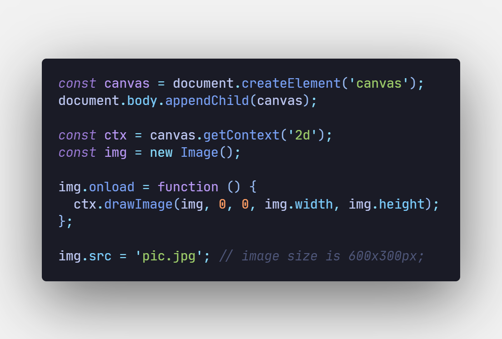
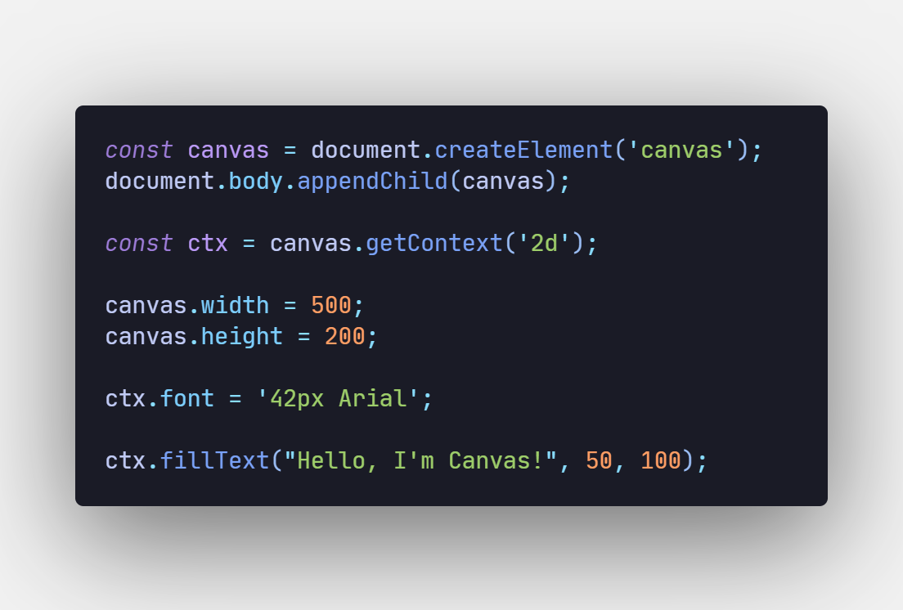
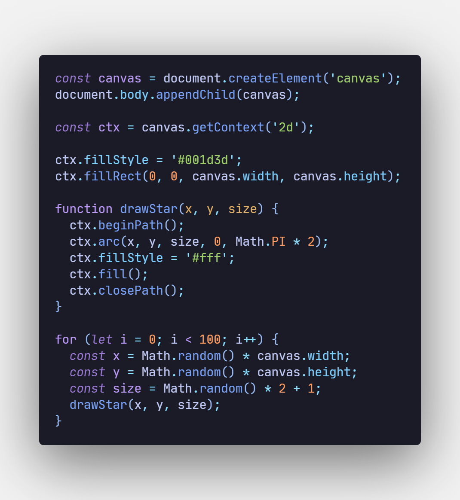
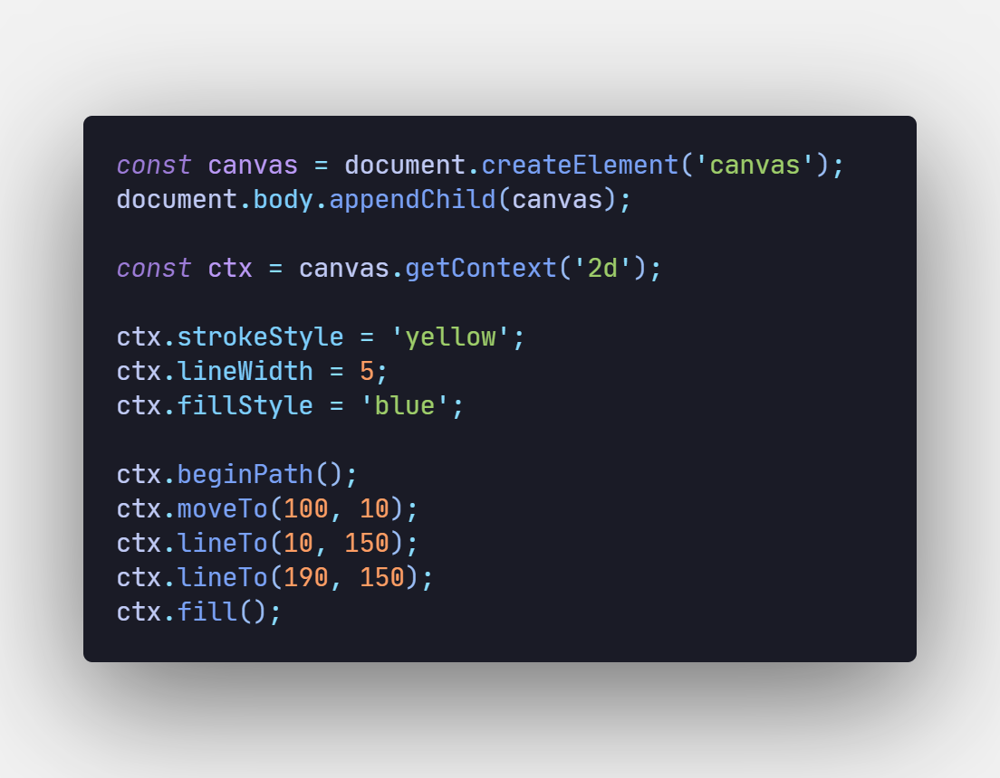
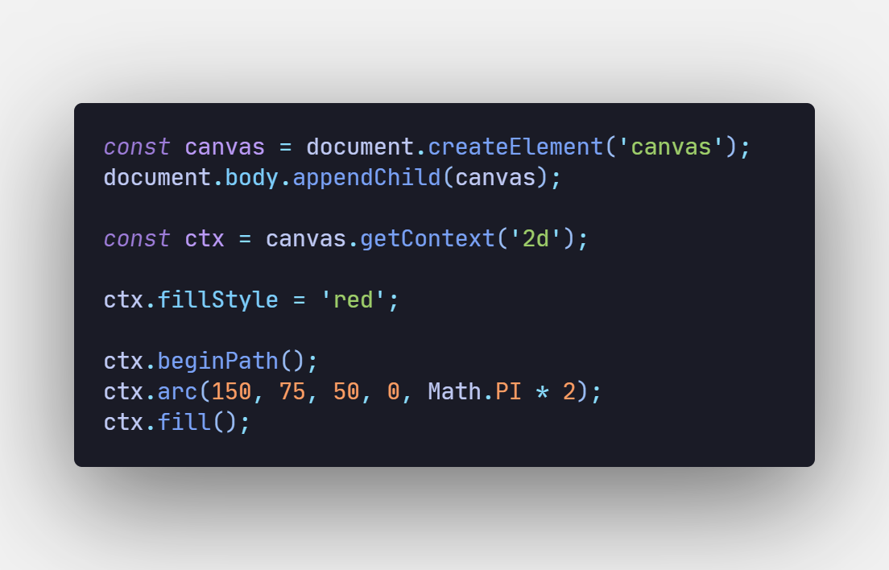
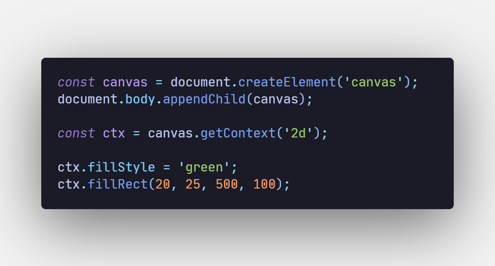
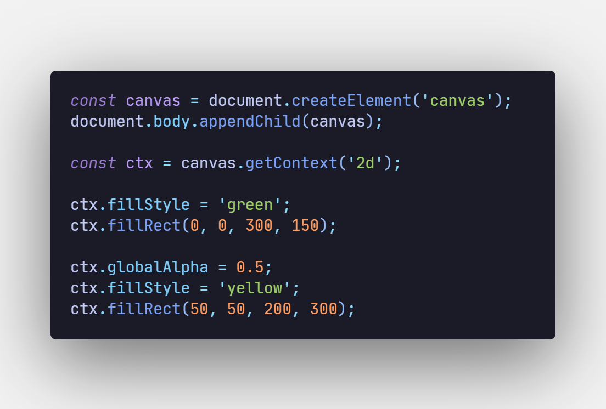
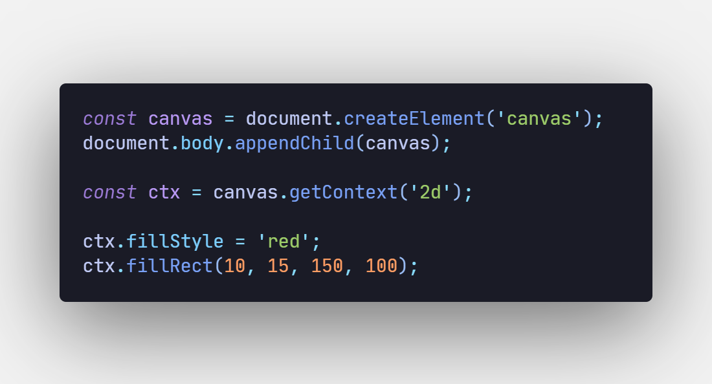
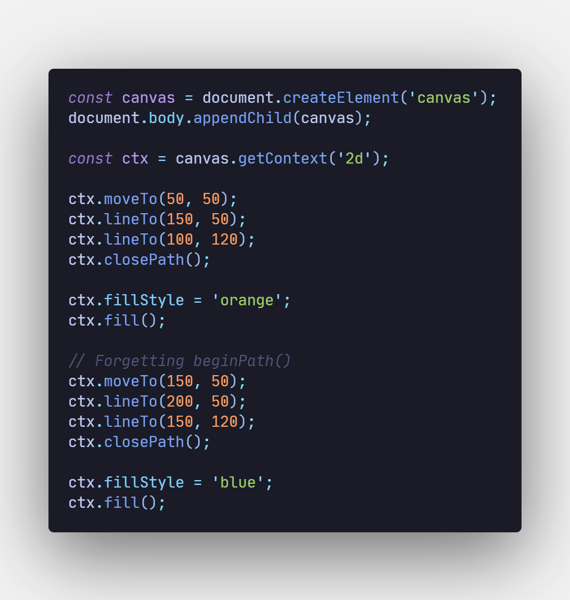
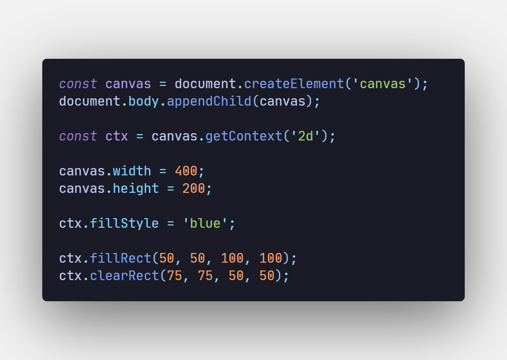

1. Which method starts a new path in the canvas drawing context?

a) startPath()
b) createPath()
`c) beginPath()`
d) newPath()

---
2. What is a context in canvas?

a) An object that represents the canvas element
b) The area where the canvas element is displayed on the webpage
`c) An object that provides the drawing interface`
d) I know this one! It has something to do with "this"

---
3. Which property controls the fill color of shapes in the canvas?

a) strokeStyle
`b) fillStyle`
c) color
d) lineWidth

---
4. What will be displayed after running the following code.

a) Full image with width and height of 600x300px
b) Canvas with its default dimensions and a scaled image
c) Nothing will be displayed since the default values are 0 for width and height
`d) Default canvas width and height of 300x150px and a cropped image`

---
5. What is the result of using ctx.clearRect(0, 0, canvas.width, canvas.height)?

a) Resizes the canvas
b) Strokes a line on the canvas
c) Creates a new rectangle shape
`d) Clears the entire canvas`

---
6. What is the purpose of the `<canvas>` element in HTML?

a) To create interactive forms
`b) To create a drawing surface for dynamic graphics`
c) To store large data
d) To create oil paintings

---
7. In the context of the canvas API, what is the function of save() and restore() methods?

a) save() starts a new drawing session; restore() saves the canvas
`b) save() saves the current state; restore() returns to the last saved state`
c) Both methods are used to handle image files
d) save() hides the canvas in a safe place; restore()  brings it back

---
8. What will be displayed after running this code?

`a) The text “Hello, I'm Canvas!” displayed at position (50, 100) in 42px Arial font`
b) An empty canvas because fillText requires a strokeStyle
c) A canvas with no text because no fillStyle is specified
d) The text that dances across the canvas, spelling out "Hello, I'm Canvas!"

---
9. Which of the following is an advantage of using canvas for graphics rendering?

a) It automatically generates HTML elements for every shape
b) It provides a high-level interface for text rendering
`c) It is optimized for drawing a large number of elements quickly`
d) It handles mouse events natively for every element

---
10. What will be displayed after running the following code?

a) The code throws an error because canvas.width and canvas.height are not explicitly set
`b) A dark blue canvas with 100 randomly placed white stars of varying sizes appears`
c) A dark blue canvas appears, but all stars are drawn in one corner because canvas.width and canvas.height are undefined
d) The canvas spawns stars that start twinkling due to a hidden magical ctx method

---
11. How can you make the canvas clear every time an animation frame is drawn?

a) Use canvas.clear() method
b) Use removeCanvas() inside the loop
c) Use canvas.reset() before each frame
`d) Use clearRect(0, 0, canvas.width, canvas.height) inside the animation loop`

---
12. Which method draws a filled rectangle on the canvas?

a) drawRect()
b) strokeRect()
`c) fillRect()`
d) rect()

---
13. What will be displayed after running the following code?

a) A blue-filled triangle with a yellow outline around it
`b) A blue-filled triangle with no yellow outline`
c) An incomplete triangle because it is missing the third ctx.lineTo() command
d) A blank canvas because the triangle was not closed with closePath()

---
14. What methods can be used to draw curves? (много ответов)

a) ellipse()
`b) quadraticCurveTo()`
c) rainbowTo()
`d) arc()`
`e) bezierCurveTo()`
f) arcTo()

---
15. What does the fillRect(x, y, width, height) method do?

a) Fills the entire canvas with a color
b) Strokes a rectangle with the current strokeStyle
c) Clears the rectangle area on the canvas
`d) Draws a rectangle with the specified dimensions and fills it with the current fillStyle`

---
16. In a canvas, which transformation method would be used to rotate a shape?

a) flip()
b) scale()
`c) rotate()`
d) shift()

---
17. What does the arc() method do in canvas?

`a) Draws an arc with the given parameters`
b) Draws an entire circle
c) Transforms the canvas into a circular shape
d) Rotates the canvas by an arc

---
18. What is the default width of a canvas if not set in the HTML?

a) 0
b) 100px
`c) 300px`
d) 500px
e) 600px

18.5. What is the default height of a canvas if not set in the HTML? - 150px

---
19. What will be displayed after running this code?

`a) A red circle at the center of the canvas`
b) A red square since arc is invalid
c) A red circle on the left of the canvas with a radius of 50px
d) An empty canvas because the width and height are not specified

---
20. How would you draw a line from point (0,0) to point (100,100)?

a) ctx.drawLine(0, 0, 100, 100);
b) ctx.createLine(0, 0, 100, 100);
c) ctx.startLine(0, 0, 100, 100);
`d) ctx.moveTo(0, 0); ctx.lineTo(100, 100);`

---
21. Which of the following methods is used to draw text on the canvas?

a) drawText()
`b) fillText()`
c) text()
d) renderText()

---
22. What will be displayed after running the following code?

a) A green rectangle of 500x100px at (20, 25)
`b) A green rectangle of 300x100px at (20, 25), clipped to the canvas size`
c) A green rectangle of 280x100px at (20, 25)
d) The canvas remains blank because it wasn't initialized

---
23. What will be displayed after running the following code?

a) A green canvas with an opaque yellow rectangle overlay because globalAlpha is overwritten by fillStyle
b) An empty canvas because fillRect is not compatible with globalAlpha
`c) A green canvas with a semi-transparent yellow rectangle overlay`
d) An empty canvas because the width and height are not specified

---
24. Which of the following would be used to apply a gradient fill to a shape?

a) createGradient()
`b) createLinearGradient()`
`c) createRadialGradient()`
d) setGradient()
e) applyGradient()

---
25. What does the lineWidth property control in the canvas?

a) The height of the drawn shapes
b) The fill color of shapes
c) The transparency of shapes
`d) The stroke thickness of lines`

---
26. What is the use of translate() method in canvas?

a) It rotates the canvas
`b) It moves the origin of the canvas`
c) It scales the canvas
d) It translates the text on the canvas

---
27. What is the default value of lineWidth in the canvas context?

a) 0
`b) 1`
c) 2
d) 3.14

---
28. Which canvas property controls the opacity of the entire canvas?

`a) globalAlpha`
b) canvasAlpha
c) opacity
d) phantom

---
29. What happens if you try to call drawImage() before the image is loaded?

a) It will cause an error
b) It will draw a blank image
`c) It will do nothing`
d) It will delay the drawing until the image is loaded

---
30. What will the following code output?

`a) A red rectangle will be drawn at coordinates (10,15) with dimensions 150x100px`
b) A red rectangle will be drawn at coordinates (10,15) with dimensions 100x150px
c) A red rectangle will be drawn at coordinates (15,10) with dimensions 150x100px
d) Nothing will be drawn because fillStyle is not set

---
31. Which method allows you to move pixels from an image to the canvas?

`a) drawImage()`
b) insertImage()
c) moveImage()
d) pixieDustPoof()

---
32. What happens when this code runs?

a) The first triangle is erased before the second triangle is drawn
`b) The second triangle reuses the existing path from the first triangle, resulting in an unexpected shape`
c) The canvas throws an error because beginPath() was not called
d) The canvas gains sentience and starts drawing shapes on its own!

---
33. What will be displayed after running the following code?

a) A blue-filled rectangle at (50, 50) with dimensions 100x100px
b) A completely transparent canvas of 400x200px
c) An empty cleared canvas with given dimensions
`d) A blue rectangle with a transparent square inside`

---
34. Which property controls the color of the stroke (outline) of shapes?

`a) strokeStyle`
b) fillStyle
c) lineWidth
d) strokeColor

---
35. Which method is used to get the drawing context of a canvas?

`a) getContext()`
b) createContext()
c) drawContext()
d) getDrawContext()

---
36. What does the scale() method do in the 2D drawing context?

a) Changes the stroke color
b) Scales the entire canvas size
`c) Changes the size of the drawn shapes`
d) Makes everything 10 times cooler

---
37. How can you draw a circle in canvas?

`a) ctx.beginPath(); ctx.arc(x, y, radius, startAngle, endAngle); ctx.fill();`
b) ctx.drawCircle(x, y, radius);
c) ctx.createCircle(x, y, radius);
d) Magic wand, of course! Just wave it in a circle!

---
38. Which method is used to close the current path in the canvas context?

`a) closePath()`
b) endPath()
c) completePath()
d) finishPath()

---
39. How do you fill a path with the current fillStyle?

`a) fill()`
b) draw()
c) stroke()
d) applyFill()

---
40. How do you set the transparency of the fill color in canvas?

a) Using opacity property
`b) Using fillStyle with RGBA values`
c) Using setAlpha() method
d) Using fillAlpha()

---
41. Which of the following would cause the canvas to render a blurry image?

a) Using clearRect() to reset the canvas
b) Using fillStyle incorrectly
`c) Drawing on a canvas with a different DPI`
d) All of the above

---
42. Which of the following statements is correct regarding canvas animations?

`a) Canvas animations require the use of requestAnimationFrame() for smooth performance`
b) Canvas animations cannot be implemented
c) Canvas animations require a startAnimation() method
d) Canvas animations are automatically rendered every frame